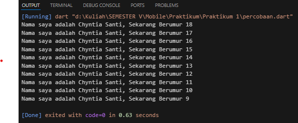

# Tugas Praktikum 
1. Modifikasilah kode pada baris 3 di VS Code atau Editor Code favorit Anda berikut ini agar mendapatkan keluaran (output) sesuai yang diminta!  
Output yang diminta:  
  
**Jawab**  
Kode Program : 
void main() {
    for (int i = 18; i >= 9; i--) {
        print('Nama saya adalah Chyntia Santi, Sekarang Berumur ${i}');
    }  
}  

Outputnya adalah sebagai berikut  

2. Mengapa sangat penting untuk memahami bahasa pemrograman Dart sebelum kita menggunakan framework Flutter ? Jelaskan!  
**Jawab**  
Untuk memahami Dart dengan baik, sehingga penggunaan framework Flutter menjadi lebih mudah dan efisien, sangat penting untuk mempelajari dasar-dasar dan konsep kunci dalam bahasa Dart.

3. Rangkumlah materi dari codelab ini menjadi poin-poin penting yang dapat Anda gunakan untuk membantu proses pengembangan aplikasi mobile menggunakan framework Flutter. 
**Jawab**  
 
**Dart operators**   
Menggunakan operator seperti x == y, seolah-olah Anda sedang memanggil
x.==(y) metode untuk melakukan perbandingan kesetaraan.
x selalu berupa turunan dari kelas yang memiliki method.   
  **Arithmetic operators**
- '+' untuk tambahan.
- '-' untuk pengurangan.
- '*' untuk perkalian.
- '/' untuk pembagian.
- '~/' untuk pembagian bilangan bulat. Di Dart, setiap pembagian sederhana dengan menghasilkan nilai double. 
- '%' untuk operasi modulus (sisa bagi dari bilangan bulat).
- '-expression' untuk negasi (yang membalikkan suatu nilai).  
 
**Increment and decrement operators**  
- ++var atau var++ untuk menambah nilai variabel var sebesar 1 
- --var atau var-- untuk mengurangi nilai variabel var sebesar 1  
 
**Equality and relational operators**
- == untuk memeriksa apakah operan sama
- != untuk memeriksa apakah operan berbeda
- '>' memeriksa apakah operan kiri lebih besar dari operan kanan
- < memeriksa apakah operan kiri lebih kecil dari operan kanan
- '>=' memeriksa apakah operan kiri lebih besar dari atau sama dengan operan kanan
- <= memeriksa apakah operan kiri kurang dari atau sama dengan operan kanan  
 
**Logical operators**  
- !expression negasi atau kebalikan hasil ekspresi—yaitu, true menjadi false dan false menjadi true.
- || menerapkan operasi logika OR antara dua ekspresi.
- && menerapkan operasi logika AND antara dua ekspresi.  
 
**Penjelasan Kode Program**  
- void menunjukkan bahwa method tidak mengembalikan data apa pun ketika telah selesai eksekusi. void adalah keyword dalam bahasa Dart yang hanya dapat digunakan secara spesifik. 
- main adalah nama function utama yang dicari oleh Dart VM saat pertama kali mengeksekusi kode. Setiap aplikasi Dart harus memiliki function main sehingga Dart VM tahu di mana harus memulai eksekusi kode.
- Tanda kurung kosong ( ) adalah tempat function untuk mendefinisikan data yang akan diterima. Function main ini tidak menerima data apa pun, oleh karena itu tanda kurung ini kosong.
- Terakhir, kurung kurawal { } di akhir baris pertama menentukan di mana kode function main dimulai, dan kurung kurawal penutup setelah beberapa baris kemudian untuk menentukan di mana kode function main berakhir. 

4. Buatlah slide yang berisi penjelasan dan contoh eksekusi kode tentang perbedaan Null Safety dan Late variabel ! (Khusus soal ini kelompok berupa link google slide)  
**Jawab**  
**Penjelasan**
- Null safety adalah konsep dalam pemrograman yang bertujuan untuk mencegah kesalahan yang disebabkan oleh akses variabel yang tidak disengaja dan disetel ke null.
- Dalam dart, late digunakan untuk menginisialisasi variabel di lain waktu, tetapi manfaat sebenarnya terjadi ketika variabel tersebut digunakan.  
 
**Contoh Eksekusi Kode**  
**Null Safety**  
void main() {  
  int nonNullableInt = 5; // Variabel non-nullable, tidak bisa bernilai null  
  int? nullableInt; // Variabel nullable, bisa bernilai null 
  
  print(nonNullableInt); // Output: 5  
  print(nullableInt); // Output: null  
}  
 
**Late Variables**  
void main() {  
  late int lateInt;  
  
  // lateInt belum diinisialisasi di sini  
  lateInt = 10; // Inisialisasi 
  print(lateInt); // Output: 10  
}  
 

**Perbedaan**
- Null Safety berfokus pada pencegahan kesalahan yang disebabkan oleh null dengan memaksa pengembang untuk menentukan apakah suatu variabel bisa null atau tidak sejak awal.
- Late Variables memungkinkan variabel untuk diinisialisasi nanti, tetapi dengan jaminan bahwa mereka akan mendapatkan nilai sebelum digunakan. late tidak ada kaitannya dengan null, melainkan lebih kepada penundaan inisialisasi.