# Jawaban Soal Praktikum

## PRAKTIKUM 1

### Soal 1

Tambahkan nama panggilan Anda pada title app sebagai identitas hasil pekerjaan Anda.

```
title: 'Chyntia',
      theme: ThemeData(
        primarySwatch: Color.blue,
        visualDensity: VisualDensity.adaptivePlatformDensity,
      ),

```

### Soal 2

Carilah judul buku favorit Anda di Google Books, lalu ganti ID buku pada variabel path di kode tersebut. Caranya ambil di URL browser Anda seperti gambar berikut ini.

Hasilnya adalah sebagai berikut <br>
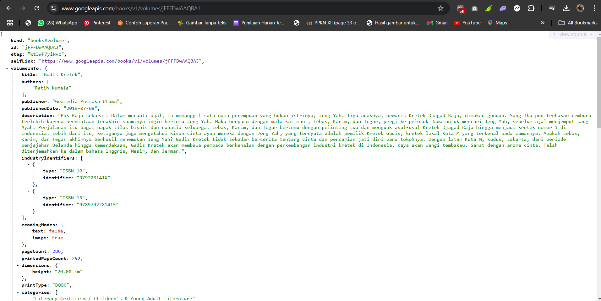

### Soal 3

Jelaskan maksud kode langkah 5 tersebut terkait substring dan catchError! <br>

- Substring: Digunakan untuk mengambil sebagian dari string berdasarkan indeks awal dan akhir, memungkinkan manipulasi teks sesuai kebutuhan, seperti memotong ID atau nama file.
- catchError: Berfungsi menangkap dan menangani error yang terjadi dalam operasi asinkron, memastikan program tetap berjalan tanpa terhenti meski ada kesalahan.

Capture hasil praktikum Anda berupa GIF dan lampirkan di README. Lalu lakukan commit dengan pesan "W11: Soal 3". <br>
Hasil ketika dijalankan
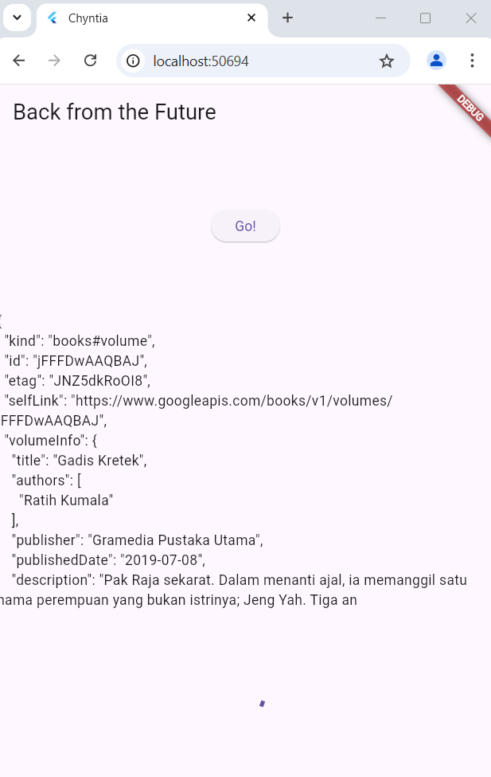

## PRAKTIKUM 2

### Soal 4

Jelaskan maksud kode langkah 1 dan 2 tersebut!

- Langkah 1: Buka file main.dart dan tambahkan tiga method (returnOneAsync, returnTwoAsync, dan returnThreeAsync) ke dalam class \_FuturePageState. Ketiga method ini masing-masing menunggu selama 3 detik menggunakan Future.delayed sebelum mengembalikan nilai integer tertentu (1, 2, dan 3). Method ini mensimulasikan proses asinkron, seperti pengambilan data.

- Langkah 2: Tambahkan method count() di bawah ketiga method tersebut. Fungsi ini menghitung total nilai yang dikembalikan oleh ketiga method sebelumnya secara berurutan menggunakan await. Setelah selesai, hasilnya diperbarui di UI dengan memanfaatkan setState, sehingga nilai total ditampilkan di layar.

Capture hasil praktikum Anda berupa GIF dan lampirkan di README. Lalu lakukan commit dengan pesan "W11: Soal 4".

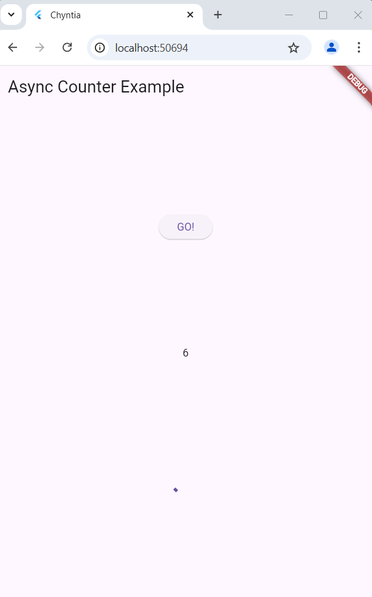

## PRAKTIKUM 3

### Soal 5

Jelaskan maksud kode langkah 2 tersebut! <br>
Langkah 2 menambahkan dua method untuk mengelola operasi asinkron menggunakan Completer:

- getNumber: Menginisialisasi completer, memulai proses asinkron melalui calculate, dan mengembalikan Future yang akan diselesaikan secara manual.
- calculate: Mensimulasikan proses yang berlangsung 5 detik, lalu menyelesaikan Future dari completer dengan nilai 42.

Dengan cara ini, Completer memberikan kontrol penuh untuk menyelesaikan Future secara manual setelah proses selesai.

Capture hasil praktikum Anda berupa GIF dan lampirkan di README. Lalu lakukan commit dengan pesan "W11: Soal 5". <br>
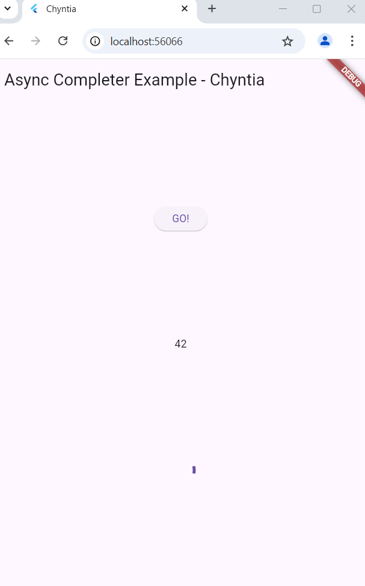

### Soal 6

Jelaskan maksud perbedaan kode langkah 2 dengan langkah 5-6 tersebut!

Perbedaan utama antara Langkah 2 dan Langkah 5-6 terletak pada penanganan error dalam operasi asinkron. Pada Langkah 2, tidak ada mekanisme penanganan error, sehingga jika terjadi kesalahan, aplikasi bisa crash atau tidak memberikan feedback. Sedangkan pada Langkah 5-6, blok try-catch ditambahkan di dalam metode calculate2(), memungkinkan aplikasi untuk menangani error dengan completer.completeError(). Ini membuat aplikasi lebih aman dan stabil, karena jika terjadi kesalahan, UI dapat menampilkan pesan error yang sesuai tanpa menghentikan aplikasi, memberikan pengalaman pengguna yang lebih baik.

Capture hasil praktikum Anda berupa GIF dan lampirkan di README. Lalu lakukan commit dengan pesan "W11: Soal 6".
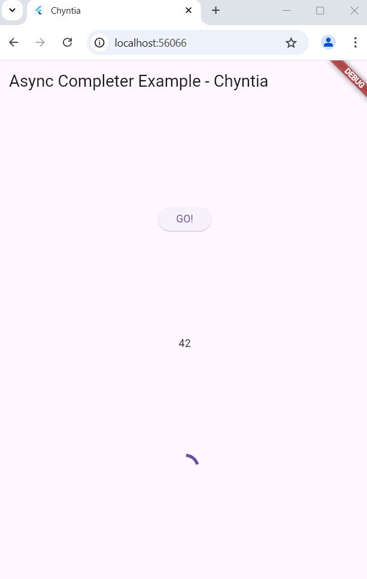

## PRAKTIKUM 4

### Soal 7

Capture hasil praktikum Anda berupa GIF dan lampirkan di README. Lalu lakukan commit dengan pesan "W11: Soal 7".

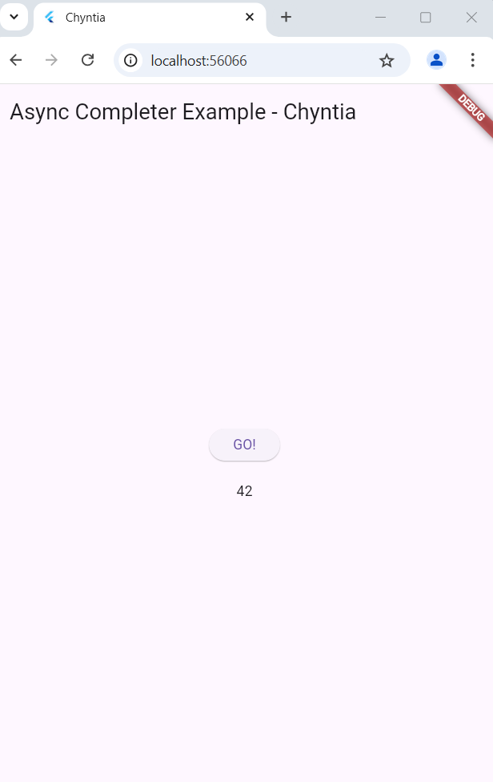

### Soal 8

Jelaskan maksud perbedaan kode langkah 1 dan 4! <br>
Perbedaan antara FutureGroup dan Future.wait terletak pada cara mereka menangani beberapa future. FutureGroup memungkinkan penambahan future secara dinamis selama eksekusi, memberikan kontrol lebih terhadap grup future, dan memerlukan pemanggilan close() untuk menandakan bahwa tidak ada future lagi yang akan ditambahkan.

Sementara itu, Future.wait lebih sederhana dan langsung digunakan untuk menunggu sekumpulan future yang sudah didefinisikan sebelumnya dalam satu langkah. Future.wait mengembalikan future yang selesai setelah semua future dalam daftar selesai, tanpa perlu memanggil close(). Dengan demikian, FutureGroup lebih fleksibel, sedangkan Future.wait lebih efisien dan mudah digunakan ketika semua future sudah diketahui sebelumnya.

## PRAKTIKUM 5

### Soal 9

Capture hasil praktikum Anda berupa GIF dan lampirkan di README. Lalu lakukan commit dengan pesan "W11: Soal 9".

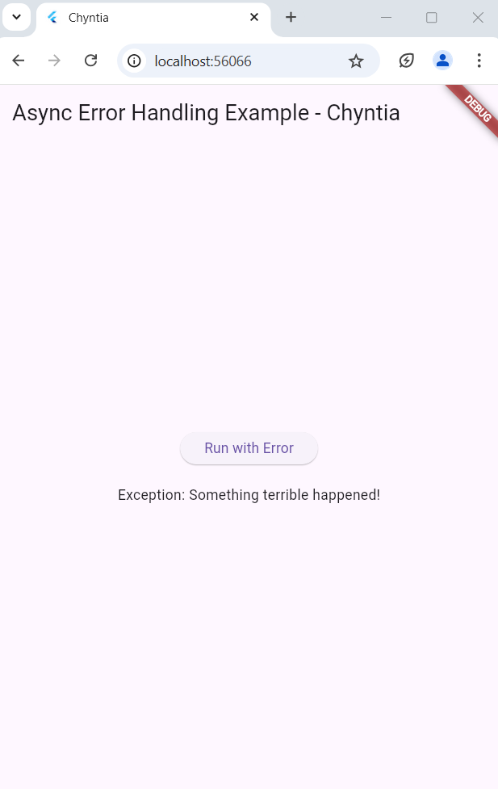

### Soal 10

Panggil method handleError() tersebut di ElevatedButton, lalu run. Apa hasilnya? Jelaskan perbedaan kode langkah 1 dan 4! <br>

Hasilnya adalah sebagai berikut <br>
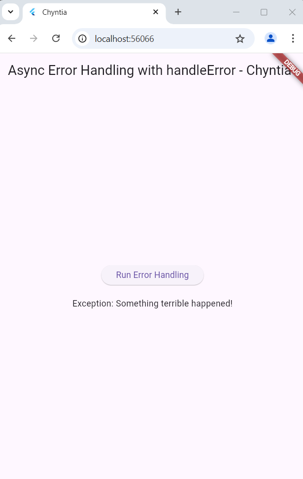

Perbedaan <br>

- Langkah 1 menggunakan .then(), .catchError(), dan .whenComplete() untuk menangani hasil sukses, error, dan penyelesaian. Pendekatan ini lebih sederhana dan berbasis callback, cocok untuk kasus yang tidak kompleks.

- Langkah 4 menggunakan try-catch-finally yang lebih terstruktur. try mencoba kode, catch menangani error, dan finally mengeksekusi kode setelahnya. Pendekatan ini memberikan kontrol lebih besar dan cocok untuk kasus yang lebih rumit.

## PRAKTIKUM 6

### Soal 11

Tambahkan nama panggilan Anda pada tiap properti title sebagai identitas pekerjaan Anda. Sudah

### Soal 12

Jika Anda tidak melihat animasi loading tampil, kemungkinan itu berjalan sangat cepat. Tambahkan delay pada method getPosition() dengan kode await Future.delayed(const Duration(seconds: 3));
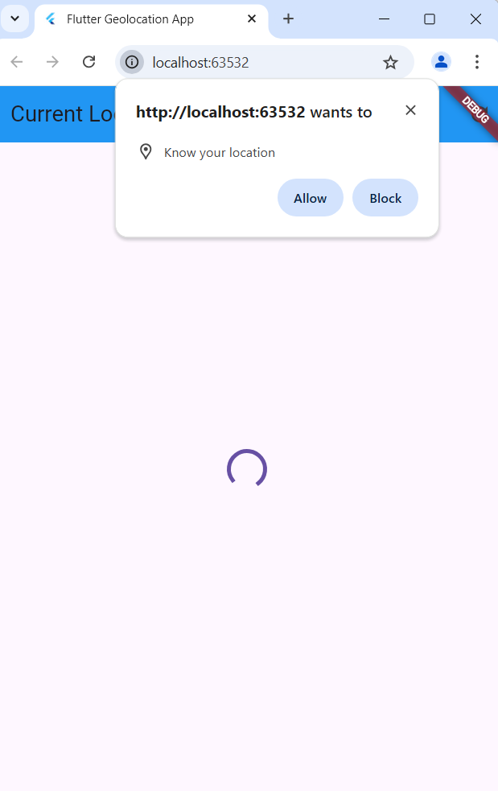

Apakah Anda mendapatkan koordinat GPS ketika run di browser? Mengapa demikian? <br>
Di browser, aplikasi Flutter tidak bisa mengakses GPS secara langsung. Browser hanya bisa menggunakan metode lain seperti IP atau WiFi untuk menentukan lokasi, yang akurasinya lebih rendah daripada GPS. Jadi, jika aplikasi dijalankan di browser, lokasi yang didapatkan tidak seakurat jika dijalankan di perangkat dengan GPS seperti ponsel atau tablet. Untuk mendapatkan lokasi yang lebih tepat, aplikasi perlu dijalankan di perangkat fisik yang memiliki sensor GPS.

Capture hasil praktikum Anda berupa GIF dan lampirkan di README. Lalu lakukan commit dengan pesan "W11: Soal 12".
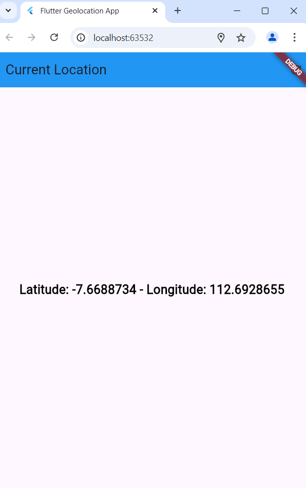

## PRAKTIKUM 7

### Soal 13

Apakah ada perbedaan UI dengan praktikum sebelumnya? Mengapa demikian? <br>
Perbedaan utama adalah bahwa dengan FutureBuilder, kita mendapatkan UI yang lebih bersih, efisien, dan reaktif. UI kini lebih mudah diatur karena FutureBuilder secara otomatis menangani status data, sedangkan sebelumnya kita harus menangani status loading dan error secara manual dengan setState().

Capture hasil praktikum Anda berupa GIF dan lampirkan di README. Lalu lakukan commit dengan pesan "W11: Soal 13". <br>
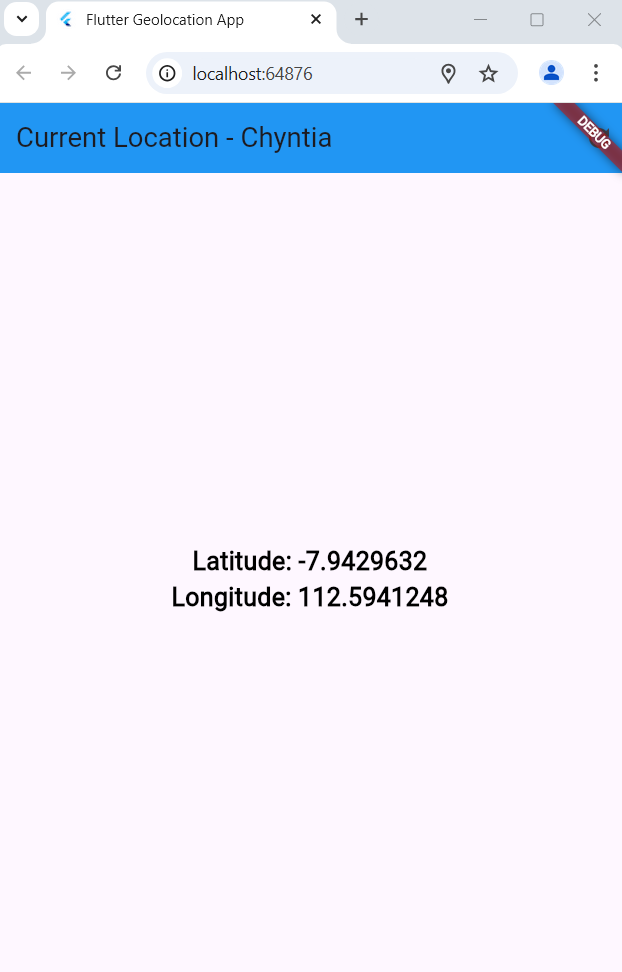

Seperti yang Anda lihat, menggunakan FutureBuilder lebih efisien, clean, dan reactive dengan Future bersama UI.

### Soal 14

Apakah ada perbedaan UI dengan langkah sebelumnya? Mengapa demikian? <br>
Perbedaan UI antara langkah sebelumnya dan sekarang terletak pada penanganan error. Sebelumnya, UI hanya menampilkan data lokasi atau kosong tanpa memberi tahu pengguna jika terjadi masalah. Dengan penambahan penanganan error menggunakan snapshot.hasError, UI kini memberikan feedback yang jelas kepada pengguna, seperti pesan kesalahan ketika ada masalah dalam mengambil data lokasi. Hal ini membuat aplikasi lebih informatif dan responsif terhadap kesalahan, meningkatkan pengalaman pengguna dengan memberikan informasi yang lebih jelas jika terjadi error atau masalah teknis.


Capture hasil praktikum Anda berupa GIF dan lampirkan di README. Lalu lakukan commit dengan pesan "W11: Soal 14". <br>


## PRAKTIKUM 8
### Soal 15

Tambahkan nama panggilan Anda pada tiap properti title sebagai identitas pekerjaan Anda.
 <br> Sudah

Silakan ganti dengan warna tema favorit Anda.

### Soal 16

Cobalah klik setiap button, apa yang terjadi ? Mengapa demikian ? <br>

ada kode yang Anda berikan, terdapat kesalahan penulisan pada deklarasi variabel backgroundColor di kelas _NavigationSecondState. Variabel ini dideklarasikan dengan kata kunci color, padahal yang benar adalah Color (huruf C besar). Kesalahan ini akan menyebabkan aplikasi gagal berfungsi dengan benar karena color bukan tipe data yang valid di Flutter. Setelah perbaikan tersebut, aplikasi akan mengirimkan warna yang dipilih dari layar kedua kembali ke layar pertama.

Setelah perbaikan ini, setiap tombol yang diklik di layar kedua (Red, Green, Blue) akan mengembalikan warna yang dipilih ke layar pertama menggunakan Navigator.pop(). Layar pertama kemudian akan memperbarui latar belakangnya sesuai dengan warna yang dipilih, karena kode yang sudah benar di dalam setState() untuk memperbarui warna latar belakang.

Gantilah 3 warna pada langkah 5 dengan warna favorit Anda! <br> Sudah

Capture hasil praktikum Anda berupa GIF dan lampirkan di README. Lalu lakukan commit dengan pesan "W11: Soal 16".
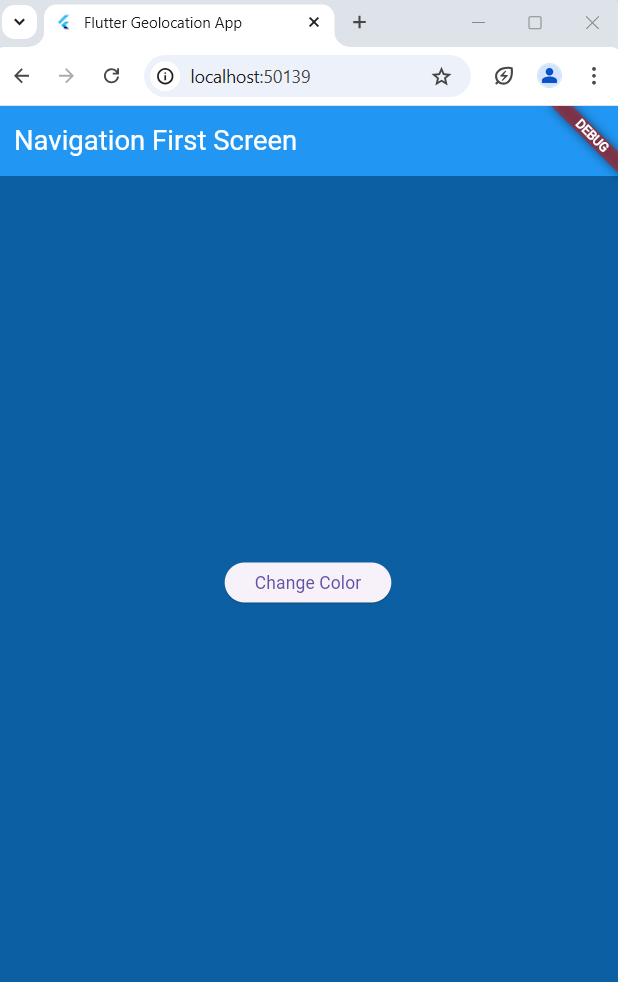 <br>

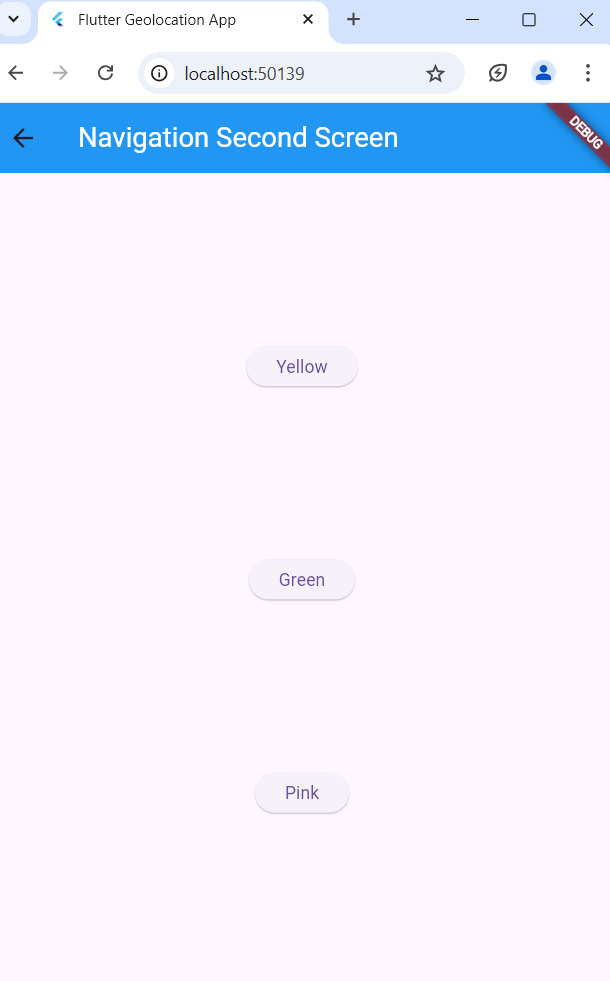 <br>

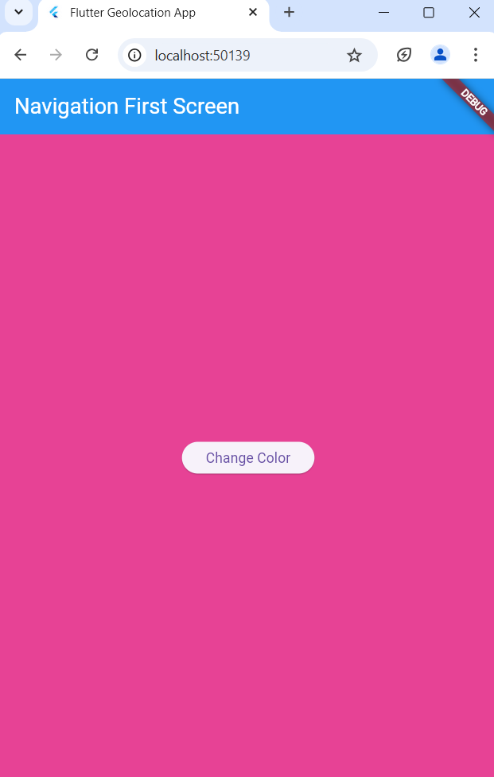


## PRAKTIKUM 9
### Soal 17

Cobalah klik setiap button, apa yang terjadi ? Mengapa demikian ? <br>
Setiap kali klik tombol ("Red", "Green", atau "Blue") di dialog, warna latar belakang aplikasi akan berubah sesuai dengan yang dipilih. Tombol "Red" akan membuat latar belakang jadi merah, tombol "Green" jadi hijau, dan tombol "Blue" jadi biru. Ini terjadi karena Navigator.pop(context, selectedColor) menutup dialog dan mengembalikan warna yang dipilih. Setelah itu, setState() akan memperbarui tampilan dengan warna baru. Kalau perubahan tidak terlihat, pastikan tidak ada error di konsol dan setState() berfungsi dengan benar.

Gantilah 3 warna pada langkah 3 dengan warna favorit Anda! <br> Sudah

Capture hasil praktikum Anda berupa GIF dan lampirkan di README. Lalu lakukan commit dengan pesan "W11: Soal 17". <br>


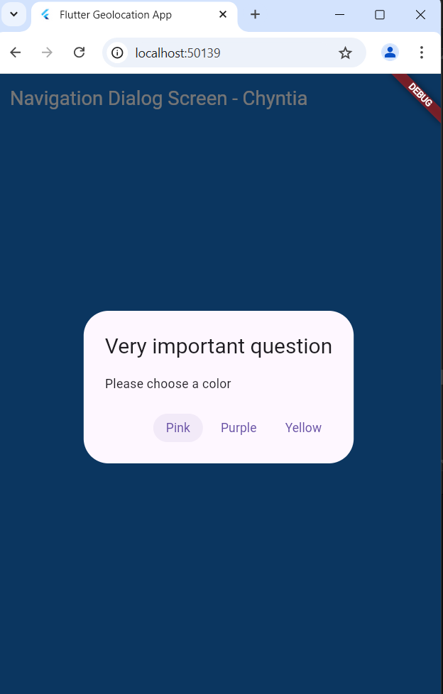 <br>
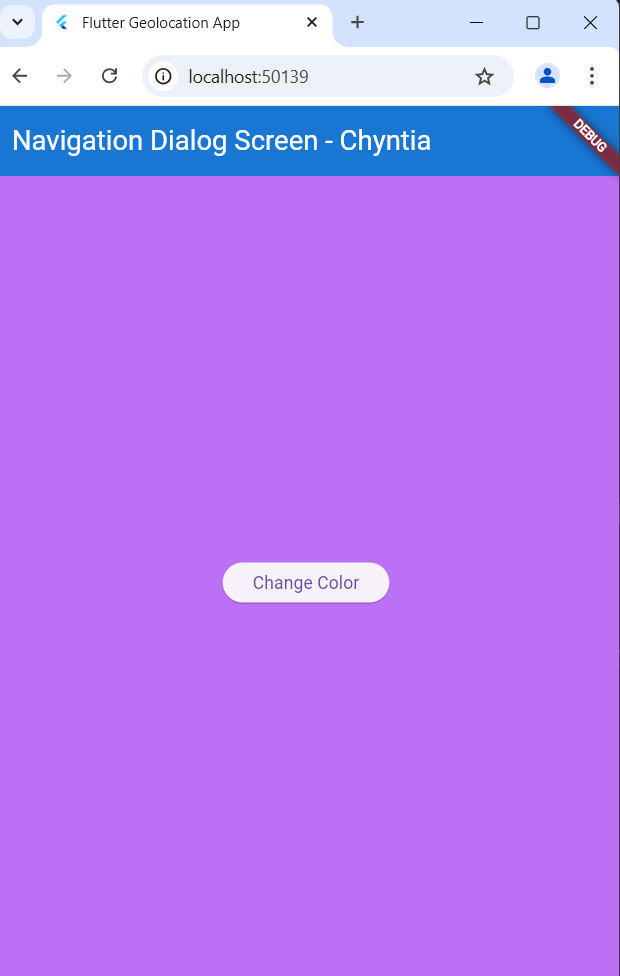
