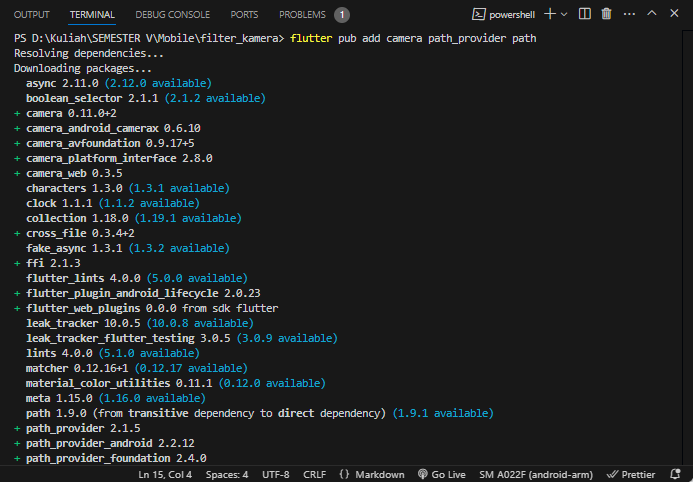

# Chyntia Santi Nur Trisnawati / 2241720017

## Tugas Praktikum

### 1. Selesaikan Praktikum 1 dan 2, lalu dokumentasikan dan push ke repository Anda berupa screenshot setiap hasil pekerjaan beserta penjelasannya di file README.md! Jika terdapat error atau kode yang tidak dapat berjalan, silakan Anda perbaiki sesuai tujuan aplikasi dibuat!

Praktiku telah dikerjakan

### 2. Gabungkan hasil praktikum 1 dengan hasil praktikum 2 sehingga setelah melakukan pengambilan foto, dapat dibuat filter carouselnya!

- Menjalankan Perintah

```
flutter pub add camera path_provider path
```

Hasilnya sebagai berikut


- Membuat takepicture_screen.dart

```
import 'package:camera/camera.dart';
import 'package:filter_kamera/widget/filter_corousel.dart';
import 'package:flutter/material.dart';

class TakePictureScreen extends StatefulWidget {
final CameraDescription camera;

const TakePictureScreen({
 super.key,
 required this.camera,
});

@override
TakePictureScreenState createState() => TakePictureScreenState();
}

class TakePictureScreenState extends State<TakePictureScreen> {
late CameraController _controller;
late Future<void> _initializeControllerFuture;

@override
void initState() {
 super.initState();
 _controller = CameraController(
   widget.camera,
   ResolutionPreset.medium,
 );
 _initializeControllerFuture = _controller.initialize();
}

@override
void dispose() {
 _controller.dispose();
 super.dispose();
}

Future<void> _takePicture() async {
 try {
   await _initializeControllerFuture;
   final image = await _controller.takePicture();
   if (!mounted) return;

   // Pindah ke halaman filter dengan gambar yang diambil
   await Navigator.of(context).push(
     MaterialPageRoute(
       builder: (context) => PhotoFilterCarousel(imagePath: image.path),
     ),
   );
 } catch (e) {
   print(e);
 }
}

@override
Widget build(BuildContext context) {
 return Scaffold(
   appBar: AppBar(title: const Text('Take a picture - 2241720017')),
   body: FutureBuilder<void>(
     future: _initializeControllerFuture,
     builder: (context, snapshot) {
       if (snapshot.connectionState == ConnectionState.done) {
         return CameraPreview(_controller);
       } else {
         return const Center(child: CircularProgressIndicator());
       }
     },
   ),
   floatingActionButton: FloatingActionButton(
     onPressed: _takePicture,
     child: const Icon(Icons.camera_alt),
   ),
 );
}
}
```

- Membuat filter_selector

```
    import 'package:filter_kamera/widget/carousel_flowdelegate.dart';
import 'package:filter_kamera/widget/filter_item.dart';
import 'package:flutter/material.dart';
import 'package:flutter/rendering.dart';


@immutable
class FilterSelector extends StatefulWidget {
  const FilterSelector({
    super.key,
    required this.filters,
    required this.onFilterChanged,
    this.padding = const EdgeInsets.symmetric(vertical: 24),
  });

  final List<Color> filters;
  final void Function(Color selectedColor) onFilterChanged;
  final EdgeInsets padding;

  @override
  State<FilterSelector> createState() => _FilterSelectorState();
}

class _FilterSelectorState extends State<FilterSelector> {
  static const _filtersPerScreen = 5;
  static const _viewportFractionPerItem = 1.0 / _filtersPerScreen;

  late final PageController _controller;
  late int _page;

  int get filterCount => widget.filters.length;

  Color itemColor(int index) => widget.filters[index % filterCount];

  @override
  void initState() {
    super.initState();
    _page = 0;
    _controller = PageController(
      initialPage: _page,
      viewportFraction: _viewportFractionPerItem,
    );
    _controller.addListener(_onPageChanged);
  }

  void _onPageChanged() {
    final page = (_controller.page ?? 0).round();
    if (page != _page) {
      _page = page;
      widget.onFilterChanged(widget.filters[page]);
    }
  }

  void _onFilterTapped(int index) {
    _controller.animateToPage(
      index,
      duration: const Duration(milliseconds: 450),
      curve: Curves.ease,
    );
  }

  @override
  void dispose() {
    _controller.dispose();
    super.dispose();
  }

  @override
  Widget build(BuildContext context) {
    return Scrollable(
      controller: _controller,
      axisDirection: AxisDirection.right,
      physics: const PageScrollPhysics(),
      viewportBuilder: (context, viewportOffset) {
        return LayoutBuilder(
          builder: (context, constraints) {
            final itemSize = constraints.maxWidth * _viewportFractionPerItem;
            viewportOffset
              ..applyViewportDimension(constraints.maxWidth)
              ..applyContentDimensions(0.0, itemSize * (filterCount - 1));

            return Stack(
              alignment: Alignment.bottomCenter,
              children: [
                _buildShadowGradient(itemSize),
                _buildCarousel(
                  viewportOffset: viewportOffset,
                  itemSize: itemSize,
                ),
                _buildSelectionRing(itemSize),
              ],
            );
          },
        );
      },
    );
  }

  Widget _buildShadowGradient(double itemSize) {
    return SizedBox(
      height: itemSize * 2 + widget.padding.vertical,
      child: const DecoratedBox(
        decoration: BoxDecoration(
          gradient: LinearGradient(
            begin: Alignment.topCenter,
            end: Alignment.bottomCenter,
            colors: [
              Colors.transparent,
              Colors.black,
            ],
          ),
        ),
        child: SizedBox.expand(),
      ),
    );
  }

  Widget _buildCarousel({
    required ViewportOffset viewportOffset,
    required double itemSize,
  }) {
    return Container(
      height: itemSize,
      margin: widget.padding,
      child: Flow(
        delegate: CarouselFlowDelegate(
          viewportOffset: viewportOffset,
          filtersPerScreen: _filtersPerScreen,
        ),
        children: [
          for (int i = 0; i < filterCount; i++)
            FilterItem(
              onFilterSelected: () => _onFilterTapped(i),
              color: itemColor(i),
            ),
        ],
      ),
    );
  }

  Widget _buildSelectionRing(double itemSize) {
    return IgnorePointer(
      child: Padding(
        padding: widget.padding,
        child: SizedBox(
          width: itemSize,
          height: itemSize,
          child: const DecoratedBox(
            decoration: BoxDecoration(
              shape: BoxShape.circle,
              border: Border.fromBorderSide(
                BorderSide(width: 6, color: Colors.white),
              ),
            ),
          ),
        ),
      ),
    );
  }
}
```

- Membuat filter_item.dart

```

import 'package:flutter/material.dart';

@immutable
class FilterItem extends StatelessWidget {
  const FilterItem({
    super.key,
    required this.color,
    this.onFilterSelected,
  });

  final Color color;
  final VoidCallback? onFilterSelected;

  @override
  Widget build(BuildContext context) {
    return GestureDetector(
      onTap: onFilterSelected,
      child: AspectRatio(
        aspectRatio: 1.0,
        child: Padding(
          padding: const EdgeInsets.all(8),
          child: ClipOval(
            child: Image.network(
              'https://docs.flutter.dev/cookbook/img-files'
              '/effects/instagram-buttons/millennial-texture.jpg',
              color: color.withOpacity(0.5),
              colorBlendMode: BlendMode.hardLight,
            ),
          ),
        ),
      ),
    );
  }
}
```

- Membuat filter_corousel.dart

```
import 'dart:io';
import 'package:filter_kamera/widget/display_picture_screen.dart';
import 'package:filter_kamera/widget/filter_selector.dart';
import 'package:flutter/material.dart';


class PhotoFilterCarousel extends StatefulWidget {
  final String imagePath;

  const PhotoFilterCarousel({super.key, required this.imagePath});

  @override
  State<PhotoFilterCarousel> createState() => _PhotoFilterCarouselState();
}

class _PhotoFilterCarouselState extends State<PhotoFilterCarousel> {
  final _filters = [
    Colors.white,
    ...List.generate(
      Colors.primaries.length,
      (index) => Colors.primaries[(index * 4) % Colors.primaries.length],
    )
  ];

  final _filterColor = ValueNotifier<Color>(Colors.white);

  void _onFilterChanged(Color value) {
    _filterColor.value = value;
  }

  @override
  Widget build(BuildContext context) {
    return Scaffold(
      appBar: AppBar(
        title: const Text('Choose a Filter'),
        actions: [
          IconButton(
            icon: const Icon(Icons.check),
            onPressed: () {
              // Bawa gambar dan filter yang dipilih ke layar tampilan akhir
              Navigator.of(context).push(
                MaterialPageRoute(
                  builder: (context) => DisplayPictureScreen(
                    imagePath: widget.imagePath,
                    filterColor: _filterColor.value,
                  ),
                ),
              );
            },
          )
        ],
      ),
      body: Stack(
        children: [
          Positioned.fill(
            child: ValueListenableBuilder(
              valueListenable: _filterColor,
              builder: (context, color, child) {
                return Image.file(
                  File(widget.imagePath),
                  color: color.withOpacity(0.5),
                  colorBlendMode: BlendMode.color,
                  fit: BoxFit.cover,
                );
              },
            ),
          ),
          Positioned(
            left: 0.0,
            right: 0.0,
            bottom: 0.0,
            child: FilterSelector(
              onFilterChanged: _onFilterChanged,
              filters: _filters,
            ),
          ),
        ],
      ),
    );
  }
}
```

- Membuat display_picture_screen.dart

```
import 'package:flutter/material.dart';
import 'dart:io';

class DisplayPictureScreen extends StatelessWidget {
  final String imagePath;
  final Color filterColor;

  const DisplayPictureScreen({
    super.key,
    required this.imagePath,
    required this.filterColor,
  });

  @override
  Widget build(BuildContext context) {
    return Scaffold(
      appBar: AppBar(title: const Text('Display the Picture - 2241720031')),
      body: Center(
        child: Image.file(
          File(imagePath),
          color: filterColor.withOpacity(0.5),
          colorBlendMode: BlendMode.color,
        ),
      ),
    );
  }
}
```

- Membuat carousel_flowdelegate.dart

```
import 'dart:math' as math;
import 'package:flutter/rendering.dart';

class CarouselFlowDelegate extends FlowDelegate {
  CarouselFlowDelegate({
    required this.viewportOffset,
    required this.filtersPerScreen,
  }) : super(repaint: viewportOffset);

  final ViewportOffset viewportOffset;
  final int filtersPerScreen;

  @override
  void paintChildren(FlowPaintingContext context) {
    final count = context.childCount;

    // All available painting width
    final size = context.size.width;

    // The distance that a single item "page" takes up from the perspective
    // of the scroll paging system. We also use this size for the width and
    // height of a single item.
    final itemExtent = size / filtersPerScreen;

    // The current scroll position expressed as an item fraction, e.g., 0.0,
    // or 1.0, or 1.3, or 2.9, etc. A value of 1.3 indicates that item at
    // index 1 is active, and the user has scrolled 30% towards the item at
    // index 2.
    final active = viewportOffset.pixels / itemExtent;

    // Index of the first item we need to paint at this moment.
    // At most, we paint 3 items to the left of the active item.
    final min = math.max(0, active.floor() - 3).toInt();

    // Index of the last item we need to paint at this moment.
    // At most, we paint 3 items to the right of the active item.
    final max = math.min(count - 1, active.ceil() + 3).toInt();

    // Generate transforms for the visible items and sort by distance.
    for (var index = min; index <= max; index++) {
      final itemXFromCenter = itemExtent * index - viewportOffset.pixels;
      final percentFromCenter = 1.0 - (itemXFromCenter / (size / 2)).abs();
      final itemScale = 0.5 + (percentFromCenter * 0.5);
      final opacity = 0.25 + (percentFromCenter * 0.75);

      final itemTransform = Matrix4.identity()
        ..translate((size - itemExtent) / 2)
        ..translate(itemXFromCenter)
        ..translate(itemExtent / 2, itemExtent / 2)
        ..multiply(Matrix4.diagonal3Values(itemScale, itemScale, 1.0))
        ..translate(-itemExtent / 2, -itemExtent / 2);

      context.paintChild(
        index,
        transform: itemTransform,
        opacity: opacity,
      );
    }
  }

  @override
  bool shouldRepaint(covariant CarouselFlowDelegate oldDelegate) {
    return oldDelegate.viewportOffset != viewportOffset;
  }
}
```

- Membuat Main.dart

```
import 'package:filter_kamera/widget/takepicture_screen.dart';
import 'package:flutter/material.dart';
import 'package:camera/camera.dart';


late List<CameraDescription> cameras;

Future<void> main() async {
  WidgetsFlutterBinding.ensureInitialized();
  cameras = await availableCameras();

  runApp(const MyApp());
}

class MyApp extends StatelessWidget {
  const MyApp({super.key});

  @override
  Widget build(BuildContext context) {
    return MaterialApp(
      title: 'Photo Filter Camera',
      theme: ThemeData(
        primarySwatch: Colors.blue,
      ),
      home: TakePictureScreen(camera: cameras.first),
      debugShowCheckedModeBanner: false,
    );
  }
}
```
Hasil ketika dijalankan adalah sebagai berikut
- Memfoto


- Setelah difoto bisa ditambahkan filter


- Fiter dipilih dan di klik tanda centang


### 3. Jelaskan maksud void async pada praktikum 1?

Future<void> main() async digunakan untuk mendeklarasikan fungsi main dalam Dart yang bersifat asinkron. Dengan menggunakan async, fungsi ini memungkinkan eksekusi operasi asinkron seperti menunggu hasil dari future tanpa memblokir jalannya program. Future<void> menunjukkan bahwa fungsi ini akan mengembalikan sebuah future yang tidak menghasilkan nilai (void), namun memungkinkan kita untuk menggunakan kata kunci await di dalamnya untuk menunggu hasil dari operasi lain yang memerlukan waktu, seperti pengambilan data dari jaringan atau operasi I/O, sehingga program tetap berjalan secara efisien tanpa menghentikan proses lainnya.

### 4. Jelaskan fungsi dari anotasi @immutable dan @override ?

- @immutable: Anotasi ini menandakan bahwa objek dalam kelas tidak boleh diubah setelah dibuat, sehingga semua propertinya harus bersifat final. Ini membantu menjaga konsistensi dan keamanan data.

- @override: Anotasi ini menunjukkan bahwa metode atau properti dalam kelas turunan menggantikan implementasi yang ada di kelas induk. Ini membantu memastikan bahwa metode yang dimaksud benar-benar di-override dengan benar.

### 5. Kumpulkan link commit repository GitHub Anda kepada dosen yang telah disepakati!
