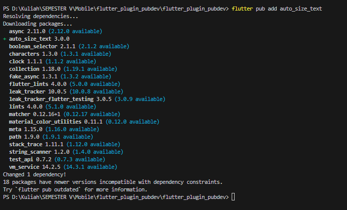

# Chyntia Santi Nur Trisnawati / 2241720017

## PRAKTIKUM 

### Langkah 1: Buat Project Baru
Buatlah sebuah project flutter baru dengan nama flutter_plugin_pubdev. Lalu jadikan repository di GitHub Anda dengan nama flutter_plugin_pubdev.

### Langkah 2: Menambahkan Plugin
Tambahkan plugin auto_size_text menggunakan perintah berikut di terminal


Jika berhasil, maka akan tampil nama plugin beserta versinya di file pubspec.yaml pada bagian dependencies.

### Langkah 3: Buat file red_text_widget.dart

Buat file baru bernama red_text_widget.dart di dalam folder lib lalu isi kode seperti berikut.
```
import 'package:flutter/material.dart';

class RedTextWidget extends StatelessWidget {
  const RedTextWidget({Key? key}) : super(key: key);

  @override
  Widget build(BuildContext context) {
    return Container();
  }
}
```

### Langkah 4: Tambah Widget AutoSizeText

Masih di file red_text_widget.dart, untuk menggunakan plugin auto_size_text, ubahlah kode return Container() menjadi seperti berikut.

```
import 'package:auto_size_text/auto_size_text.dart';
import 'package:flutter/material.dart';

class RedTextWidget extends StatelessWidget {
  final String text; // Add this line to declare the 'text' property

  const RedTextWidget({Key? key, required this.text}) : super(key: key); // Accept 'text' as a required parameter

  @override
  Widget build(BuildContext context) {
    return AutoSizeText(
      text,
      style: const TextStyle(color: Colors.red, fontSize: 14),
      maxLines: 2,
      overflow: TextOverflow.ellipsis,
    );
  }
}
```

Setelah Anda menambahkan kode di atas, Anda akan mendapatkan info error. Mengapa demikian? Jelaskan dalam laporan praktikum Anda!

### Langkah 5: Buat Variabel text dan parameter di constructor

Tambahkan variabel text dan parameter di constructor seperti berikut.
```
import 'package:auto_size_text/auto_size_text.dart';
import 'package:flutter/material.dart';

class RedTextWidget extends StatelessWidget {
  final String text; // Define the text variable

  const RedTextWidget({Key? key, required this.text}) : super(key: key);

  @override
  Widget build(BuildContext context) {
    return AutoSizeText(
      text, // Use the text parameter
      style: const TextStyle(color: Colors.red, fontSize: 14),
      maxLines: 2,
      overflow: TextOverflow.ellipsis,
    );
  }
}
```

### Langkah 6: Tambahkan widget di main.dart

Buka file main.dart lalu tambahkan di dalam children: pada class _MyHomePageState

```
import 'package:flutter/material.dart';
import 'package:auto_size_text/auto_size_text.dart';

void main() {
  runApp(const MyApp());
}

class MyApp extends StatelessWidget {
  const MyApp({Key? key}) : super(key: key);

  @override
  Widget build(BuildContext context) {
    return MaterialApp(
      title: 'Flutter Demo',
      theme: ThemeData(
        primarySwatch: Colors.blue,
      ),
      home: const MyHomePage(),
    );
  }
}

class MyHomePage extends StatefulWidget {
  const MyHomePage({Key? key}) : super(key: key);

  @override
  State<MyHomePage> createState() => _MyHomePageState();
}

class _MyHomePageState extends State<MyHomePage> {
  int _counter = 0;

  void _incrementCounter() {
    setState(() {
      _counter++;
    });
  }

  @override
  Widget build(BuildContext context) {
    return Scaffold(
      appBar: AppBar(
        backgroundColor: Colors.blue, // Set AppBar background to blue
        title: const Text(
          'Flutter Demo Home Page',
          style:
              TextStyle(color: Colors.white), // Set title text color to white
        ),
      ),
      body: Center(
        child: Column(
          mainAxisAlignment: MainAxisAlignment.center,
          children: <Widget>[
            Container(
              color: Colors.yellowAccent,
              width: 100,
              padding: const EdgeInsets.all(4.0),
              child: const RedTextWidget(
                text: 'You have pushed...',
              ),
            ),
            Container(
              color: Colors.greenAccent,
              width: 150,
              padding: const EdgeInsets.all(4.0),
              child: const Text(
                'You have pushed the button this many times:',
                textAlign: TextAlign.center,
                style: TextStyle(fontSize: 16),
              ),
            ),
            Text(
              '$_counter',
              style: Theme.of(context).textTheme.headlineMedium,
            ),
          ],
        ),
      ),
      floatingActionButton: FloatingActionButton(
        onPressed: _incrementCounter,
        tooltip: 'Increment',
        backgroundColor: Colors.blue, // Blue background
        foregroundColor: Colors.white, // White "+" icon
        child: const Icon(Icons.add),
      ),
    );
  }
}

class RedTextWidget extends StatelessWidget {
  final String text;

  const RedTextWidget({Key? key, required this.text}) : super(key: key);

  @override
  Widget build(BuildContext context) {
    return AutoSizeText(
      text,
      style: const TextStyle(color: Colors.red, fontSize: 14),
      maxLines: 1,
      overflow: TextOverflow.ellipsis,
      textAlign: TextAlign.center,
    );
  }
}
```
Hasil ketika dijalankan adalah sebegai berikut


# Tugas Praktikum
1. Selesaikan Praktikum tersebut, lalu dokumentasikan dan push ke repository Anda berupa screenshot hasil pekerjaan beserta penjelasannya di file README.md!

Sudah dilaksanakan

2. Jelaskan maksud dari langkah 2 pada praktikum tersebut!

Perintah flutter pub add auto_size_text digunakan untuk menambahkan pustaka auto_size_text ke dalam proyek Flutter. Pustaka ini berguna untuk membuat teks yang dapat menyesuaikan ukurannya secara otomatis agar pas dengan ruang yang tersedia, sehingga sangat bermanfaat dalam antarmuka pengguna yang responsif. Dengan auto_size_text, teks akan secara otomatis mengecil ketika ruangnya terbatas, tanpa perlu mengatur ukuran teks secara manual.

3. Jelaskan maksud dari langkah 5 pada praktikum tersebut!

Kode ini mendefinisikan widget RedTextWidget dengan sebuah variabel final String text; yang menyimpan teks yang ditampilkan. Konstruktor RedTextWidget menggunakan required this.text, memastikan teks harus diisi saat widget dibuat, dan const membuat widget ini tidak bisa diubah setelah dibuat, sehingga lebih efisien. Parameter Key? key membantu dalam identifikasi widget saat dibangun di pohon widget Flutter.

4. Pada langkah 6 terdapat dua widget yang ditambahkan, jelaskan fungsi dan perbedaannya!

Container Pertama:
Container pertama memiliki lebar 50 piksel dan warna latar belakang kuning (yellowAccent). Di dalamnya terdapat widget kustom RedTextWidget, yang kemungkinan menampilkan teks dengan warna merah, meskipun fungsi pastinya bergantung pada definisi dari widget tersebut.

Container Kedua:
Container kedua memiliki lebar 100 piksel dengan warna latar belakang hijau (greenAccent). Di dalamnya terdapat widget Text bawaan Flutter, yang menampilkan teks biasa tanpa format khusus seperti warna atau gaya tertentu.

PERBEDAAN 

Perbedaannya adalah:

- Lebar: Container pertama 50px, kedua 100px.
- Warna Latar: Container pertama kuning, kedua hijau.
- Widget Anak: Container pertama pakai RedTextWidget (kemungkinan teks merah), kedua pakai Text biasa.


5. Jelaskan maksud dari tiap parameter yang ada di dalam plugin auto_size_text berdasarkan tautan pada dokumentasi ini !

Berikut adalah beberapa parameter utama dalam widget AutoSizeText:

- minFontSize: Menentukan ukuran font minimum saat teks diubah ukurannya.
- maxFontSize: Menetapkan ukuran font maksimum.
- stepGranularity: Menentukan seberapa banyak ukuran font berkurang dalam setiap langkah saat diubah.
- presetFontSizes: Memungkinkan ukuran font tertentu untuk mengatur ulang ukuran font.
- group: Menyinkronkan ukuran font di beberapa widget AutoSizeText.
- overflowReplacement: Menampilkan widget alternatif jika teks meluap.

6. Kumpulkan laporan praktikum Anda berupa link repository GitHub kepada dosen!