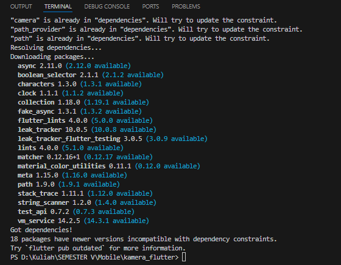

# Chyntia Santi Nur Trisnawati / 2241720017

# Praktikum 1: Mengambil Foto dengan Kamera di Flutter
## Langkah 1: Buat Project Baru
Buatlah sebuah project flutter baru dengan nama kamera_flutter, lalu sesuaikan style laporan praktikum yang Anda buat.

## Langkah 2: Tambah dependensi yang diperlukan
Anda memerlukan tiga dependensi pada project flutter untuk menyelesaikan praktikum ini.
- camera → menyediakan seperangkat alat untuk bekerja dengan kamera pada device.
- path_provider → menyediakan lokasi atau path untuk menyimpan hasil foto.
- path → membuat path untuk mendukung berbagai platform.
- Untuk menambahkan dependensi plugin, jalankan perintah flutter pub add seperti berikut di terminal:

```
flutter pub add camera path_provider path
```

Hasil ketika dijalankan adalah sebagai berikut


## Langkah 3: Ambil Sensor Kamera dari device
Selanjutnya, kita perlu mengecek jumlah kamera yang tersedia pada perangkat menggunakan plugin camera seperti pada kode berikut ini. Kode ini letakkan dalam void main().

lib/main.dart
```
// Ensure that plugin services are initialized so that `availableCameras()`
// can be called before `runApp()`
WidgetsFlutterBinding.ensureInitialized();

// Obtain a list of the available cameras on the device.
final cameras = await availableCameras();

// Get a specific camera from the list of available cameras.
final firstCamera = cameras.first;
```

Ubah void main() menjadi async function seperti berikut ini.

lib/main.dart
```
Future<void> main() async {
  ...
}
```

Pastikan melakukan impor plugin sesuai yang dibutuhkan.

Kode Program
```
import 'package:flutter/material.dart';
import 'package:camera/camera.dart';

Future<void> main() async {
  // Pastikan plugin services diinisialisasi sebelum `availableCameras()` dipanggil
  WidgetsFlutterBinding.ensureInitialized();

  // Mendapatkan daftar kamera yang tersedia pada perangkat
  final cameras = await availableCameras();

  // Mendapatkan kamera pertama dari daftar kamera yang tersedia
  final firstCamera = cameras.first;

  // Jalankan aplikasi dan pass firstCamera jika perlu
  runApp(MyApp(camera: firstCamera));
}

class MyApp extends StatelessWidget {
  final CameraDescription camera;

  MyApp({required this.camera});

  @override
  Widget build(BuildContext context) {
    return MaterialApp(
      title: 'Camera App',
      theme: ThemeData(
        primarySwatch: Colors.blue,
      ),
      home: CameraScreen(camera: camera),
    );
  }
}

class CameraScreen extends StatelessWidget {
  final CameraDescription camera;

  CameraScreen({required this.camera});

  @override
  Widget build(BuildContext context) {
    return Scaffold(
      appBar: AppBar(
        title: Text('Camera Preview'),
      ),
      body: Center(
        child: Text('Camera: ${camera.name}'),
      ),
    );
  }
}
```

## Langkah 4: Buat dan inisialisasi CameraController

Setelah Anda dapat mengakses kamera, gunakan langkah-langkah berikut untuk membuat dan menginisialisasi CameraController. Pada langkah berikut ini, Anda akan membuat koneksi ke kamera perangkat yang memungkinkan Anda untuk mengontrol kamera dan menampilkan pratinjau umpan kamera.

    1. Buat StatefulWidget dengan kelas State pendamping.
    2. Tambahkan variabel ke kelas State untuk menyimpan CameraController.
    3. Tambahkan variabel ke kelas State untuk menyimpan Future yang dikembalikan dari CameraController.initialize().
    5. Buat dan inisialisasi controller dalam metode initState().
    6. Hapus controller dalam metode dispose().

lib/widget/takepicture_screen.dart

```
// A screen that allows users to take a picture using a given camera.
class TakePictureScreen extends StatefulWidget {
  const TakePictureScreen({
    super.key,
    required this.camera,
  });

  final CameraDescription camera;

  @override
  TakePictureScreenState createState() => TakePictureScreenState();
}

class TakePictureScreenState extends State<TakePictureScreen> {
  late CameraController _controller;
  late Future<void> _initializeControllerFuture;

  @override
  void initState() {
    super.initState();
    // To display the current output from the Camera,
    // create a CameraController.
    _controller = CameraController(
      // Get a specific camera from the list of available cameras.
      widget.camera,
      // Define the resolution to use.
      ResolutionPreset.medium,
    );

    // Next, initialize the controller. This returns a Future.
    _initializeControllerFuture = _controller.initialize();
  }

  @override
  void dispose() {
    // Dispose of the controller when the widget is disposed.
    _controller.dispose();
    super.dispose();
  }

  @override
  Widget build(BuildContext context) {
    // Fill this out in the next steps.
    return Container();
  }
}
```

