# Pertemuan 3

### Praktikum 1: Menerapkan Control Flows ("if/else")

Selesaikan langkah-langkah praktikum berikut ini menggunakan DartPad di browser Anda.

### Langkah 1:

Ketik atau salin kode program berikut ke dalam fungsi main() 
void main() { 
String test = "test2"; 

if (test == "test1") {  
print("Test1");  
} else if (test == "test2") { // menggunakan else if (huruf kecil) 
print("Test2"); 
} else {  
print("Something else"); 
} 
if (test == "test2") print("Test2 again"); // statement satu baris tanpa tanda kurung kurawal  
}  

### Langkah 2:  

Silakan coba eksekusi (Run) kode pada langkah 1 tersebut. Apa yang terjadi? Jelaskan! 
Hasil ketika dijalankan adalah sebagai berikut
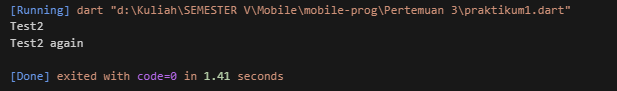  
Yang terjadi adalah ketika dijalankan outputnya ada dua yang pertama karena yang dipanggil adalah "test2" maka outputnya adalah "Test2" kemudian setelah di jalankan jika "test2" maka print di print lagi "Test2 again" sehingga terdapat dua output ketika dijalankan.

### Langkah 3:

Tambahkan kode program berikut, lalu coba eksekusi (Run) kode Anda.
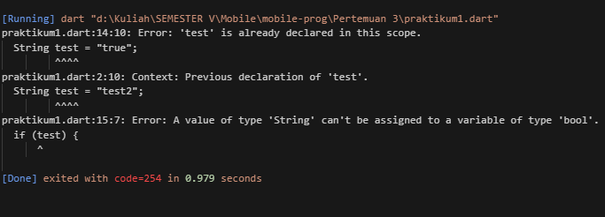  
Terjadi eror karena Error ariabel test dideklarasikan dua kali, yang tidak diizinkan Dart, dan kondisi if (test) mencoba menggunakan string sebagai boolean, yang menyebabkan kesalahan. Solusinya, gunakan nama variabel unik dan pastikan kondisi if membandingkan string, seperti if.
Berikut adalah kode program yang sudah dibenarkan 
(test == "true").  
void main() {  
String test = "test2";  
 
if (test == "test1") {  
print("Test1");  
} else if (test == "test2") {  
print("Test2");  
} else {  
print("Something else");  
}  
 
if (test == "test2") print("Test2 again");  
 
// Ganti nama variabel dan perbaiki kondisi if  
String test2 = "true";  
if (test2 == "true") { // Kondisi yang benar untuk mengecek string "true"  
print("Kebenaran"); 
}  
}  
Berikut adalah hasil ketika dijalankan  
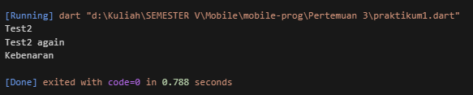  

### Praktikum 2: Menerapkan Perulangan "while" dan "do-while

Selesaikan langkah-langkah praktikum berikut ini menggunakan DartPad di browser Anda.

### Langkah 1:

Ketik atau salin kode program berikut ke dalam fungsi main().  
void main() {  
while (counter < 33) {  
print(counter);  
counter++;  
}  
}  

### Langkah 2:

Silakan coba eksekusi (Run) kode pada langkah 1 tersebut. Apa yang terjadi? Jelaskan! Lalu perbaiki jika terjadi error.  
Terjadi eror seperti berikut
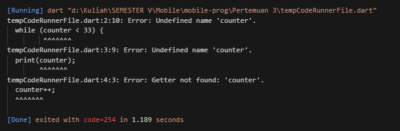  
Eror tersebut terjadi karena variabel counter belum dideklarasikan. Berikut adalah kode program yang sudah dibenarkan  
void main() { 
int counter = 0; // Deklarasikan counter 
while (counter < 33) {  
print(counter);  
counter++;  
}  
}  
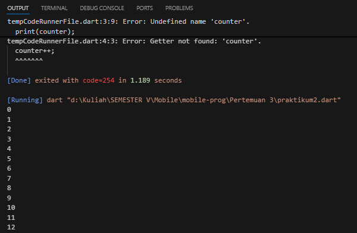

### Langkah 3:

Tambahkan kode program berikut, lalu coba eksekusi (Run) kode Anda.  
do {  
print(counter);  
counter++;  
} while (counter < 77);  
Apa yang terjadi ? Jika terjadi error, silakan perbaiki namun tetap menggunakan do-while. 
Hasil ketika dijalankan tidak error namun menjadikan output tidak sesuai sehingga berikut adalah kode program yang sudah benar  
void main() {  
int counter = 0; // Deklarasikan counter  
 
// Loop pertama dengan do-while  
do {  
print(counter);  
counter++;  
} while (counter < 77); 
 
// Loop kedua dengan while (tidak akan dieksekusi karena counter >= 33)  
while (counter < 33) { 
print(counter); 
counter++; 
} 
} 
Hasil ketika dijalankan adalah sebagai berikut
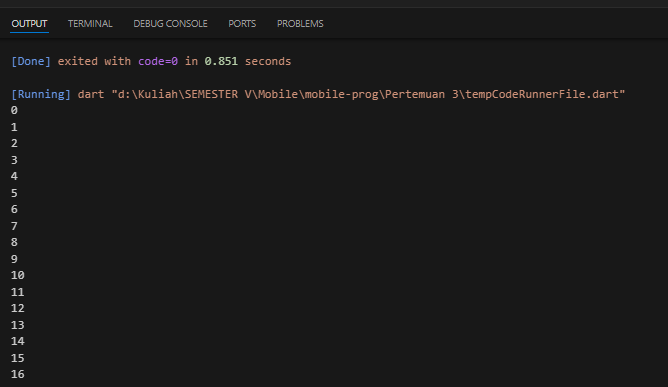  

### Praktikum 3: Menerapkan Perulangan "for" dan "break-continue"

Selesaikan langkah-langkah praktikum berikut ini menggunakan DartPad di browser Anda.  

### Langkah 1:  

Ketik atau salin kode program berikut ke dalam fungsi main().  
for (Index = 10; index < 27; index) {  
print(Index);  
} 

### Langkah 2:

Silakan coba eksekusi (Run) kode pada langkah 1 tersebut. Apa yang terjadi? Jelaskan! Lalu perbaiki jika terjadi error.  
Hasil ketika dijalankan adalah eror sebagai berikut  
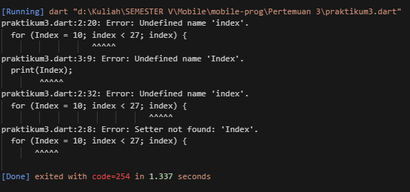  
Alasannya yaitu Kode mengalami error karena variabel index tidak dideklarasikan terlebih dahulu, sehingga program tidak mengetahui tipe data dari index. Berikut adalah kode yang sudah diperbaiki  
void main() {  
for (int index = 10; index < 27; index++) {  
print(index);  
}  
}  
Hasil ketika dijalankan adalah sebagai berikut  
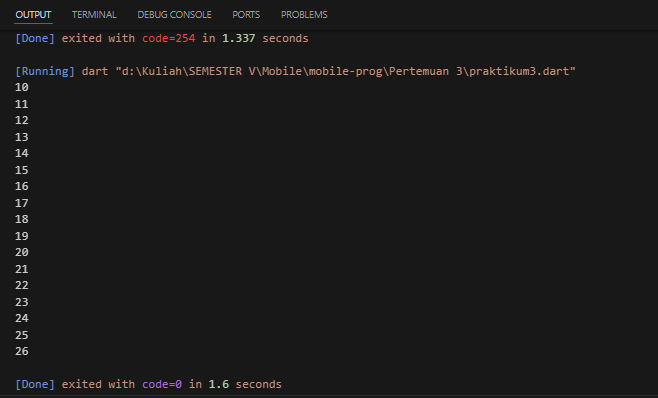

### Langkah 3:

Tambahkan kode program berikut di dalam for-loop, lalu coba eksekusi (Run) kode Anda.  
If (Index == 21) break;  
Else If (index > 1 || index < 7) continue;  
print(index);  
Apa yang terjadi ? Jika terjadi error, silakan perbaiki namun tetap menggunakan for dan break-continue.  
Hasil ketika dijalankan adalah eror, sehingga kode program perbaikannya adalah sebagai berikut :  
void main() { 
for (int index = 10; index < 27; index++) { 
if (index == 21) break; // Hentikan loop jika index sama dengan 21 
if (index > 1 && index < 7) continue; // Lewati cetak jika index antara 2 dan 6 
print(index); // Cetak index jika tidak memenuhi kondisi di atas 
} 
} 
Hasil ketika dijalankan adalah sebagai berikut :  
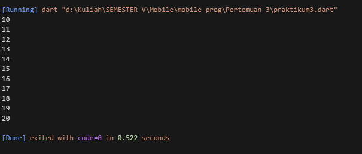  

### Tugas Praktikum

1. Silakan selesaikan Praktikum 1 sampai 3, lalu dokumentasikan berupa screenshot hasil pekerjaan beserta penjelasannya!  
2. Buatlah sebuah program yang dapat menampilkan bilangan prima dari angka 0 sampai 201 menggunakan Dart. Ketika bilangan prima ditemukan, maka tampilkan nama lengkap dan NIM Anda.  
   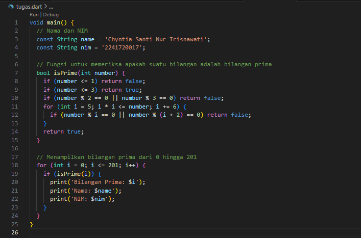  
   hasil ketika dijalankan adalah sebagai berikut  
   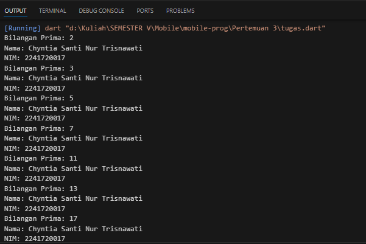  
3. Kumpulkan berupa link commit repo GitHub pada tautan yang telah disediakan di grup Telegram!
