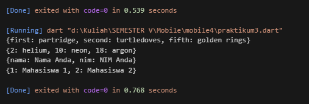
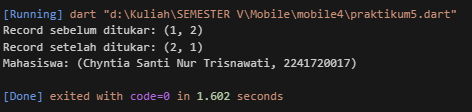

# Praktikum 1: Eksperimen Tipe Data List
## Langkah 1:

Ketik atau salin kode program berikut ke dalam void main().
``` 
var list = [1, 2, 3];
assert(list.length == 3);
assert(list[1] == 2);
print(list.length);
print(list[1]);

list[1] = 1;
assert(list[1] == 1);
print(list[1]);
```
## Langkah 2:

Silakan coba eksekusi (Run) kode pada langkah 1 tersebut. Apa yang terjadi? Jelaskan! <br>
Hasil ketika dijalankan adalah sebagai berikut
 <br>
Kode tersebut menyebabkan error karena asersi pertama memeriksa apakah panjang array list sama dengan 3, padahal panjangnya 5, sehingga asersi gagal. Asersi kedua juga salah karena memeriksa apakah elemen kedua adalah 2, sedangkan nilainya 1. Selain itu, penggunaan fungsi print() tidak valid di JavaScript, seharusnya menggunakan console.log() untuk mencetak output. Kode dapat diperbaiki dengan mengganti asersi yang sesuai dengan panjang dan nilai elemen yang benar, serta mengganti print() dengan console.log().


``` 
void main() {
  var list = [1, 2, 3];
  
  assert(list.length == 3);
  assert(list[1] == 2);
  
  print(list.length);  // Output: 3
  print(list[1]);      // Output: 2
  
  list[1] = 1;
  
  assert(list[1] == 1);
  print(list[1]);      // Output: 1
} 
```
Hasil ketika dijalankan <br>


## Langkah 3:

Ubah kode pada langkah 1 menjadi variabel final yang mempunyai index = 5 dengan default value = null. Isilah nama dan NIM Anda pada elemen index ke-1 dan ke-2. Lalu print dan capture hasilnya.

Apa yang terjadi ? Jika terjadi error, silakan perbaiki.

Terjadi eror seperti berikut
``` 
void main() {
  void main() {
  // Mengubah list menjadi variabel final dengan panjang 5 dan nilai default null
  final list = List.filled(5, null);
  
  // Mengisi elemen index ke-1 dan ke-2 dengan nama dan NIM
  list[1] = "Chyntia Santi Nur Trisnawati";  // Ganti dengan nama Anda
  list[2] = "2241720017";   // Ganti dengan NIM Anda
  
  assert(list.length == 5);
  
  print(list.length);  // Output: 5
  print(list[1]);      // Output: Nama Anda
  print(list[2]);      // Output: NIM Anda
}

}
```
Hasil ketika dijalankan <br> 


Perbaikan kode <br>
``` 
void main() {
  // Membuat list dengan panjang 5 dan nilai default null
  List<String?> list = List.filled(5, null);

  // Isi elemen indeks ke-0 dengan nama
  list[0] = "Chyntia Santi Nur Trisnawati";

  // Isi elemen indeks ke-1 dengan NIM
  list[1] = "2241720017";

  // Mencetak isi list
  print(list);
}
```
Hasil ketika dijalankan <br>


# Praktikum 2: Eksperimen Tipe Data Set
## Langkah 1:

Ketik atau salin kode program berikut ke dalam fungsi main().
``` 
void main() {
  var halogens = {'fluorine', 'chlorine', 'bromine', 'iodine', 'astatine'};
  print(halogens);  // Output: {fluorine, chlorine, bromine, iodine, astatine}
}
```
## Langkah 2:

Silakan coba eksekusi (Run) kode pada langkah 1 tersebut. Apa yang terjadi? Jelaskan! Lalu perbaiki jika terjadi error. <br>
Hasil ketika dijalankan tidak terjadi eror, Kode di atas mendeklarasikan sebuah set bernama halogens yang berisi unsur-unsur halogen: 'fluorine', 'chlorine', 'bromine', 'iodine', dan 'astatine'. Set dalam Dart adalah koleksi elemen yang unik dan tidak terurut, sehingga elemen-elemen dalam set tidak akan muncul lebih dari sekali dan urutannya bisa berbeda setiap kali dicetak. Perintah print(halogens) akan menampilkan seluruh elemen dalam set ke konsol tanpa menjamin urutannya. <br>
Outpunya adalah sebagai berikut <br>


## Langkah 3:

Tambahkan kode program berikut, lalu coba eksekusi (Run) kode Anda.

``` 
var names1 = <String>{};
Set<String> names2 = {}; // This works, too.
var names3 = {}; // Creates a map, not a set.

print(names1);
print(names2);
print(names3);
```
Apa yang terjadi ? Jika terjadi error, silakan perbaiki namun tetap menggunakan ketiga variabel tersebut. Tambahkan elemen nama dan NIM Anda pada kedua variabel Set tersebut dengan dua fungsi berbeda yaitu .add() dan .addAll(). <br>
Yang terjadi adalah tidak ada eror, Kode tersebut mendeklarasikan tiga variabel: names1 dan names2 sebagai set kosong bertipe String, sementara names3 diinterpretasikan sebagai map kosong karena menggunakan {} tanpa tipe eksplisit. Meskipun output cetaknya sama ({}), names3 sebenarnya adalah map, bukan set. <br>
Berikut Hasilnya <br>


Perbaiki kode baru
``` 
void main() {
  var names1 = <String>{};
  Set<String> names2 = {}; // Ini juga set kosong
  var names3 = {}; // Ini akan menjadi map kosong

  // Menambahkan elemen pada Set names1 menggunakan .add()
  names1.add("Chyntia Santi Nur Trisnwati"); 
  names1.add("2241720017");  

  // Menambahkan elemen pada Set names2 menggunakan .addAll()
  names2.addAll({"Chyntia Santi Nur Trisnwati", "2241720017"});

  print(names1);  
  print(names2);  
  print(names3);  
}
```
Hasil ketika dijalankan adalah sebagai berikut <br>


# Praktikum 3: Eksperimen Tipe Data Maps
## Langkah 1:

Ketik atau salin kode program berikut ke dalam fungsi main().
``` 
void main() {
  var gifts = {
  // Key:    Value
  'first': 'partridge',
  'second': 'turtledoves',
  'fifth': 1
};

var nobleGases = {
  2: 'helium',
  10: 'neon',
  18: 2,
};

print(gifts);
print(nobleGases);
}
```

## Langkah 2:

Silakan coba eksekusi (Run) kode pada langkah 1 tersebut. Apa yang terjadi? Jelaskan! Lalu perbaiki jika terjadi error. <br>
Tidak terjadi eror, Kode tersebut mendefinisikan dua map di Dart: gifts dan nobleGases. Map gifts memiliki pasangan kunci-nilai dengan kunci berupa string seperti 'first', 'second', dan 'fifth', serta nilai yang bervariasi antara string dan integer. Sementara itu, map nobleGases menggunakan kunci berupa angka (2, 10, 18) dengan nilai yang juga bervariasi, terdiri dari string ('helium', 'neon') dan integer (2). Ketika dicetak, kedua map menunjukkan pasangan kunci-nilai sesuai urutan deklarasi, yang menunjukkan bahwa Dart mendukung tipe data campuran untuk kunci maupun nilai dalam map. <br>

Hasil ketika dijalankan adalah sebagai berikut <br>


## Langkah 3:

Tambahkan kode program berikut, lalu coba eksekusi (Run) kode Anda.
``` 
var mhs1 = Map<String, String>();
gifts['first'] = 'partridge';
gifts['second'] = 'turtledoves';
gifts['fifth'] = 'golden rings';

var mhs2 = Map<int, String>();
nobleGases[2] = 'helium';
nobleGases[10] = 'neon';
nobleGases[18] = 'argon';
```
Hasil ketika dijalankan adalah sebagai berikut <br>
 <br>


Program Dart di atas mendefinisikan dua peta: gifts dan nobleGases. Peta gifts berisi hadiah dengan kunci bertipe string, di mana item 'fifth' diperbarui menjadi 'golden rings'. Peta nobleGases menyimpan nama gas mulia dengan kunci bertipe integer, di mana item dengan kunci 18 diubah menjadi 'argon'. Dua map kosong, mhs1 dan mhs2, dideklarasikan tetapi tidak diisi. Ketika dicetak, gifts dan nobleGases menunjukkan isi yang telah diperbarui, sementara mhs1 dan mhs2 tetap kosong.

Kode yang lebih benar adalah sebagai berikut
``` 
void main() {
  var gifts = {
    // Key:    Value
    'first': 'partridge',
    'second': 'turtledoves',
    'fifth': 'golden rings' // Memperbaiki nilai untuk kunci 'fifth'
  };

  var nobleGases = {
    2: 'helium',
    10: 'neon',
    18: 'argon', // Memperbaiki nilai untuk kunci 18
  };

  var mhs1 = <String, String>{}; // Membuat map kosong dengan tipe String
  var mhs2 = <int, String>{}; // Membuat map kosong dengan tipe int dan String

  // Menambahkan elemen ke mhs1
  mhs1['nama'] = 'Nama Anda';  // Ganti dengan nama Anda
  mhs1['nim'] = 'NIM Anda';    // Ganti dengan NIM Anda

  // Menambahkan elemen ke mhs2
  mhs2[1] = 'Mahasiswa 1'; // Contoh penambahan mahasiswa
  mhs2[2] = 'Mahasiswa 2'; // Contoh penambahan mahasiswa

  print(gifts);
  print(nobleGases);
  print(mhs1);
  print(mhs2);
}
```
Hasil ketika dijalankan adalah sebagai berikut <br>


## Langkah 1:

Ketik atau salin kode program berikut ke dalam fungsi main().
``` 
var list = [1, 2, 3];
var list2 = [0, ...list];
print(list1);
print(list2);
print(list2.length);
```
## Langkah 2:

Silakan coba eksekusi (Run) kode pada langkah 1 tersebut. Apa yang terjadi? Jelaskan! Lalu perbaiki jika terjadi error.

Hasil ketika dijalankan adalah eror sebagai berikut <br>
 <br>
Berikut adalah kode program yang sudah benar 
``` 
void main() {
  var list = [1, 2, 3];
  var list2 = [0, ...list]; 
  
  print(list);    
  print(list2);   
  print(list2.length); 
}
```
Hasil ketika dijalankan <br>


## Langkah 3:

Tambahkan kode program berikut, lalu coba eksekusi (Run) kode Anda.
``` 
list1 = [1, 2, null];
print(list1);
var list3 = [0, ...?list1];
print(list3.length);
```

Apa yang terjadi ? Jika terjadi error, silakan perbaiki.

Tambahkan variabel list berisi NIM Anda menggunakan Spread Operators. Dokumentasikan hasilnya dan buat laporannya! <br>

 <br>
Kode Program yang sudah dimodifikasi <br>
``` 
void main() {
  var list = [1, 2, 3]; // Daftar awal
  var nim = ['2241720017'];
  var list2 = [0, ...list]; 
  
  print(list);    
  print(list2);   
  print(list2.length); 

  var list1 = [1, 2, null]; 
  print(list1);
  
  var list3 = [0, ...?list1, ...nim]; // Menambahkan NIM Anda menggunakan Spread Operator
  print(list3); // Mencetak list3
  print(list3.length); // Mencetak panjang list3
}
```
Hasil ketika dijalankan adalah sebagai berikut <br>
 <br>

## Langkah 4:

Tambahkan kode program berikut, lalu coba eksekusi (Run) kode Anda.
``` 
var nav = ['Home', 'Furniture', 'Plants', if (promoActive) 'Outlet'];
print(nav);
```
Apa yang terjadi ? Jika terjadi error, silakan perbaiki. Tunjukkan hasilnya jika variabel promoActive ketika true dan false.<br>
Terjadi eror seperti pada gambar berikut <br>
 <br>
Permbetulan kode program adalah sebagai berikut
``` 
void main() {
  var list = [1, 2, 3]; // Daftar awal
  var nim = ['2241720017'];
  var list2 = [0, ...list]; // Spread operator untuk menambahkan list ke dalam list2
  
  print('List awal: $list');    
  print('List 2: $list2');   
  print('Panjang list2: ${list2.length}'); // Mencetak panjang list2

  var list1 = [1, 2, null]; // List yang mengandung null
  print('List 1: $list1');
  
  var list3 = [0, ...?list1, ...nim]; // Menambahkan NIM menggunakan spread operator
  print('List 3: $list3'); // Mencetak list3
  print('Panjang list3: ${list3.length}'); // Mencetak panjang list3

  // Mendefinisikan promoActive sebelum digunakan
  bool promoActive = true; // Atur nilai variabel promoActive
  var nav = ['Home', 'Furniture', 'Plants', if (promoActive) 'Outlet']; // Menggunakan if conditional
  print('Navigasi (promoActive true): $nav'); // Mencetak navigasi jika promoActive true

  // Uji dengan promoActive sebagai false
  promoActive = false; // Ubah nilai variabel promoActive
  nav = ['Home', 'Furniture', 'Plants', if (promoActive) 'Outlet']; // Menggunakan if conditional
  print('Navigasi (promoActive false): $nav'); // Mencetak navigasi jika promoActive false
}
```
Hasil ketika dijalankan adalah sebagai berikut <br>


## Langkah 5:

Tambahkan kode program berikut, lalu coba eksekusi (Run) kode Anda.
```
var nav2 = ['Home', 'Furniture', 'Plants', if (login case 'Manager') 'Inventory'];
print(nav2);
```
Apa yang terjadi ? Jika terjadi error, silakan perbaiki. Tunjukkan hasilnya jika variabel login mempunyai kondisi lain. <br>
Hasil ketika dijalankan adalah eror sebagai berikut
 <br>
Berikut adalah pembenaran kodenya <br>
```
void main() {
  var list = [1, 2, 3]; // Daftar awal
  var nim = ['2241720017'];
  var list2 = [0, ...list]; // Spread operator untuk menambahkan list ke dalam list2
  
  print('List awal: $list');    
  print('List 2: $list2');   
  print('Panjang list2: ${list2.length}'); // Mencetak panjang list2

  var list1 = [1, 2, null]; // List yang mengandung null
  print('List 1: $list1');
  
  var list3 = [0, ...?list1, ...nim]; // Menambahkan NIM menggunakan spread operator
  print('List 3: $list3'); // Mencetak list3
  print('Panjang list3: ${list3.length}'); // Mencetak panjang list3

  // Mendefinisikan promoActive sebelum digunakan
  bool promoActive = true; // Atur nilai variabel promoActive
  var nav = ['Home', 'Furniture', 'Plants', if (promoActive) 'Outlet']; // Menggunakan if conditional
  print('Navigasi (promoActive true): $nav'); // Mencetak navigasi jika promoActive true

  // Uji dengan promoActive sebagai false
  promoActive = false; // Ubah nilai variabel promoActive
  nav = ['Home', 'Furniture', 'Plants', if (promoActive) 'Outlet']; // Menggunakan if conditional
  print('Navigasi (promoActive false): $nav'); // Mencetak navigasi jika promoActive false

  // Definisikan variabel login
  String login = 'Manager'; // Ubah nilai untuk menguji kondisi lain
  var nav2 = ['Home', 'Furniture', 'Plants', if (login == 'Manager') 'Inventory'];
  print('Navigasi dengan login: $nav2'); // Mencetak navigasi berdasarkan login

  // Uji dengan kondisi login lainnya
  login = 'User'; // Ubah nilai untuk menguji kondisi lain
  nav2 = ['Home', 'Furniture', 'Plants', if (login == 'Manager') 'Inventory'];
  print('Navigasi dengan login: $nav2'); // Mencetak navigasi dengan login User
  
  login = 'Admin'; // Ubah nilai untuk menguji kondisi lain
  nav2 = ['Home', 'Furniture', 'Plants', if (login == 'Manager') 'Inventory'];
  print('Navigasi dengan login: $nav2'); // Mencetak navigasi dengan login Admin
}

```
Berikut adalah hasil ketika dijalankan <br>
 <br>

## Langkah 6:

Tambahkan kode program berikut, lalu coba eksekusi (Run) kode Anda.
```
var listOfInts = [1, 2, 3];
var listOfStrings = ['#0', for (var i in listOfInts) '#$i'];
assert(listOfStrings[1] == '#1');
print(listOfStrings);
```
Apa yang terjadi ? Jika terjadi error, silakan perbaiki. Jelaskan manfaat Collection For dan dokumentasikan hasilnya. <br>
Hasil ketika dijalankan adalah eror, berikut adalah kode program dan hasil yang sudah dibenarkan
```
void main() {
  var list = [1, 2, 3]; // Daftar awal
  var nim = ['2241720017'];
  var list2 = [0, ...list]; // Spread operator untuk menambahkan list ke dalam list2
  
  print('List awal: $list');    
  print('List 2: $list2');   
  print('Panjang list2: ${list2.length}'); // Mencetak panjang list2

  var list1 = [1, 2, null]; // List yang mengandung null
  print('List 1: $list1');
  
  var list3 = [0, ...?list1, ...nim]; // Menambahkan NIM menggunakan spread operator
  print('List 3: $list3'); // Mencetak list3
  print('Panjang list3: ${list3.length}'); // Mencetak panjang list3

  // Mendefinisikan promoActive sebelum digunakan
  bool promoActive = true; // Atur nilai variabel promoActive
  var nav = ['Home', 'Furniture', 'Plants', if (promoActive) 'Outlet']; // Menggunakan if conditional
  print('Navigasi (promoActive true): $nav'); // Mencetak navigasi jika promoActive true

  // Uji dengan promoActive sebagai false
  promoActive = false; // Ubah nilai variabel promoActive
  nav = ['Home', 'Furniture', 'Plants', if (promoActive) 'Outlet']; // Menggunakan if conditional
  print('Navigasi (promoActive false): $nav'); // Mencetak navigasi jika promoActive false

  // Definisikan variabel login
  String login = 'Manager'; // Ubah nilai untuk menguji kondisi lain
  var nav2 = ['Home', 'Furniture', 'Plants', if (login == 'Manager') 'Inventory'];
  print('Navigasi dengan login: $nav2'); // Mencetak navigasi berdasarkan login

  // Uji dengan kondisi login lainnya
  login = 'User'; // Ubah nilai untuk menguji kondisi lain
  nav2 = ['Home', 'Furniture', 'Plants', if (login == 'Manager') 'Inventory'];
  print('Navigasi dengan login: $nav2'); // Mencetak navigasi dengan login User
  
  login = 'Admin'; // Ubah nilai untuk menguji kondisi lain
  nav2 = ['Home', 'Furniture', 'Plants', if (login == 'Manager') 'Inventory'];
  print('Navigasi dengan login: $nav2'); // Mencetak navigasi dengan login Admin

  // Menambahkan listOfStrings menggunakan Collection For
  var listOfInts = [1, 2, 3];
  var listOfStrings = ['#0', for (var i in listOfInts) '#$i'];
  assert(listOfStrings[1] == '#1'); // Memastikan elemen kedua adalah '#1'
  print('List of Strings: $listOfStrings');
}
```
Hasil ketika dijalankan <br>


# Praktikum 5: Eksperimen Tipe Data Records

## Langkah 1:

Ketik atau salin kode program berikut ke dalam fungsi main().
```
var record = ('first', a: 2, b: true, 'last');
print(record)
```
## Langkah 2:

Silakan coba eksekusi (Run) kode pada langkah 1 tersebut. Apa yang terjadi? Jelaskan! Lalu perbaiki jika terjadi error. <br>
Ketika kode program dijalankan maka tidak terjadi eror hasil ketika dijalankan adalah sebagai berikut <br>


## Langkah 3:

Tambahkan kode program berikut di luar scope void main(), lalu coba eksekusi (Run) kode Anda.
```
(int, int) tukar((int, int) record) {
  var (a, b) = record;
  return (b, a);
}
```
Apa yang terjadi ? Jika terjadi error, silakan perbaiki. Gunakan fungsi tukar() di dalam main() sehingga tampak jelas proses pertukaran value field di dalam Records. <br>
Hasil ketika dijalankan adalah program tidak mengalami eror, hasilnya adalah sebagai berikut


## Langkah 4:

Tambahkan kode program berikut di dalam scope void main(), lalu coba eksekusi (Run) kode Anda.
```
// Record type annotation in a variable declaration:
(String, int) mahasiswa;
print(mahasiswa);
```
Apa yang terjadi ? Jika terjadi error, silakan perbaiki. Inisialisasi field nama dan NIM Anda pada variabel record mahasiswa di atas. Dokumentasikan hasilnya dan buat laporannya! <br>
Hasil ketika dijalankan adalah terjadi eror, berikut adalah kode program yang sudah diperbaiki dan hasil ketka dijalankan
``` 
// Fungsi untuk menukar dua nilai dalam tuple
(int, int) tukar((int, int) record) {
  var (a, b) = record; // Menggunakan destructuring untuk mendapatkan nilai a dan b
  return (b, a); // Mengembalikan tuple dengan nilai yang ditukar
}

void main() {
  // Membuat record yang merupakan tuple
  var record = (1, 2); // Misalnya tuple dengan dua integer
  print('Record sebelum ditukar: $record');

  // Menggunakan fungsi tukar untuk menukar nilai dalam record
  var swappedRecord = tukar(record);
  print('Record setelah ditukar: $swappedRecord');

  // Inisialisasi record mahasiswa
  (String, int) mahasiswa = ('Chyntia Santi Nur Trisnawati', 2241720017);
  print('Mahasiswa: $mahasiswa');
}
```
 <br>

## Langkah 5:

Tambahkan kode program berikut di dalam scope void main(), lalu coba eksekusi (Run) kode Anda.
```
var mahasiswa2 = ('first', a: 2, b: true, 'last');

print(mahasiswa2.$1); // Prints 'first'
print(mahasiswa2.a); // Prints 2
print(mahasiswa2.b); // Prints true
print(mahasiswa2.$2); // Prints 'last'
```
Apa yang terjadi ? Jika terjadi error, silakan perbaiki. Gantilah salah satu isi record dengan nama dan NIM Anda, lalu dokumentasikan hasilnya dan buat laporannya! <br>
Terjadi eror, berikut adalah hasil kode program yang sudah diperbaiki 
```
// Fungsi untuk menukar dua nilai dalam tuple
(int, int) tukar((int, int) record) {
  var (a, b) = record; // Menggunakan destructuring untuk mendapatkan nilai a dan b
  return (b, a); // Mengembalikan tuple dengan nilai yang ditukar
}

void main() {
  // Membuat record yang merupakan tuple
  var record = (1, 2); // Misalnya tuple dengan dua integer
  print('Record sebelum ditukar: $record');

  // Menggunakan fungsi tukar untuk menukar nilai dalam record
  var swappedRecord = tukar(record);
  print('Record setelah ditukar: $swappedRecord');

  // Inisialisasi record mahasiswa
  (String, int) mahasiswa = ('Chyntia Santi Nur Trisnawati', 2241720017);
  print('Mahasiswa: $mahasiswa');
  // Tuple dengan named fields
  var mahasiswa2 = ('Chyntia Santi Nur Trisnawati', a: 2241720017, b: true, 'last');

  print(mahasiswa2.$1); // Mengakses elemen pertama ('Chyntia Santi Nur Trisnawati')
  print(mahasiswa2.a);  // Mengakses elemen named field 'a' (2241720017)
  print(mahasiswa2.b);  // Mengakses elemen named field 'b' (true)
  print(mahasiswa2.$2); // Mengakses elemen terakhir ('last')
}
```
Hasil ketika dijalankan adalah sebagai berikut<br>


# Tugas Praktikum

## 1. Silakan selesaikan Praktikum 1 sampai 5, lalu dokumentasikan berupa screenshot hasil pekerjaan Anda beserta penjelasannya!
Sudah dilaksanakan
## 2. Jelaskan yang dimaksud Functions dalam bahasa Dart!
Dalam bahasa Dart, functions adalah blok kode yang dapat digunakan kembali untuk melakukan tugas tertentu. Fungsi dapat menerima input (disebut parameter) dan dapat mengembalikan output (disebut return value) setelah melakukan proses tertentu. Fungsi mempermudah pengelolaan kode dengan memungkinkan reuse dan modularitas.

## 3. Jelaskan jenis-jenis parameter di Functions beserta contoh sintaksnya!
1. Positional Parameters (Parameter Posisi)
Parameter ini diisi berdasarkan posisi urutannya di dalam definisi fungsi. Saat fungsi dipanggil, argumen diberikan sesuai dengan urutan parameter tersebut. Contoh:
```
python
Copy code
def greet(name, age):
    print(f"Hello {name}, you are {age} years old.")

greet("Chyntia", 21)
```
2. Default Parameters (Parameter Default)
Parameter default digunakan ketika kita ingin memberikan nilai bawaan (default) jika tidak ada argumen yang diberikan saat fungsi dipanggil. Contoh:
```
python
Copy code
def greet(name, age=21):
    print(f"Hello {name}, you are {age} years old.")

greet("Chyntia")
```
3. Keyword Parameters (Parameter Kata Kunci)
Dalam pemanggilan fungsi, kita bisa secara eksplisit menentukan nilai parameter dengan menyebutkan nama parameternya. Ini memungkinkan kita untuk melewatkan argumen dalam urutan yang tidak harus sesuai. Contoh:
```
python
Copy code
def greet(name, age):
    print(f"Hello {name}, you are {age} years old.")

greet(age=21, name="Chyntia")
```
4. Arbitrary Positional Parameters (Parameter Posisi Sejumlah Tidak Terbatas)
Parameter ini memungkinkan fungsi menerima sejumlah argumen yang tidak terbatas. Ini biasanya didefinisikan dengan menggunakan tanda * sebelum nama parameter. Contoh:
```
python
Copy code
def greet(*names):
    for name in names:
        print(f"Hello {name}")

greet("Chyntia", "Santi", "Nur")
```
5. Arbitrary Keyword Parameters (Parameter Kata Kunci Sejumlah Tidak Terbatas)
Parameter ini memungkinkan fungsi menerima sejumlah argumen kata kunci yang tidak terbatas, biasanya didefinisikan dengan menggunakan tanda ** sebelum nama parameter. Contoh:
```
python
Copy code
def greet(**person):
    print(f"Hello {person['name']}, you are {person['age']} years old.")

greet(name="Chyntia", age=21)
```

Kesimpulan:
- Positional Parameters: Bergantung pada urutan argumen.
- Default Parameters: Memiliki nilai default jika argumen tidak diberikan.
- Keyword Parameters: Argumen diberikan dengan menyebutkan nama parameternya.
- Arbitrary Positional Parameters: Menerima sejumlah argumen tak terbatas.
- Arbitrary Keyword Parameters: Menerima sejumlah argumen kata kunci tak terbatas.

## 4. Jelaskan maksud Functions sebagai first-class objects beserta contoh sintaknya!

Fungsi dianggap sebagai first-class objects (atau first-class citizens) dalam bahasa pemrograman Python. Ini berarti bahwa fungsi dalam Python diperlakukan sebagai objek, sama seperti tipe data lainnya seperti angka, string, atau list. Dengan kata lain, fungsi bisa:
- Menyimpan fungsi dalam variabel: Anda dapat menyimpan fungsi di dalam variabel dan kemudian memanggil fungsi tersebut melalui variabel itu.
- Menggunakan fungsi sebagai argumen: Fungsi dapat diberikan sebagai argumen ke fungsi lain, seperti dalam kasus callback functions.
- Mengembalikan fungsi dari fungsi lain: Anda bisa membuat fungsi yang mengembalikan fungsi lainnya.
- Menyimpan fungsi dalam struktur data: Fungsi bisa disimpan dalam list, dictionary, dan struktur data lainnya.

### Contoh Penerapan
1. Menyimpan Fungsi dalam Variabel
```
python
Copy code
def greet(name):
    return f"Hello, {name}!"

say_hello = greet  # Menyimpan fungsi greet dalam variabel say_hello
print(say_hello("Chyntia"))  # Output: Hello, Chyntia!
```

2. Melewatkan Fungsi sebagai Argumen
```
python
Copy code
def greet(name):
    return f"Hello, {name}!"

def call_function(func, value):
    return func(value)

print(call_function(greet, "Santi"))  # Output: Hello, Santi!
```

3. Mengembalikan Fungsi dari Fungsi Lain
```
python
Copy code
def outer_function(name):
    def inner_function():
        return f"Hello, {name}!"
    return inner_function

greeting = outer_function("Nur")
print(greeting())  # Output: Hello, Nur!
```
Di sini, outer_function mengembalikan fungsi inner_function, yang disimpan dalam variabel greeting dan kemudian dipanggil.

4. Menyimpan Fungsi dalam Struktur Data
```
python
Copy code
def add(x, y):
    return x + y

def subtract(x, y):
    return x - y

operations = {
    "add": add,
    "subtract": subtract
}

print(operations["add"](5, 3))  # Output: 8
print(operations["subtract"](5, 3))  # Output: 2
```

## 5. Apa itu Anonymous Functions? Jelaskan dan berikan contohnya!

Anonymous Functions, dalam Python, dikenal sebagai fungsi lambda. Fungsi ini disebut anonymous karena tidak perlu dideklarasikan dengan nama seperti fungsi biasa yang menggunakan kata kunci def. Anonymous functions digunakan untuk membuat fungsi kecil, sederhana, dan biasanya hanya terdiri dari satu ekspresi.

Fungsi ini sering digunakan di tempat di mana fungsi sederhana diperlukan untuk operasi yang cepat, seperti dalam filter, map, atau pengurutan.

### Contoh Penggunaan Anonymous Function:
1. Fungsi Lambda Sederhana
```
# Fungsi lambda untuk menambahkan dua angka
add = lambda x, y: x + y
print(add(5, 3))  # Output: 8
```
2. Penggunaan Lambda dalam map()
```
# Menggunakan lambda untuk mengkuadratkan angka dalam list
numbers = [1, 2, 3, 4, 5]
squared_numbers = list(map(lambda x: x**2, numbers))
print(squared_numbers)  # Output: [1, 4, 9, 16, 25]
```
3. Penggunaan Lambda dalam filter()
```
# Menggunakan lambda untuk memfilter angka genap dari list
numbers = [1, 2, 3, 4, 5, 6]
even_numbers = list(filter(lambda x: x % 2 == 0, numbers))
print(even_numbers)  # Output: [2, 4, 6]
```
4. Penggunaan Lambda untuk Pengurutan Kustom
```
# Menggunakan lambda untuk mengurutkan list berdasarkan panjang string
names = ["Chyntia", "Santi", "Nur", "Trisnawati"]
sorted_names = sorted(names, key=lambda name: len(name))
print(sorted_names)  # Output: ['Nur', 'Santi', 'Chyntia', 'Trisnawati']
```
## 6. Jelaskan perbedaan Lexical scope dan Lexical closures! Berikan contohnya!
### Lexical Scope
Lexical scope (atau static scope) adalah konsep dalam pemrograman di mana lingkup atau cakupan variabel ditentukan oleh struktur kode program secara statis, yaitu pada saat kode ditulis. Dalam konsep ini, fungsi akan mencari variabel dari lingkup terdekatnya ke lingkup yang lebih luar, berdasarkan lokasi definisi fungsi di dalam kode (bukan pada saat fungsi tersebut dieksekusi).

Jadi, dalam lexical scope, ketika fungsi dipanggil, ia akan melihat lingkungan di mana fungsi tersebut didefinisikan, bukan lingkungan di mana ia dieksekusi.

### Contoh Lexical Scope:
```
def outer_function():
    x = 10  # Variabel dalam lingkup luar

    def inner_function():
        print(x)  # Mengakses variabel x dari lingkup luar
    
    inner_function()
```
### Lexical Closures
Lexical closures adalah fungsi yang "mengikat" atau "menutup" lingkungannya sehingga dapat mengakses variabel dari lingkup di mana fungsi tersebut didefinisikan, bahkan setelah lingkup tersebut tidak lagi aktif (telah selesai dieksekusi). Ini terjadi ketika fungsi bersarang di dalam fungsi lain dan fungsi dalam (inner function) mengakses variabel dari fungsi luar (outer function). Fungsi tersebut "mengikat" variabel dari lingkup luar, sehingga disebut closure.

Closure memungkinkan fungsi dalam (inner function) untuk mempertahankan referensi ke variabel lingkup luar meskipun lingkup luar sudah selesai dieksekusi.
```
Contoh Lexical Closures:
python
Copy code
def outer_function(x):
    def inner_function(y):
        return x + y  # Menggunakan variabel x dari lingkup luar
    return inner_function

closure_function = outer_function(10)
result = closure_function(5)  # Output: 15
print(result)
```
### Perbedaan Utama antara Lexical Scope dan Lexical Closures:
Lexical Scope:

- Menjelaskan bagaimana lingkup variabel ditentukan berdasarkan tempat fungsi didefinisikan (secara statis).
- Tidak melibatkan konsep penyimpanan lingkungan untuk digunakan kembali setelah fungsi luar selesai.

Lexical Closures:
- Mengacu pada fungsi yang mengikat lingkup luar di mana ia didefinisikan, dan menyimpan lingkungan tersebut sehingga dapat diakses bahkan setelah lingkup luar tidak aktif lagi.
- Closure memungkinkan variabel dari lingkup luar untuk tetap tersedia di dalam fungsi dalam 

## 7. Jelaskan dengan contoh cara membuat return multiple value di Functions!
Di Python, fungsi bisa mengembalikan lebih dari satu nilai. Cara ini sangat berguna ketika kita ingin mengembalikan beberapa hasil dari satu fungsi tanpa harus menggabungkan mereka menjadi satu objek seperti list atau dictionary. Python mendukung pengembalian banyak nilai secara langsung dengan menggunakan tuple secara implisit.

## Contoh 1: Pengembalian Beberapa Nilai dengan Tuple
```
def calculate(a, b):
    sum_result = a + b
    diff_result = a - b
    return sum_result, diff_result  # Mengembalikan dua nilai

# Memanggil fungsi dan menangkap hasilnya
result_sum, result_diff = calculate(10, 5)

print(f"Sum: {result_sum}")      # Output: Sum: 15
print(f"Difference: {result_diff}")  # Output: Difference: 5
```

Contoh 2: Mengembalikan Multiple Values sebagai Tuple Secara Implisit
Python secara otomatis mengemas hasil return yang terpisah menjadi tuple.
```
def get_coordinates():
    x = 10
    y = 20
    z = 30
    return x, y, z  # Mengembalikan tiga nilai

# Meng-unpack nilai ke variabel terpisah
coord_x, coord_y, coord_z = get_coordinates()

print(f"x: {coord_x}, y: {coord_y}, z: {coord_z}")
# Output: x: 10, y: 20, z: 30
```

## Contoh 3: Mengembalikan Multiple Values sebagai List atau Dictionary
Selain tuple, kita juga bisa mengembalikan beberapa nilai dalam bentuk list atau dictionary untuk situasi yang lebih kompleks.

- Mengembalikan sebagai List
```
def calculate(a, b):
    return [a + b, a - b, a * b]  # Mengembalikan list

result = calculate(10, 5)
print(result)  # Output: [15, 5, 50]
```
Mengembalikan sebagai Dictionary
```
def calculate(a, b):
    return {"sum": a + b, "difference": a - b, "product": a * b}

result = calculate(10, 5)
print(result)  # Output: {'sum': 15, 'difference': 5, 'product': 50}
print(result['sum'])  # Output: 15
```
## 8. Kumpulkan berupa link commit repo GitHub pada tautan yang telah disediakan di grup Telegram!


