# Praktikum 1

## Langkah 1: Buat Project Baru

Buatlah sebuah project flutter baru dengan nama layout_flutter. Atau sesuaikan style laporan praktikum yang Anda buat.

## Langkah 2: Buka file lib/main.dart

Buka file main.dart lalu ganti dengan kode berikut. Isi nama dan NIM Anda di text title.

```
import 'package:flutter/material.dart';

void main() => runApp(const MyApp());

class MyApp extends StatelessWidget {
  const MyApp({super.key});

  @override
  Widget build(BuildContext context) {
    return MaterialApp(
      title: 'Flutter layout: Nama dan NIM Anda',
      home: Scaffold(
        appBar: AppBar(
          title: const Text('Flutter layout demo'),
        ),
        body: const Center(
          child: Text('Hello World'),
        ),
      ),
    );
  }
}
```

Hasil ketika dijalankan adalah sebagai berikut
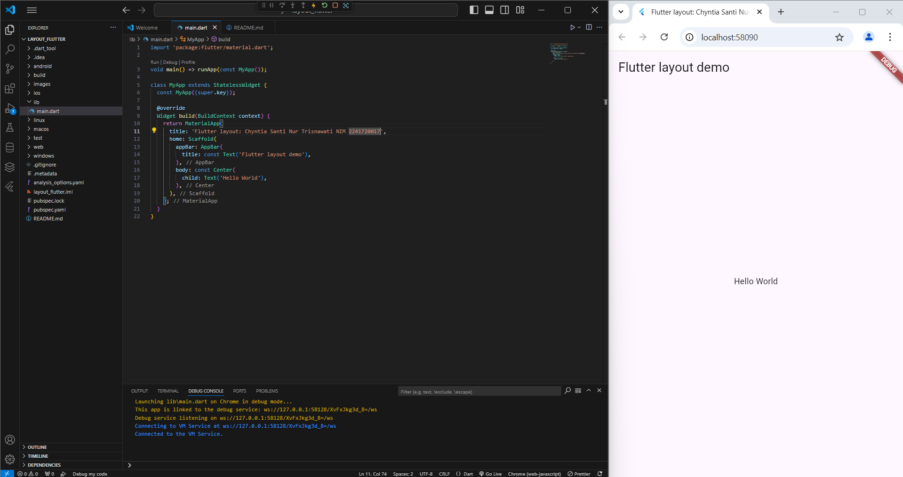

## Langkah 3: Identifikasi layout diagram

Pertama, identifikasi elemen yang lebih besar. Dalam contoh ini, empat elemen disusun menjadi sebuah kolom: sebuah gambar, dua baris, dan satu blok teks.
Selanjutnya, buat diagram setiap baris. Baris pertama, disebut bagian Judul, memiliki 3 anak: kolom teks, ikon bintang, dan angka. Anak pertamanya, kolom, berisi 2 baris teks. Kolom pertama itu memakan banyak ruang, sehingga harus dibungkus dengan widget yang Diperluas.

Baris kedua, disebut bagian Tombol, juga memiliki 3 anak: setiap anak merupakan kolom yang berisi ikon dan teks. Setelah tata letak telah dibuat diagramnya, cara termudah adalah dengan menerapkan pendekatan bottom-up. Untuk meminimalkan kebingungan visual dari kode tata letak yang banyak bertumpuk, tempatkan beberapa implementasi dalam variabel dan fungsi.

## Langkah 4: Implementasi title row

Pertama, Anda akan membuat kolom bagian kiri pada judul. Tambahkan kode berikut di bagian atas metode build() di dalam kelas MyApp:

```
Widget titleSection = Container(
  padding: const EdgeInsets.all(...),
  child: Row(
    children: [
      Expanded(
        /* soal 1*/
        child: Column(
          crossAxisAlignment: ...,
          children: [
            /* soal 2*/
            Container(
              padding: const EdgeInsets.only(bottom: ...),
              child: const Text(
                'Wisata Gunung di Batu',
                style: TextStyle(
                  fontWeight: FontWeight.bold,
                ),
              ),
            ),
            Text(
              'Batu, Malang, Indonesia',
              style: TextStyle(...),
            ),
          ],
        ),
      ),
      /* soal 3*/
      Icon(
       ...,
        color: ...,
      ),
      const Text(...),
    ],
  ),
);
```

/_ soal 1 _/ Letakkan widget Column di dalam widget Expanded agar menyesuaikan ruang yang tersisa di dalam widget Row. Tambahkan properti crossAxisAlignment ke CrossAxisAlignment.start sehingga posisi kolom berada di awal baris.

/_ soal 2 _/ Letakkan baris pertama teks di dalam Container sehingga memungkinkan Anda untuk menambahkan padding = 8. Teks ‘Batu, Malang, Indonesia' di dalam Column, set warna menjadi abu-abu.

/_ soal 3 _/ Dua item terakhir di baris judul adalah ikon bintang, set dengan warna merah, dan teks "41". Seluruh baris ada di dalam Container dan beri padding di sepanjang setiap tepinya sebesar 32 piksel. Kemudian ganti isi body text ‘Hello World' dengan variabel titleSection seperti berikut.

Hasil keseluruhan kode yang sudah dibuat

```
import 'package:flutter/material.dart';

void main() => runApp(const MyApp());

class MyApp extends StatelessWidget {
  const MyApp({super.key});

  @override
  Widget build(BuildContext context) {
    // Menyusun titleSection di dalam build method
    Widget titleSection = Container(
      padding: const EdgeInsets.all(32), // Menambahkan padding
      child: Row(
        children: [
          Expanded(
            /* soal 1: Mengatur kolom bagian kiri */
            child: Column(
              crossAxisAlignment: CrossAxisAlignment.start, // Mengatur alignment kiri
              children: [
                /* soal 2: Menambahkan padding dan teks */
                Container(
                  padding: const EdgeInsets.only(bottom: 8), // Menambahkan padding bawah
                  child: const Text(
                    'Wisata Gunung di Batu',
                    style: TextStyle(
                      fontWeight: FontWeight.bold,
                    ),
                  ),
                ),
                Text(
                  'Batu, Malang, Indonesia',
                  style: TextStyle(
                    color: Colors.grey[500], // Menambahkan warna teks abu-abu
                  ),
                ),
              ],
            ),
          ),
          /* soal 3: Menambahkan ikon dan teks */
          Icon(
            Icons.star,
            color: Colors.red[500], // Warna ikon merah
          ),
          const Text('41'), // Menambahkan teks di sebelah ikon
        ],
      ),
    );

    return MaterialApp(
      title: 'Flutter layout: Chyntia Santi Nur Trisnawati NIM 2241720017',
      home: Scaffold(
        appBar: AppBar(
          title: const Text('Flutter layout demo'),
        ),
        body: Column(
          children: [
            titleSection, // Menampilkan titleSection di body
            const Center(
              child: Text('Hello World'),
            ),
          ],
        ),
      ),
    );
  }
}
```

Hasil ketika gambar dijalankan adalah sebagai berikut
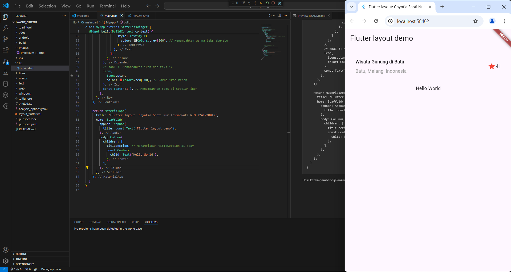

# Praktikum 2: Implementasi button row

Selesaikan langkah-langkah praktikum berikut ini dengan melanjutkan dari praktikum sebelumnya.

## Langkah 1: Buat method Column \_buildButtonColumn

Bagian tombol berisi 3 kolom yang menggunakan tata letak yang sama—sebuah ikon di atas baris teks. Kolom pada baris ini diberi jarak yang sama, dan teks serta ikon diberi warna primer.

Karena kode untuk membangun setiap kolom hampir sama, buatlah metode pembantu pribadi bernama buildButtonColumn(), yang mempunyai parameter warna, Icon dan Text, sehingga dapat mengembalikan kolom dengan widgetnya sesuai dengan warna tertentu.

```
class MyApp extends StatelessWidget {
  const MyApp({super.key});

  @override
  Widget build(BuildContext context) {
    // ···
  }

  Column _buildButtonColumn(Color color, IconData icon, String label) {
    return Column(
      mainAxisSize: MainAxisSize.min,
      mainAxisAlignment: MainAxisAlignment.center,
      children: [
        Icon(icon, color: color),
        Container(
          margin: const EdgeInsets.only(top: 8),
          child: Text(
            label,
            style: TextStyle(
              fontSize: 12,
              fontWeight: FontWeight.w400,
              color: color,
            ),
          ),
        ),
      ],
    );
  }
}
```

## Langkah 2: Buat widget buttonSection

Buat Fungsi untuk menambahkan ikon langsung ke kolom. Teks berada di dalam Container dengan margin hanya di bagian atas, yang memisahkan teks dari ikon.

Bangun baris yang berisi kolom-kolom ini dengan memanggil fungsi dan set warna, Icon, dan teks khusus melalui parameter ke kolom tersebut. Sejajarkan kolom di sepanjang sumbu utama menggunakan MainAxisAlignment.spaceEvenly untuk mengatur ruang kosong secara merata sebelum, di antara, dan setelah setiap kolom. Tambahkan kode berikut tepat di bawah deklarasi titleSection di dalam metode build():

```
Color color = Theme.of(context).primaryColor;

Widget buttonSection = Row(
  mainAxisAlignment: MainAxisAlignment.spaceEvenly,
  children: [
    _buildButtonColumn(color, Icons.call, 'CALL'),
    _buildButtonColumn(color, Icons.near_me, 'ROUTE'),
    _buildButtonColumn(color, Icons.share, 'SHARE'),
  ],
);
```

## Langkah 3: Tambah button section ke body

Tambahkan variabel buttonSection ke dalam body seperti berikut:

## Hasil Kode Program Secara Keseluruhan

```import 'package:flutter/material.dart';

void main() => runApp(const MyApp());

class MyApp extends StatelessWidget {
  const MyApp({super.key});

  @override
  Widget build(BuildContext context) {
    // Menyusun titleSection di dalam build method
    Widget titleSection = Container(
      padding: const EdgeInsets.all(32), // Menambahkan padding
      child: Row(
        children: [
          Expanded(
            /* soal 1: Mengatur kolom bagian kiri */
            child: Column(
              crossAxisAlignment: CrossAxisAlignment.start, // Mengatur alignment kiri
              children: [
                /* soal 2: Menambahkan padding dan teks */
                Container(
                  padding: const EdgeInsets.only(bottom: 8), // Menambahkan padding bawah
                  child: const Text(
                    'Wisata Gunung di Batu',
                    style: TextStyle(
                      fontWeight: FontWeight.bold,
                    ),
                  ),
                ),
                Text(
                  'Batu, Malang, Indonesia',
                  style: TextStyle(
                    color: Colors.grey[500], // Menambahkan warna teks abu-abu
                  ),
                ),
              ],
            ),
          ),
          /* soal 3: Menambahkan ikon dan teks */
          Icon(
            Icons.star,
            color: Colors.red[500], // Warna ikon merah
          ),
          const Text('41'), // Menambahkan teks di sebelah ikon
        ],
      ),
    );

    // Menambahkan buttonSection di bawah titleSection
    Color color = Theme.of(context).primaryColor;

    Widget buttonSection = Row(
      mainAxisAlignment: MainAxisAlignment.spaceEvenly,
      children: [
        _buildButtonColumn(color, Icons.call, 'CALL'),
        _buildButtonColumn(color, Icons.near_me, 'ROUTE'),
        _buildButtonColumn(color, Icons.share, 'SHARE'),
      ],
    );

    return MaterialApp(
      title: 'Flutter layout: Chyntia Santi Nur Trisnawati NIM 2241720017',
      home: Scaffold(
        appBar: AppBar(
          title: const Text('Flutter layout demo'),
        ),
        body: Column(
          children: [
            titleSection, // Menampilkan titleSection di body
            buttonSection, // Menambahkan buttonSection
          ],
        ),
      ),
    );
  }

  Column _buildButtonColumn(Color color, IconData icon, String label) {
    return Column(
      mainAxisSize: MainAxisSize.min,
      mainAxisAlignment: MainAxisAlignment.center,
      children: [
        Icon(icon, color: color),
        Container(
          margin: const EdgeInsets.only(top: 8),
          child: Text(
            label,
            style: TextStyle(
              fontSize: 12,
              fontWeight: FontWeight.w400,
              color: color,
            ),
          ),
        ),
      ],
    );
  }
}
```

Hasil ketika di jalankan adalah sebagai berikut


# Praktikum 3: Implementasi text section

## Langkah 1: Buat widget textSection

Tentukan bagian teks sebagai variabel. Masukkan teks ke dalam Container dan tambahkan padding di sepanjang setiap tepinya. Tambahkan kode berikut tepat di bawah deklarasi buttonSection:

```
Widget textSection = Container(
  padding: const EdgeInsets.all(32),
  child: const Text(
    'Carilah teks di internet yang sesuai '
    'dengan foto atau tempat wisata yang ingin '
    'Anda tampilkan. '
    'Tambahkan nama dan NIM Anda sebagai '
    'identitas hasil pekerjaan Anda. '
    'Selamat mengerjakan 🙂.',
    softWrap: true,
  ),
);
```

Dengan memberi nilai softWrap = true, baris teks akan memenuhi lebar kolom sebelum membungkusnya pada batas kata.

## Langkah 2: Tambahkan variabel text section ke body

## Kode Program seluruhnya

```
import 'package:flutter/material.dart';

void main() => runApp(const MyApp());

class MyApp extends StatelessWidget {
  const MyApp({super.key});

  @override
  Widget build(BuildContext context) {
    // Menyusun titleSection di dalam build method
    Widget titleSection = Container(
      padding: const EdgeInsets.all(32), // Menambahkan padding
      child: Row(
        children: [
          Expanded(
            child: Column(
              crossAxisAlignment:
                  CrossAxisAlignment.start, // Mengatur alignment kiri
              children: [
                Container(
                  padding: const EdgeInsets.only(
                      bottom: 8), // Menambahkan padding bawah
                  child: const Text(
                    'Wisata Gunung di Batu',
                    style: TextStyle(
                      fontWeight: FontWeight.bold,
                    ),
                  ),
                ),
                Text(
                  'Batu, Malang, Indonesia',
                  style: TextStyle(
                    color: Colors.grey[500], // Menambahkan warna teks abu-abu
                  ),
                ),
              ],
            ),
          ),
          Icon(
            Icons.star,
            color: Colors.red[500], // Warna ikon merah
          ),
          const Text('41'), // Menambahkan teks di sebelah ikon
        ],
      ),
    );

    // Menambahkan buttonSection di bawah titleSection
    Color color = Theme.of(context).primaryColor;

    Widget buttonSection = Row(
      mainAxisAlignment: MainAxisAlignment.spaceEvenly,
      children: [
        _buildButtonColumn(color, Icons.call, 'CALL'),
        _buildButtonColumn(color, Icons.near_me, 'ROUTE'),
        _buildButtonColumn(color, Icons.share, 'SHARE'),
      ],
    );

    // Menambahkan textSection di bawah buttonSection
    Widget textSection = Container(
      padding: const EdgeInsets.all(32),
      child: const Text(
        'Pura Ulun Danu Beratan Bedugul adalah salah satu pura paling ikonik di Bali yang terletak di tepi Danau Beratan, kawasan Bedugul, Kabupaten Tabanan.'
        'Pura ini dibangun pada abad ke-17, tepatnya pada tahun 1633, dan didedikasikan untuk Dewi Danu, dewi air, danau, serta sungai dalam agama Hindu.'
        'Arsitektur pura ini sangat khas, dengan menara berundak yang disebut "meru", di mana menara utamanya memiliki sebelas tingkat.\n\n'
        'Keunikan Pura Ulun Danu terletak pada posisinya yang tampak seolah mengambang di atas Danau Beratan ketika permukaan air naik, menciptakan pemandangan yang menakjubkan.'
        'Pura ini terletak di dataran tinggi, sekitar 1.200 meter di atas permukaan laut, yang membuat udara di sekitarnya sejuk dan segar.'
        'Suasana ini menjadikan Pura Ulun Danu Beratan Bedugul sebagai tempat yang sempurna untuk menghindari panasnya Bali bagian selatan dan menikmati ketenangan alam pegunungan.\n\n'
        'Selain menjadi tempat ibadah penting bagi umat Hindu Bali, pura ini juga merupakan destinasi wisata populer karena pemandangan alamnya yang memukau dan arsitekturnya yang mengesankan.'
        'Selain menikmati keindahan pura dan danau, pengunjung juga bisa menikmati berbagai aktivitas lain, seperti berperahu di Danau Beratan atau menjelajahi taman-taman indah di sekitar pura.'
        'Kawasan ini sangat terawat dan cocok untuk bersantai sambil menikmati keindahan alam.'
        'Dari Denpasar, ibu kota Bali, Pura Ulun Danu dapat dicapai dalam waktu sekitar 1,5 hingga 2 jam perjalanan dengan mobil.\n\n'
        'Waktu terbaik untuk mengunjungi pura ini adalah pagi atau sore hari, ketika udara masih sejuk dan cahaya matahari menciptakan pantulan yang indah di atas permukaan danau.'
        'Dengan keindahan arsitektur, suasana spiritual, dan pemandangan alam yang menawan, Pura Ulun Danu Beratan Bedugul bukan hanya merupakan tempat ibadah penting bagi masyarakat Bali, tetapi juga simbol budaya dan destinasi wisata yang harus dikunjungi. \n \n'
        'Nama: Chyntia Santi Nur Trisnawati\n'
        'NIM: 2241720017',
        softWrap: true,
      ),
    );

    return MaterialApp(
      title: 'Flutter layout: Chyntia Santi Nur Trisnawati NIM 2241720017',
      home: Scaffold(
        appBar: AppBar(
          title: const Text('Flutter layout demo'),
        ),
        body: ListView(
          children: [
            titleSection, // Menampilkan titleSection
            buttonSection, // Menampilkan buttonSection
            textSection, // Menampilkan textSection
          ],
        ),
      ),
    );
  }

  Column _buildButtonColumn(Color color, IconData icon, String label) {
    return Column(
      mainAxisSize: MainAxisSize.min,
      mainAxisAlignment: MainAxisAlignment.center,
      children: [
        Icon(icon, color: color),
        Container(
          margin: const EdgeInsets.only(top: 8),
          child: Text(
            label,
            style: TextStyle(
              fontSize: 12,
              fontWeight: FontWeight.w400,
              color: color,
            ),
          ),
        ),
      ],
    );
  }
}
```

Hasil ketika dijalankan adalah sebagai berikut
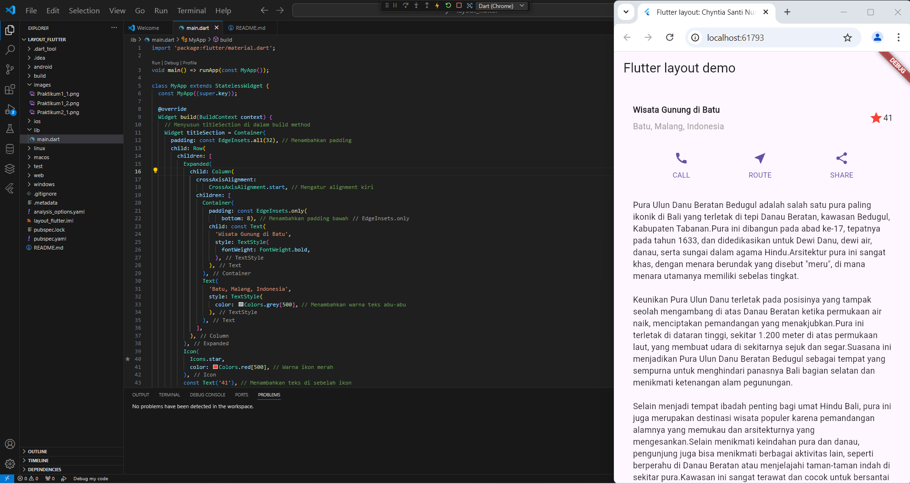

# Praktikum 4: Implementasi image section

Selesaikan langkah-langkah praktikum berikut ini dengan melanjutkan dari praktikum sebelumnya.

## Langkah 1: Siapkan aset gambar

Anda dapat mencari gambar di internet yang ingin ditampilkan. Buatlah folder images di root project layout_flutter. Masukkan file gambar tersebut ke folder images, lalu set nama file tersebut ke file pubspec.yaml seperti berikut:<br>
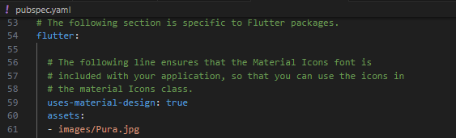

## Langkah 2: Tambahkan gambar ke body

Tambahkan aset gambar ke dalam body seperti berikut: <br>
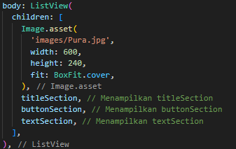

## Langkah 3: Terakhir, ubah menjadi ListView

Pada langkah terakhir ini, atur semua elemen dalam ListView, bukan Column, karena ListView mendukung scroll yang dinamis saat aplikasi dijalankan pada perangkat yang resolusinya lebih kecil.

## Hasil Keseluruhan Pemrograman

```
import 'package:flutter/material.dart';

void main() => runApp(const MyApp());

class MyApp extends StatelessWidget {
  const MyApp({super.key});

  @override
  Widget build(BuildContext context) {
    // Menyusun titleSection di dalam build method
    Widget titleSection = Container(
      padding: const EdgeInsets.all(32), // Menambahkan padding
      child: Row(
        children: [
          Expanded(
            child: Column(
              crossAxisAlignment:
                  CrossAxisAlignment.start, // Mengatur alignment kiri
              children: [
                Container(
                  padding: const EdgeInsets.only(
                      bottom: 8), // Menambahkan padding bawah
                  child: const Text(
                    'Wisata Gunung di Batu',
                    style: TextStyle(
                      fontWeight: FontWeight.bold,
                    ),
                  ),
                ),
                Text(
                  'Batu, Malang, Indonesia',
                  style: TextStyle(
                    color: Colors.grey[500], // Menambahkan warna teks abu-abu
                  ),
                ),
              ],
            ),
          ),
          Icon(
            Icons.star,
            color: Colors.red[500], // Warna ikon merah
          ),
          const Text('41'), // Menambahkan teks di sebelah ikon
        ],
      ),
    );

    // Menambahkan buttonSection di bawah titleSection
    Color color = Theme.of(context).primaryColor;

    Widget buttonSection = Row(
      mainAxisAlignment: MainAxisAlignment.spaceEvenly,
      children: [
        _buildButtonColumn(color, Icons.call, 'CALL'),
        _buildButtonColumn(color, Icons.near_me, 'ROUTE'),
        _buildButtonColumn(color, Icons.share, 'SHARE'),
      ],
    );

    // Menambahkan textSection di bawah buttonSection
    Widget textSection = Container(
      padding: const EdgeInsets.all(32),
      child: const Text(
        'Pura Ulun Danu Beratan Bedugul adalah salah satu pura paling ikonik di Bali yang terletak di tepi Danau Beratan, kawasan Bedugul, Kabupaten Tabanan.'
        'Pura ini dibangun pada abad ke-17, tepatnya pada tahun 1633, dan didedikasikan untuk Dewi Danu, dewi air, danau, serta sungai dalam agama Hindu.'
        'Arsitektur pura ini sangat khas, dengan menara berundak yang disebut "meru", di mana menara utamanya memiliki sebelas tingkat.\n\n'
        'Keunikan Pura Ulun Danu terletak pada posisinya yang tampak seolah mengambang di atas Danau Beratan ketika permukaan air naik, menciptakan pemandangan yang menakjubkan.'
        'Pura ini terletak di dataran tinggi, sekitar 1.200 meter di atas permukaan laut, yang membuat udara di sekitarnya sejuk dan segar.'
        'Suasana ini menjadikan Pura Ulun Danu Beratan Bedugul sebagai tempat yang sempurna untuk menghindari panasnya Bali bagian selatan dan menikmati ketenangan alam pegunungan.\n\n'
        'Selain menjadi tempat ibadah penting bagi umat Hindu Bali, pura ini juga merupakan destinasi wisata populer karena pemandangan alamnya yang memukau dan arsitekturnya yang mengesankan.'
        'Selain menikmati keindahan pura dan danau, pengunjung juga bisa menikmati berbagai aktivitas lain, seperti berperahu di Danau Beratan atau menjelajahi taman-taman indah di sekitar pura.'
        'Kawasan ini sangat terawat dan cocok untuk bersantai sambil menikmati keindahan alam.'
        'Dari Denpasar, ibu kota Bali, Pura Ulun Danu dapat dicapai dalam waktu sekitar 1,5 hingga 2 jam perjalanan dengan mobil.\n\n'
        'Waktu terbaik untuk mengunjungi pura ini adalah pagi atau sore hari, ketika udara masih sejuk dan cahaya matahari menciptakan pantulan yang indah di atas permukaan danau.'
        'Dengan keindahan arsitektur, suasana spiritual, dan pemandangan alam yang menawan, Pura Ulun Danu Beratan Bedugul bukan hanya merupakan tempat ibadah penting bagi masyarakat Bali, tetapi juga simbol budaya dan destinasi wisata yang harus dikunjungi. \n \n'
        'Nama: Chyntia Santi Nur Trisnawati\n'
        'NIM: 2241720017',
        softWrap: true,
      ),
    );

    return MaterialApp(
      title: 'Flutter layout: Chyntia Santi Nur Trisnawati NIM 2241720017',
      home: Scaffold(
        appBar: AppBar(
          title: const Text('Flutter layout demo'),
        ),
        body: ListView(
          children: [
            Image.asset(
              'images/Pura.jpg',
              width: 600,
              height: 240,
              fit: BoxFit.cover,
            ),
            titleSection, // Menampilkan titleSection
            buttonSection, // Menampilkan buttonSection
            textSection, // Menampilkan textSection
          ],
        ),
      ),
    );
  }

  Column _buildButtonColumn(Color color, IconData icon, String label) {
    return Column(
      mainAxisSize: MainAxisSize.min,
      mainAxisAlignment: MainAxisAlignment.center,
      children: [
        Icon(icon, color: color),
        Container(
          margin: const EdgeInsets.only(top: 8),
          child: Text(
            label,
            style: TextStyle(
              fontSize: 12,
              fontWeight: FontWeight.w400,
              color: color,
            ),
          ),
        ),
      ],
    );
  }
}
```

Hasil ketika dijalankan
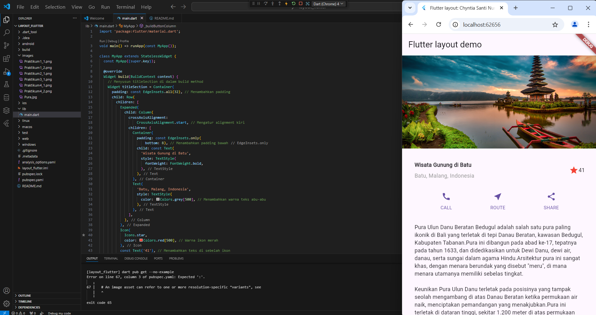

# Tugas Praktikum 1

## Selesaikan Praktikum 1 sampai 4, lalu dokumentasikan dan push ke repository Anda berupa screenshot setiap hasil pekerjaan beserta penjelasannya di file README.md!

Sudah dikerjakan

## Silakan implementasikan di project baru "basic_layout_flutter" dengan mengakses sumber ini: https://docs.flutter.dev/codelabs/layout-basics

### Aplikasi materi

Untuk a MaterialAplikasi, Anda dapat menggunakan Scaffoldwidget; ini menyediakan spanduk default, warna latar belakang, dan memiliki API untuk menambahkan laci, snack bar, dan lembaran bawah. Kemudian Anda dapat menambahkan Centerwidget langsung ke bodyproperti untuk halaman rumah.

```
class MyApp extends StatelessWidget {
  const MyApp({super.key});

  @override
  Widget build(BuildContext context) {
    const String appTitle = 'Flutter layout demo';
    return MaterialApp(
      title: appTitle,
      home: Scaffold(
        appBar: AppBar(
          title: const Text(appTitle),
        ),
        body: const Center(
          child: Text('Hello World'),
        ),
      ),
    );
  }
}
```

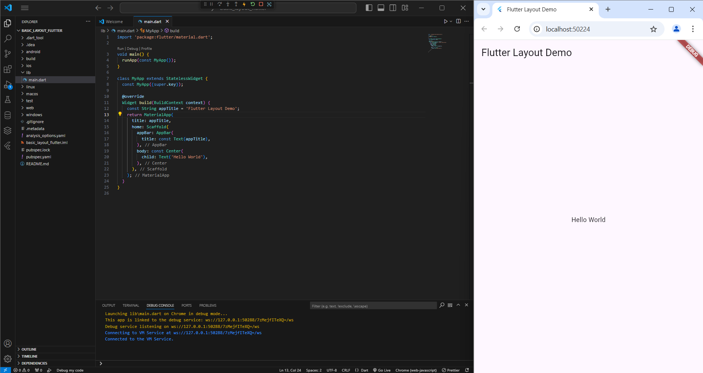

### Aplikasi Cupertino

Kode Program

```
import 'package:flutter/cupertino.dart';
import 'package:flutter/material.dart';

void main() {
  runApp(const MyApp());
}

class MyApp extends StatelessWidget {
  const MyApp({super.key});

  @override
  Widget build(BuildContext context) {
    return const CupertinoApp(
      title: 'Flutter layout demo',
      theme: CupertinoThemeData(
        brightness: Brightness.light,
        primaryColor: CupertinoColors.systemBlue,
      ),
      home: CupertinoPageScaffold(
        navigationBar: CupertinoNavigationBar(
          backgroundColor: CupertinoColors.systemGrey,
          middle: Text('Flutter layout demo'),
        ),
        child: Center(
          child: Column(
            mainAxisAlignment: MainAxisAlignment.center,
            children: <Widget>[
              Text(
                'Hello World',
                style: TextStyle(fontSize: 24), // Added text style for visibility
              ),
            ],
          ),
        ),
      ),
    );
  }
}

```

Hasil ketika dijalankan adalah sebagi berikut
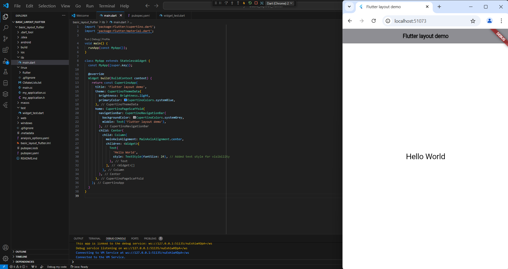

### Aplikasi non-Materi

Kode Programnya

```
import 'package:flutter/cupertino.dart';
import 'package:flutter/material.dart';

void main() {
  runApp(const MyApp());
}

class MyApp extends StatelessWidget {
  const MyApp({super.key});

  @override
  Widget build(BuildContext context) {
    return Container(
      decoration: const BoxDecoration(color: Colors.white),
      child: const Center(
        child: Text(
          'Hello World',
          textDirection: TextDirection.ltr,
          style: TextStyle(
            fontSize: 32,
            color: Colors.black87,
          ),
        ),
      ),
    );
  }
}

```

Hasil ketika dijalankan adalah sebagai berikut
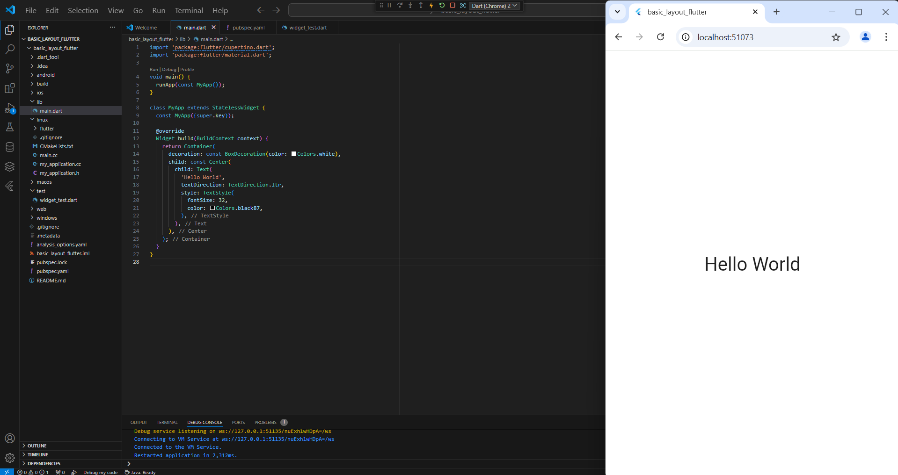

### Menyelaraskan Widget

### ROW

Kode Program

```
import 'package:flutter/material.dart';

void main() {
  runApp(const MyApp());
}

class MyApp extends StatelessWidget {
  const MyApp({super.key});

  @override
  Widget build(BuildContext context) {
    return MaterialApp(
      title: 'Row Example',
      home: Scaffold(
        appBar: AppBar(
          title: const Text('Row of Images'),
        ),
        body: Center(
          child: Row(
            mainAxisAlignment:
                MainAxisAlignment.spaceEvenly, // Ruang horizontal terbagi rata
            children: [
              Image.asset('images/menu1_chicken.jpeg', width: 100),
              Image.asset('images/menu2_mukoo.jpeg', width: 100),
              Image.asset('images/menu3_tteokbokki.jpeg', width: 100),
            ],
          ),
        ),
      ),
    );
  }
}
```

Hasil ketika dijalankan
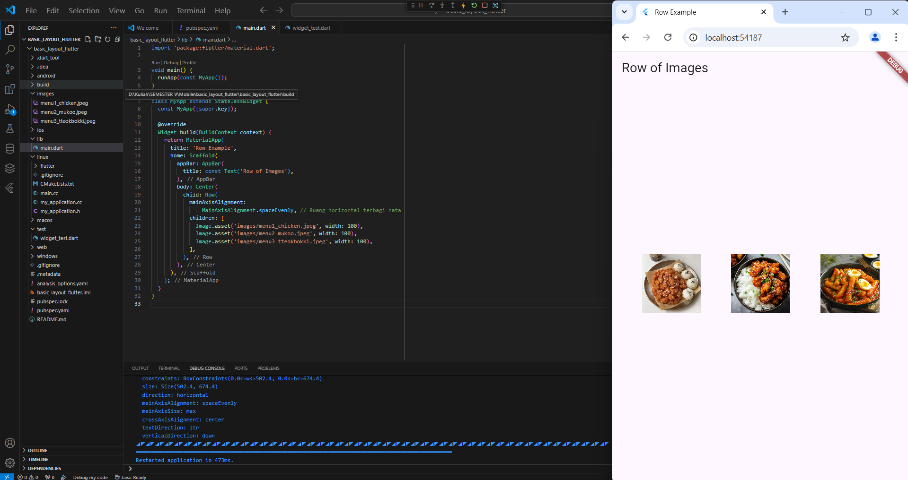

### Column

Kode Program

```
import 'package:flutter/material.dart';

void main() {
  runApp(const MyApp());
}

class MyApp extends StatelessWidget {
  const MyApp({super.key});

  @override
  Widget build(BuildContext context) {
    return MaterialApp(
      title: 'Row Example',
      home: Scaffold(
        appBar: AppBar(
          title: const Text('Row of Images'),
        ),
        body: Center(
          child: Column(
            mainAxisAlignment:
                MainAxisAlignment.spaceEvenly, // Ruang horizontal terbagi rata
            children: [
              Image.asset('images/menu1_chicken.jpeg', width: 100),
              Image.asset('images/menu2_mukoo.jpeg', width: 100),
              Image.asset('images/menu3_tteokbokki.jpeg', width: 100),
            ],
          ),
        ),
      ),
    );
  }
}

```

Hasil ketika dijalankan
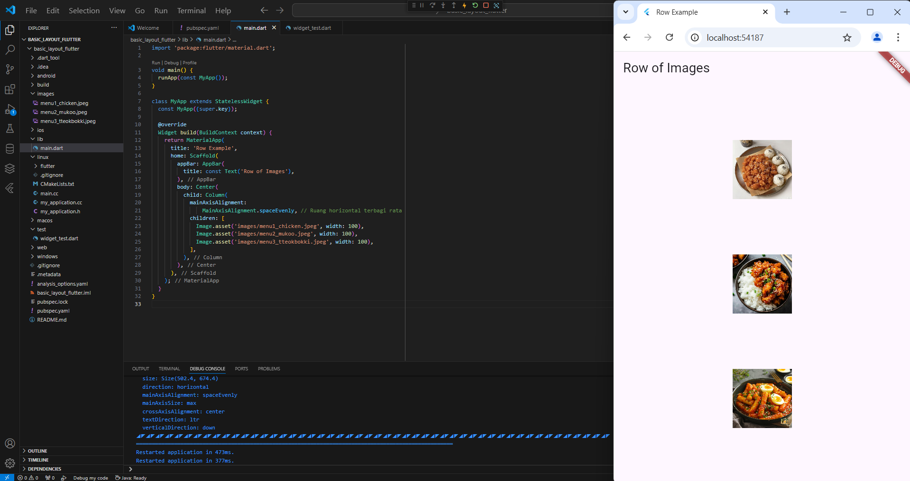

### Sizing widget

Ukuran sama rata

Kode Program

```
import 'package:flutter/material.dart';

void main() {
  runApp(const MyApp());
}

class MyApp extends StatelessWidget {
  const MyApp({super.key});

  @override
  Widget build(BuildContext context) {
    return MaterialApp(
      title: 'Row Example',
      home: Scaffold(
        appBar: AppBar(
          title: const Text('Row of Images'),
        ),
        body: Center(
          child: Row(
            mainAxisAlignment:
                MainAxisAlignment.center, // Ruang horizontal terbagi rata
            children: [
              Expanded(
                child: Image.asset('images/menu1_chicken.jpeg', width: 100),
              ),
              Expanded(
                child: Image.asset('images/menu2_mukoo.jpeg', width: 100),
              ),
              Expanded(
                child: Image.asset('images/menu3_tteokbokki.jpeg', width: 100),
              )
            ],
          ),
        ),
      ),
    );
  }
}

```

Hasil ketika dijalankan
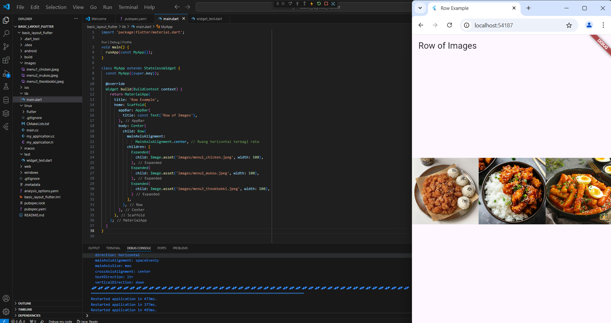

Besar di tengan dengan Flex

Kode Program

```
import 'package:flutter/material.dart';

void main() {
  runApp(const MyApp());
}

class MyApp extends StatelessWidget {
  const MyApp({super.key});

  @override
  Widget build(BuildContext context) {
    return MaterialApp(
      title: 'Row Example',
      home: Scaffold(
        appBar: AppBar(
          title: const Text('Row of Images'),
        ),
        body: Center(
          child: Row(
            mainAxisAlignment:
                MainAxisAlignment.center, // Ruang horizontal terbagi rata
            children: [
              Expanded(
                child: Image.asset('images/menu1_chicken.jpeg', width: 100),
              ),
              Expanded(
                flex: 2,
                child: Image.asset('images/menu2_mukoo.jpeg', width: 100),
              ),
              Expanded(
                child: Image.asset('images/menu3_tteokbokki.jpeg', width: 100),
              )
            ],
          ),
        ),
      ),
    );
  }
}

```

Hasil ketika dijalankan
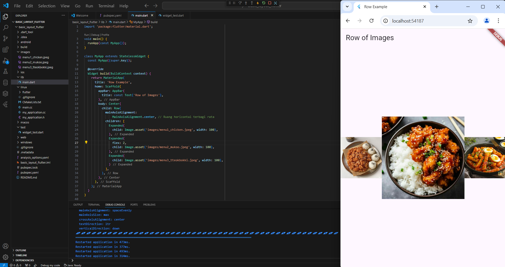

### Widget pengepakan

Kode Program

```
import 'package:flutter/material.dart';

void main() {
  runApp(const MyApp());
}

class MyApp extends StatelessWidget {
  const MyApp({super.key});

  @override
  Widget build(BuildContext context) {
    return MaterialApp(
      title: 'Row Example',
      home: Scaffold(
        appBar: AppBar(
          title: const Text('Row of Images'),
        ),
        body: Center(
          child: Row(
            mainAxisAlignment:
                MainAxisAlignment.center, // Ruang horizontal terbagi rata
            children: [
              Icon(Icons.star, color: Colors.green[500]),
              Icon(Icons.star, color: Colors.green[500]),
              Icon(Icons.star, color: Colors.green[500]),
              const Icon(Icons.star, color: Colors.black),
              const Icon(Icons.star, color: Colors.black),
            ],
          ),
        ),
      ),
    );
  }
}

```

Hasil ketika dijalankan adalah sebagai berikut
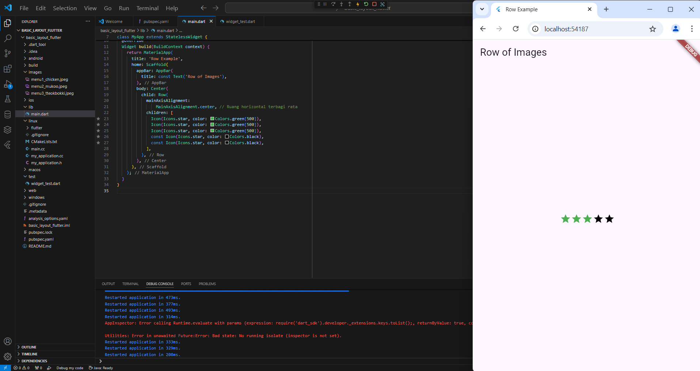

### Baris dan kolom bersarang

1. Ratting dan Review

Kode Program

```
import 'package:flutter/material.dart';

void main() {
  runApp(const MyApp());
}

class MyApp extends StatelessWidget {
  const MyApp({super.key});

  @override
  Widget build(BuildContext context) {
    // Definisikan widget bintang (stars) dan rating di sini
    final stars = Row(
      mainAxisSize: MainAxisSize.min,
      children: [
        Icon(Icons.star, color: Colors.green[500]),
        Icon(Icons.star, color: Colors.green[500]),
        Icon(Icons.star, color: Colors.green[500]),
        const Icon(Icons.star, color: Colors.black),
        const Icon(Icons.star, color: Colors.black),
      ],
    );

    final ratings = Container(
      padding: const EdgeInsets.all(20),
      child: Row(
        mainAxisAlignment: MainAxisAlignment.spaceEvenly,
        children: [
          stars,
          const Text(
            '170 Reviews',
            style: TextStyle(
              color: Colors.black,
              fontWeight: FontWeight.w800,
              fontFamily: 'Roboto',
              letterSpacing: 0.5,
              fontSize: 20,
            ),
          ),
        ],
      ),
    );

    return MaterialApp(
      title: 'Row Example',
      home: Scaffold(
        appBar: AppBar(
          title: const Text('Row of Images'),
        ),
        body: Center(
          child: ratings, // Tampilkan ratings widget di sini
        ),
      ),
    );
  }
}

```

Hasil ketika dijalankan adalah sebagai berikut
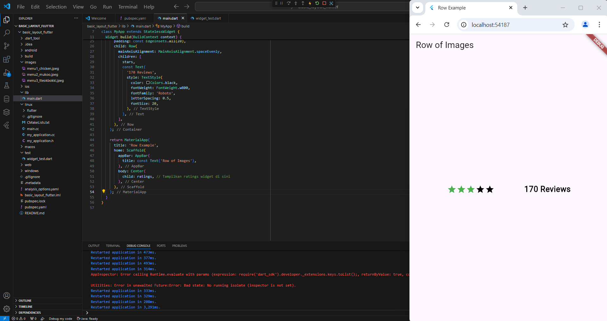

Beisikan icon
Kode Programnta

```
import 'package:flutter/material.dart';

void main() {
  runApp(const MyApp());
}

class MyApp extends StatelessWidget {
  const MyApp({super.key});

  @override
  Widget build(BuildContext context) {
    // Gaya teks default untuk deskripsi
    const descTextStyle = TextStyle(
      color: Colors.black,
      fontWeight: FontWeight.w800,
      fontFamily: 'Roboto',
      letterSpacing: 0.5,
      fontSize: 18,
      height: 2,
    );

    // Daftar ikon dengan teks di bawahnya
    final iconList = DefaultTextStyle.merge(
      style: descTextStyle,
      child: Container(
        padding: const EdgeInsets.all(20),
        child: Row(
          mainAxisAlignment: MainAxisAlignment.spaceEvenly,
          children: [
            Column(
              children: [
                Icon(Icons.kitchen, color: Colors.green[500]),
                const Text('PREP:'),
                const Text('25 min'),
              ],
            ),
            Column(
              children: [
                Icon(Icons.timer, color: Colors.green[500]),
                const Text('COOK:'),
                const Text('1 hr'),
              ],
            ),
            Column(
              children: [
                Icon(Icons.restaurant, color: Colors.green[500]),
                const Text('FEEDS:'),
                const Text('4-6'),
              ],
            ),
          ],
        ),
      ),
    );

    return MaterialApp(
      title: 'Icon List Example',
      home: Scaffold(
        appBar: AppBar(
          title: const Text('Icon List with Text'),
        ),
        body: Center(
          child: iconList, // Menampilkan iconList di tengah layar
        ),
      ),
    );
  }
}
```

Hasil ketika dijalankan adalah sebagai berikut
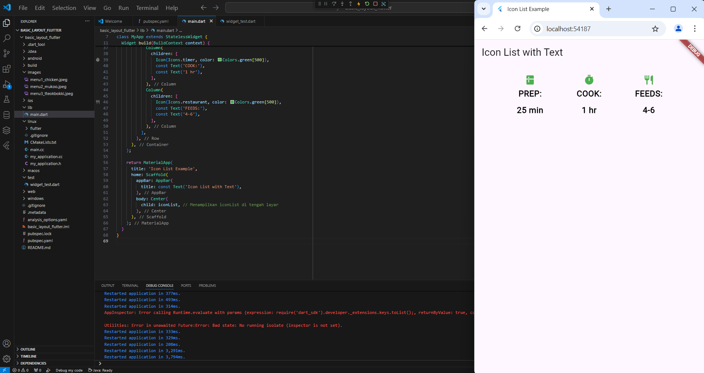

Variabel berisi peringkat dan baris ikon
Kode Program

```
import 'package:flutter/material.dart';

void main() {
  runApp(const MyApp());
}

class MyApp extends StatelessWidget {
  const MyApp({super.key});

  @override
  Widget build(BuildContext context) {
    // Gaya teks default untuk deskripsi
    const descTextStyle = TextStyle(
      color: Colors.black,
      fontWeight: FontWeight.w800,
      fontFamily: 'Roboto',
      letterSpacing: 0.5,
      fontSize: 18,
      height: 2,
    );

    // Widget teks untuk judul
    final titleText = const Text(
      'Strawberry Pavlova',
      style: TextStyle(
        fontSize: 24,
        fontWeight: FontWeight.bold,
      ),
    );

    // Widget teks untuk subjudul
    final subTitle = const Text(
      'A delicious dessert made of meringue, strawberries, and whipped cream.',
      style: TextStyle(
        fontSize: 16,
        color: Colors.grey,
      ),
    );

    // Widget rating dengan ikon bintang
    final stars = Row(
      mainAxisSize: MainAxisSize.min,
      children: [
        Icon(Icons.star, color: Colors.green[500]),
        Icon(Icons.star, color: Colors.green[500]),
        Icon(Icons.star, color: Colors.green[500]),
        const Icon(Icons.star, color: Colors.black),
        const Icon(Icons.star, color: Colors.black),
      ],
    );

    // Widget untuk jumlah rating
    final ratings = Container(
      padding: const EdgeInsets.all(20),
      child: Row(
        mainAxisAlignment: MainAxisAlignment.spaceEvenly,
        children: [
          stars,
          const Text(
            '170 Reviews',
            style: TextStyle(
              color: Colors.black,
              fontWeight: FontWeight.w800,
              fontFamily: 'Roboto',
              letterSpacing: 0.5,
              fontSize: 20,
            ),
          ),
        ],
      ),
    );

    // Daftar ikon dengan teks di bawahnya
    final iconList = DefaultTextStyle.merge(
      style: descTextStyle,
      child: Container(
        padding: const EdgeInsets.all(20),
        child: Row(
          mainAxisAlignment: MainAxisAlignment.spaceEvenly,
          children: [
            Column(
              children: [
                Icon(Icons.kitchen, color: Colors.green[500]),
                const Text('PREP:'),
                const Text('25 min'),
              ],
            ),
            Column(
              children: [
                Icon(Icons.timer, color: Colors.green[500]),
                const Text('COOK:'),
                const Text('1 hr'),
              ],
            ),
            Column(
              children: [
                Icon(Icons.restaurant, color: Colors.green[500]),
                const Text('FEEDS:'),
                const Text('4-6'),
              ],
            ),
          ],
        ),
      ),
    );

    // Kolom kiri yang mencakup titleText, subTitle, ratings, dan iconList
    final leftColumn = Container(
      padding: const EdgeInsets.fromLTRB(20, 30, 20, 20),
      child: Column(
        crossAxisAlignment: CrossAxisAlignment.start,
        children: [
          titleText,
          const SizedBox(height: 8),
          subTitle,
          ratings,
          iconList,
        ],
      ),
    );

    return MaterialApp(
      title: 'Icon List Example',
      home: Scaffold(
        appBar: AppBar(
          title: const Text('Icon List with Text'),
        ),
        body: Center(
          child: leftColumn, // Menampilkan leftColumn di tengah layar
        ),
      ),
    );
  }
}

```

Hasil ketika dijalankan adalah sebagai berikut
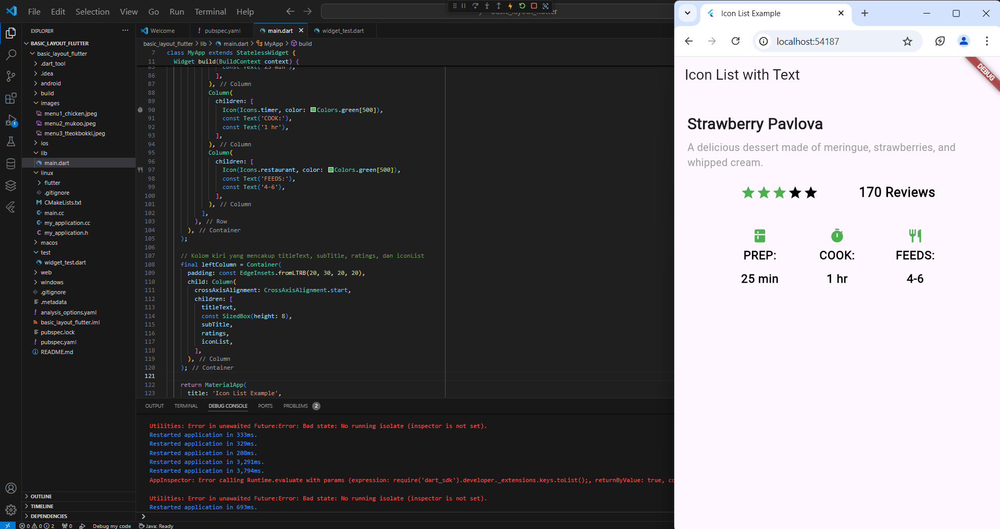

Menambahkan aset dan gambar
Kode Program

```
import 'package:flutter/material.dart';

void main() {
  runApp(const MyApp());
}

class MyApp extends StatelessWidget {
  const MyApp({super.key});

  @override
  Widget build(BuildContext context) {
    // Gaya teks default untuk deskripsi
    const descTextStyle = TextStyle(
      color: Colors.black,
      fontWeight: FontWeight.w800,
      fontFamily: 'Roboto',
      letterSpacing: 0.5,
      fontSize: 18,
      height: 2,
    );

    // Widget teks untuk judul
    final titleText = const Text(
      'Tteokbokki Korean Food',
      style: TextStyle(
        fontSize: 24,
        fontWeight: FontWeight.bold,
      ),
    );

    // Widget teks untuk subjudul
    final subTitle = const Text(
      'Tteokbokki is a popular Korean street food made of chewy rice cakes stir-fried in a spicy, savory sauce, often with fish cakes, scallions, and hard-boiled eggs.',
      style: TextStyle(
        fontSize: 16,
        color: Colors.grey,
      ),
    );

    // Widget rating dengan ikon bintang
    final stars = Row(
      mainAxisSize: MainAxisSize.min,
      children: [
        Icon(Icons.star, color: Colors.red[500]),
        Icon(Icons.star, color: Colors.red[500]),
        Icon(Icons.star, color: Colors.red[500]),
        const Icon(Icons.star, color: Colors.black),
        const Icon(Icons.star, color: Colors.black),
      ],
    );

    // Widget untuk jumlah rating
    final ratings = Container(
      padding: const EdgeInsets.all(20),
      child: Row(
        mainAxisAlignment: MainAxisAlignment.spaceEvenly,
        children: [
          stars,
          const Text(
            '170 Reviews',
            style: TextStyle(
              color: Colors.black,
              fontWeight: FontWeight.w800,
              fontFamily: 'Roboto',
              letterSpacing: 0.5,
              fontSize: 20,
            ),
          ),
        ],
      ),
    );

    // Daftar ikon dengan teks di bawahnya
    final iconList = DefaultTextStyle.merge(
      style: descTextStyle,
      child: Container(
        padding: const EdgeInsets.all(20),
        child: Row(
          mainAxisAlignment: MainAxisAlignment.spaceEvenly,
          children: [
            Column(
              children: [
                Icon(Icons.kitchen, color: Colors.red[500]),
                const Text('PREP:'),
                const Text('25 min'),
              ],
            ),
            Column(
              children: [
                Icon(Icons.timer, color: Colors.red[500]),
                const Text('COOK:'),
                const Text('1 hr'),
              ],
            ),
            Column(
              children: [
                Icon(Icons.restaurant, color: Colors.red[500]),
                const Text('FEEDS:'),
                const Text('4-6'),
              ],
            ),
          ],
        ),
      ),
    );

    // Kolom kiri yang mencakup titleText, subTitle, ratings, dan iconList
    final leftColumn = Container(
      padding: const EdgeInsets.fromLTRB(20, 30, 20, 20),
      child: Column(
        crossAxisAlignment: CrossAxisAlignment.start,
        children: [
          titleText,
          const SizedBox(height: 8),
          subTitle,
          ratings,
          iconList,
        ],
      ),
    );

    // Gambar utama
    final mainImage = Expanded(
      child: Image.asset(
        'images/menu3_tteokbokki.jpeg',
        fit: BoxFit.cover,
      ),
    );

    return MaterialApp(
      title: 'Korean Food',
      home: Scaffold(
        appBar: AppBar(
          title: const Text('Korean Food'),
        ),
        body: Center(
          child: Container(
            margin: const EdgeInsets.fromLTRB(0, 40, 0, 30),
            height: 600,
            child: Card(
              child: Row(
                crossAxisAlignment: CrossAxisAlignment.start,
                children: [
                  SizedBox(
                    width: 440,
                    child: leftColumn,
                  ),
                  mainImage,
                ],
              ),
            ),
          ),
        ),
      ),
    );
  }
}
```

Hasil ketika dijalankan
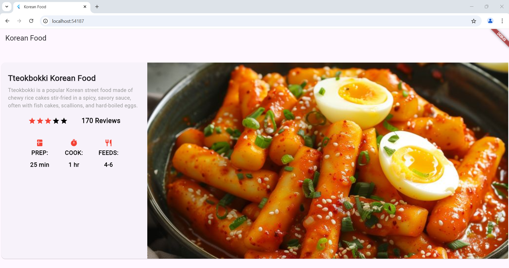

### Kontainer

Kode Program

```
import 'package:flutter/material.dart';

void main() {
  runApp(MyApp());
}

class MyApp extends StatelessWidget {
  @override
  Widget build(BuildContext context) {
    return MaterialApp(
      title: 'Decorated Image Column',
      theme: ThemeData(
        primarySwatch: Colors.blue,
      ),
      home: HomeScreen(),
    );
  }
}

class HomeScreen extends StatelessWidget {
  @override
  Widget build(BuildContext context) {
    return Scaffold(
      appBar: AppBar(
        title: Text('Decorated Image Column Example'),
      ),
      body: Center(
        child: _buildImageColumn(),
      ),
    );
  }

  // Method to build the image column
  Widget _buildImageColumn() {
    return Container(
      decoration: const BoxDecoration(
        color: Colors.black26,
      ),
      child: Column(
        children: [
          _buildImageRow(1),
          _buildImageRow(3),
        ],
      ),
    );
  }

  // Method to build individual rows within the column
  Widget _buildImageRow(int imageIndex) => Row(
        children: [
          _buildDecoratedImage(imageIndex),
          _buildDecoratedImage(imageIndex + 1),
        ],
      );

  // Method to build decorated image
  Widget _buildDecoratedImage(int imageIndex) => Expanded(
        child: Container(
          decoration: BoxDecoration(
            border: Border.all(width: 10, color: Colors.black38),
            borderRadius: const BorderRadius.all(Radius.circular(8)),
          ),
          margin: const EdgeInsets.all(4),
          child: Image.asset(
            'images/menu1_chicken.jpeg',
            fit: BoxFit.cover,
          ),
        ),
      );
}

```

Hasil ketika dijalankan
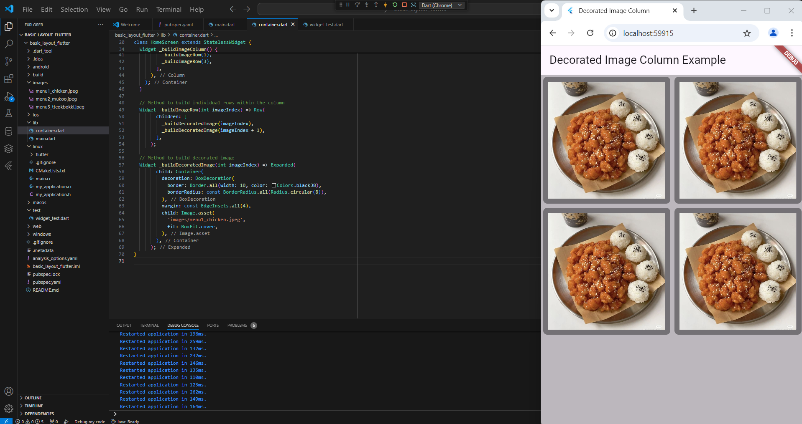

### Contoh (GridView)

```
import 'package:flutter/material.dart';

void main() {
  runApp(MyApp());
}

class MyApp extends StatelessWidget {
  @override
  Widget build(BuildContext context) {
    return MaterialApp(
      title: 'Contoh Gridview',
      theme: ThemeData(
        primarySwatch: Colors.blue,
      ),
      home: HomeScreen(),
    );
  }
}

class HomeScreen extends StatelessWidget {
  @override
  Widget build(BuildContext context) {
    return Scaffold(
      appBar: AppBar(
        title: Text('GridView Example'),
      ),
      body: _buildGrid(),
    );
  }

  Widget _buildGrid() {
    return GridView.extent(
      maxCrossAxisExtent: 150,
      padding: const EdgeInsets.all(4),
      mainAxisSpacing: 4,
      crossAxisSpacing: 4,
      children: _buildGridTileList(30),
    );
  }

  List<Container> _buildGridTileList(int count) {
    return List.generate(
      count,
      (i) => Container(
        decoration: BoxDecoration(
          image: DecorationImage(
            image: AssetImage('images/menu2_mukoo.jpeg'),
            fit: BoxFit.cover,
          ),
          borderRadius: BorderRadius.circular(8),
        ),
      ),
    );
  }
}
```

Hasil ketika dijalankan adalah sebagai berikut


### ListView

Kode Program

```
import 'package:flutter/material.dart';

void main() {
  runApp(MyApp());
}

class MyApp extends StatelessWidget {
  @override
  Widget build(BuildContext context) {
    return MaterialApp(
      title: 'Contoh ListView',
      theme: ThemeData(
        primarySwatch: Colors.blue,
      ),
      home: HomeScreen(),
    );
  }
}

class HomeScreen extends StatelessWidget {
  @override
  Widget build(BuildContext context) {
    return Scaffold(
      appBar: AppBar(
        title: Text('List of Places'),
      ),
      body: _buildList(),
    );
  }

  Widget _buildList() {
    return ListView(
      children: [
        _tile('CineArts at the Empire', '85 W Portal Ave', Icons.theaters),
        _tile('The Castro Theater', '429 Castro St', Icons.theaters),
        _tile('Alamo Drafthouse Cinema', '2550 Mission St', Icons.theaters),
        _tile('Roxie Theater', '3117 16th St', Icons.theaters),
        _tile('United Artists Stonestown Twin', '501 Buckingham Way',
            Icons.theaters),
        _tile('AMC Metreon 16', '135 4th St #3000', Icons.theaters),
        const Divider(),
        _tile('K\'s Kitchen', '757 Monterey Blvd', Icons.restaurant),
        _tile('Emmy\'s Restaurant', '1923 Ocean Ave', Icons.restaurant),
        _tile('Chaiya Thai Restaurant', '272 Claremont Blvd', Icons.restaurant),
        _tile('La Ciccia', '291 30th St', Icons.restaurant),
      ],
    );
  }

  ListTile _tile(String title, String subtitle, IconData icon) {
    return ListTile(
      title: Text(
        title,
        style: const TextStyle(
          fontWeight: FontWeight.w500,
          fontSize: 20,
        ),
      ),
      subtitle: Text(subtitle),
      leading: Icon(
        icon,
        color: Colors.blue[500],
      ),
    );
  }
}
```

Hasil ketika dijalankan adalah sebagai berikut


### Stack

Kode Program

```
import 'package:flutter/material.dart';

void main() {
  runApp(const MyApp());
}

class MyApp extends StatelessWidget {
  const MyApp({Key? key}) : super(key: key);

  @override
  Widget build(BuildContext context) {
    return MaterialApp(
      home: Scaffold(
        appBar: AppBar(
          title: const Text('Stack Example'),
        ),
        body: Center(
          child: _buildStack(),
        ),
      ),
    );
  }

  Widget _buildStack() {
    return Stack(
      alignment: const Alignment(0.6, 0.6),
      children: [
        const CircleAvatar(
          backgroundImage: AssetImage('images/fotoku.png'),
          radius: 100,
        ),
        Container(
          decoration: const BoxDecoration(
            color: Colors.black45,
          ),
          padding: const EdgeInsets.all(8),
          child: const Text(
            'Chyntia Santi',
            style: TextStyle(
              fontSize: 20,
              fontWeight: FontWeight.bold,
              color: Colors.white,
            ),
          ),
        ),
      ],
    );
  }
}
```

Hasil ketika dijalankan adalah sebagai berikut
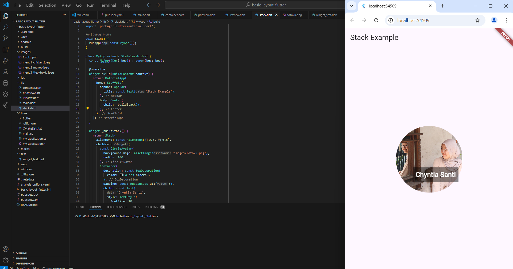

### Stack and Card

Kode Program

```
import 'package:flutter/material.dart';

void main() {
  runApp(MyApp());
}

class MyApp extends StatelessWidget {
  @override
  Widget build(BuildContext context) {
    return MaterialApp(
      home: Scaffold(
        appBar: AppBar(
          title: Text('Card Example'),
        ),
        body: Center(
          child: _buildCard(),
        ),
      ),
    );
  }

  Widget _buildCard() {
    return SizedBox(
      height: 210,
      child: Card(
        child: Column(
          children: [
            ListTile(
              title: const Text(
                '1625 Main Street',
                style: TextStyle(fontWeight: FontWeight.w500),
              ),
              subtitle: const Text('My City, CA 99984'),
              leading: Icon(
                Icons.restaurant_menu,
                color: Colors.blue[500],
              ),
            ),
            const Divider(),
            ListTile(
              title: const Text(
                '(408) 555-1212',
                style: TextStyle(fontWeight: FontWeight.w500),
              ),
              leading: Icon(
                Icons.contact_phone,
                color: Colors.blue[500],
              ),
            ),
            ListTile(
              title: const Text('costa@example.com'),
              leading: Icon(
                Icons.contact_mail,
                color: Colors.blue[500],
              ),
            ),
          ],
        ),
      ),
    );
  }
}
```

Hasil ketika dijalankan
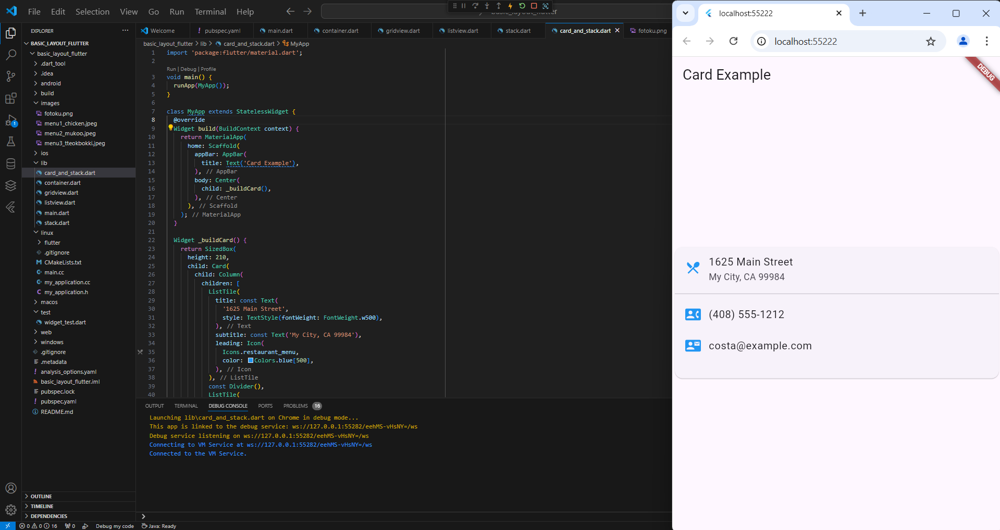

## Kumpulkan link commit repository GitHub Anda kepada dosen yang telah disepakati!

# Praktikum 5: Membangun Navigasi di Flutter

### Langkah 1: Siapkan project baru

sudah dilakukan

### Langkah 2: Mendefinisikan Route

Class HomePage

```
import 'package:flutter/material.dart';

class HomePage extends StatelessWidget {
  @override
  Widget build(BuildContext context) {
    throw UnimplementedError();
  }
}

```

Class ItemPage

```
import 'package:flutter/material.dart';

class ItemPage extends StatelessWidget {
  @override
  Widget build(BuildContext context) {
    throw UnimplementedError();
  }
}
```

### Langkah 3: Lengkapi Kode di main.dart

```
import 'package:belanja/pages/home_page.dart';
import 'package:belanja/pages/item_page.dart';
import 'package:flutter/material.dart';

void main() {
  runApp(MaterialApp(
    initialRoute: '/',
    routes: {
      '/': (context) => HomePage(),
      '/item': (context) => ItemPage(),
    },
  ));
}
```

### Langkah 4: Membuat data model

```
import 'package:flutter/material.dart';

class Item {
  final String name;
  final int price;

  Item({required this.name, required this.price});
}
```

### Langkah 5: Lengkapi kode di class HomePage

```
import 'package:belanja/models/item.dart';
import 'package:flutter/material.dart';

class HomePage extends StatelessWidget {
  final List<Item> items = [
    Item(name: 'Sugar', price: 5000),
    Item(name: 'Salt', price: 2000),
  ];
}
```

### Langkah 6: Membuat ListView dan itemBuilder

```
import 'package:belanja/models/item.dart';
import 'package:flutter/material.dart';

class HomePage extends StatelessWidget {
  final List<Item> items = [
    Item(name: 'Sugar', price: 5000),
    Item(name: 'Salt', price: 2000),
  ];

  @override
  Widget build(BuildContext context) {
    return Scaffold(
      appBar: AppBar(
        title: Text('Home Page'),
      ),
      body: Container(
        margin: EdgeInsets.all(8),
        child: ListView.builder(
          padding: EdgeInsets.all(8),
          itemCount: items.length,
          itemBuilder: (context, index) {
            final item = items[index];
            return Card(
              child: Container(
                margin: EdgeInsets.all(8),
                child: Row(
                  children: [
                    Expanded(child: Text(item.name)),
                    Expanded(
                      child: Text(
                        item.price.toString(),
                        textAlign: TextAlign.end,
                      ),
                    ),
                  ],
                ),
              ),
            );
          },
        ),
      ),
    );
  }
}
```

Hasil ketika dijalankan adalah sebagai berikut


### Langkah 7: Menambahkan aksi pada ListView

```
import 'package:belanja/models/item.dart';
import 'package:flutter/material.dart';

class HomePage extends StatelessWidget {
  final List<Item> items = [
    Item(name: 'Sugar', price: 5000),
    Item(name: 'Salt', price: 2000),
  ];

  @override
  Widget build(BuildContext context) {
    return Scaffold(
      appBar: AppBar(
        title: Text('Home Page'),
      ),
      body: Container(
        margin: EdgeInsets.all(8),
        child: ListView.builder(
          padding: EdgeInsets.all(8),
          itemCount: items.length,
          itemBuilder: (context, index) {
            final item = items[index];
            return InkWell(
              onTap: () {
                Navigator.pushNamed(context, '/item');
              },
              child: Card(
                child: Container(
                  margin: EdgeInsets.all(8),
                  child: Row(
                    children: [
                      Expanded(child: Text(item.name)),
                      Expanded(
                        child: Text(
                          item.price.toString(),
                          textAlign: TextAlign.end,
                        ),
                      ),
                    ],
                  ),
                ),
              ),
            );
          },
        ),
      ),
    );
  }
}
```

Hasil ketika dijalankan
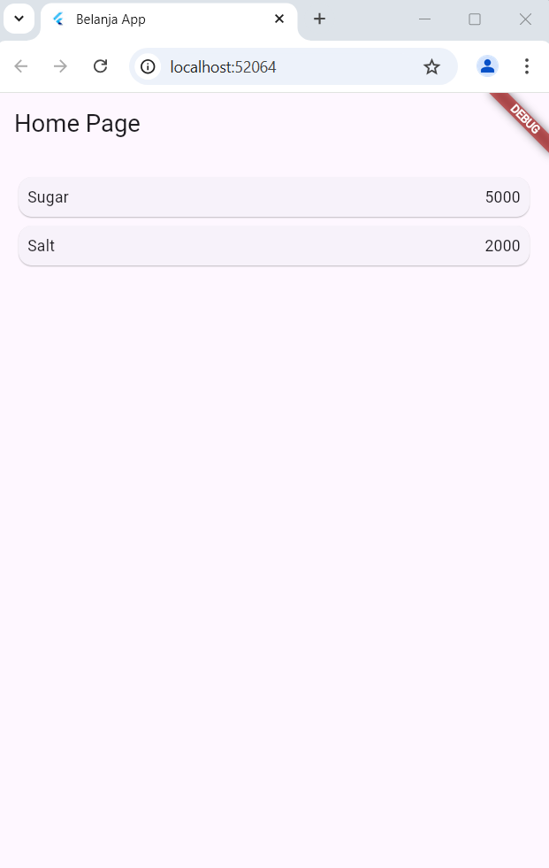

Ketika di klik maka hasilnya sebagai berikut
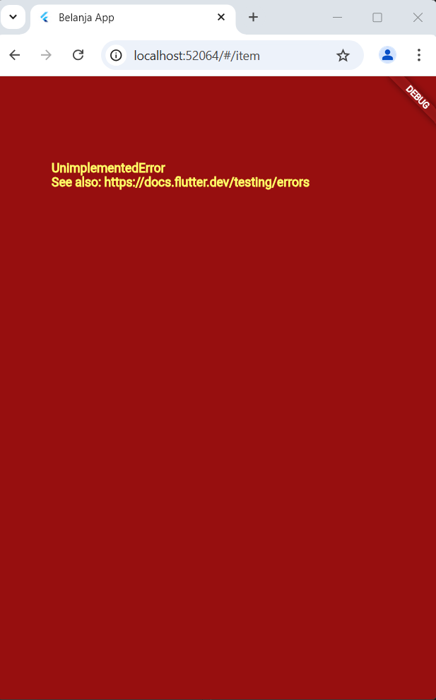

# Tugas Praktikum 2

1. Untuk melakukan pengiriman data ke halaman berikutnya, cukup menambahkan informasi arguments pada penggunaan Navigator. Perbarui kode pada bagian Navigator menjadi seperti berikut.

```
Navigator.pushNamed(context, '/item', arguments: item);
```

2. Pembacaan nilai yang dikirimkan pada halaman sebelumnya dapat dilakukan menggunakan ModalRoute. Tambahkan kode berikut pada blok fungsi build dalam halaman ItemPage. Setelah nilai didapatkan, anda dapat menggunakannya seperti penggunaan variabel pada umumnya. (https://docs.flutter.dev/cookbook/navigation/navigate-with-arguments)

```
import 'package:belanja/models/item.dart';
import 'package:flutter/material.dart';

class ItemPage extends StatelessWidget {
  const ItemPage({super.key});

  static const routeName = '/Item';

  @override
  Widget build(BuildContext context) {
    // Extract the arguments from the current ModalRoute
    final args = ModalRoute.of(context)?.settings.arguments as Item?;

    // Check if args is null and handle the case
    if (args == null) {
      return Scaffold(
        appBar: AppBar(
          title: Text('Error'),
        ),
        body: Center(
          child: Text('No item data available', style: TextStyle(fontSize: 24)),
        ),
      );
    }

    return Scaffold(
      appBar: AppBar(
        title: Text(args.name),
      ),
      body: Center(
        child: Text(
          args.price.toString(), // Convert price to string if it's not already
          style: TextStyle(fontSize: 24),
        ), // Display the item's price
      ),
    );
  }
}
```

3. Pada hasil akhir dari aplikasi belanja yang telah anda selesaikan, tambahkan atribut foto produk, stok, dan rating. Ubahlah tampilan menjadi GridView seperti di aplikasi marketplace pada umumnya.

```import 'package:belanjaanku/models/item.dart';
import 'package:flutter/material.dart';

class HomePage extends StatelessWidget {
  final List<Item> items = [
    Item(
      name: 'Timun',
      price: 5000,
      imageUrl: 'images/Timun.jpg',
      stock: 20,
      rating: 4.8,
    ),
    Item(
      name: 'Bawang Merah',
      price: 2000,
      imageUrl: 'images/bawang_merah.jpg',
      stock: 15,
      rating: 4.0,
    ),
    Item(
      name: 'Bawang Putih',
      price: 2000,
      imageUrl: 'images/bawang_putih.jpg',
      stock: 15,
      rating: 4.0,
    ),
    Item(
      name: 'Bayam',
      price: 2000,
      imageUrl: 'images/Bayam.jpeg',
      stock: 15,
      rating: 4.0,
    ),
    Item(
      name: 'Kentang',
      price: 2000,
      imageUrl: 'images/kentang.jpg',
      stock: 15,
      rating: 4.0,
    ),
    Item(
      name: 'Paprika',
      price: 2000,
      imageUrl: 'images/paprika.jpg',
      stock: 15,
      rating: 4.0,
    ),
  ];

  @override
  Widget build(BuildContext context) {
    return Scaffold(
      appBar: AppBar(
        title: Container(
          padding: EdgeInsets.symmetric(horizontal: 10, vertical: 5),
          decoration: BoxDecoration(// Rounded corners for background
              ),
          child: Text(
            'Blonjo',
            style: TextStyle(
              color: Colors.white, // White text color
              fontWeight: FontWeight.bold,
              fontSize: 25,
            ),
          ),
        ),
        centerTitle: true,
        backgroundColor: Colors.green, // AppBar background color
      ),
      body: Container(
        margin: EdgeInsets.all(8),
        child: GridView.builder(
          gridDelegate: SliverGridDelegateWithFixedCrossAxisCount(
            crossAxisCount: 2, // Two columns
            childAspectRatio: 0.8, // Adjusted aspect ratio for square images
            crossAxisSpacing: 8, // Reduced spacing for a tighter layout
            mainAxisSpacing: 8,
          ),
          padding: EdgeInsets.all(8),
          itemCount: items.length,
          itemBuilder: (context, index) {
            final item = items[index];
            return InkWell(
              onTap: () {
                Navigator.pushNamed(context, '/item', arguments: item);
              },
              child: Card(
                elevation: 3,
                shape: RoundedRectangleBorder(
                  borderRadius: BorderRadius.circular(8),
                ),
                child: Column(
                  crossAxisAlignment: CrossAxisAlignment.stretch,
                  children: [
                    ClipRRect(
                      borderRadius:
                          BorderRadius.vertical(top: Radius.circular(8)),
                      child: Image.asset(
                        item.imageUrl,
                        height: 200,
                        width:
                            100, // Reduced height to make it closer to square
                        fit: BoxFit.cover,
                      ),
                    ),
                    Padding(
                      padding: const EdgeInsets.all(6.0), // Smaller padding
                      child: Text(
                        item.name,
                        style: TextStyle(
                          fontWeight: FontWeight.bold,
                          fontSize: 14,
                        ),
                        maxLines: 1,
                        overflow: TextOverflow.ellipsis,
                      ),
                    ),
                    Padding(
                      padding: const EdgeInsets.symmetric(horizontal: 6.0),
                      child: Text(
                        'Price: Rp ${item.price}',
                        style: TextStyle(
                          color: Colors.green[800],
                          fontSize: 12,
                        ),
                      ),
                    ),
                    Padding(
                      padding: const EdgeInsets.symmetric(horizontal: 6.0),
                      child: Text(
                        'Stock: ${item.stock}',
                        style: TextStyle(
                          color: Colors.grey[600],
                          fontSize: 12,
                        ),
                      ),
                    ),
                    Padding(
                      padding: const EdgeInsets.symmetric(horizontal: 6.0),
                      child: Row(
                        children: [
                          Icon(
                            Icons.star,
                            color: Colors.amber,
                            size: 14,
                          ),
                          SizedBox(width: 2),
                          Text(
                            item.rating.toStringAsFixed(1),
                            style: TextStyle(
                              color: Colors.grey[700],
                              fontSize: 12,
                            ),
                          ),
                        ],
                      ),
                    ),
                  ],
                ),
              ),
            );
          },
        ),
      ),
    );
  }
}
```

Hasil ketika dijalankan adalah sebagai berikut
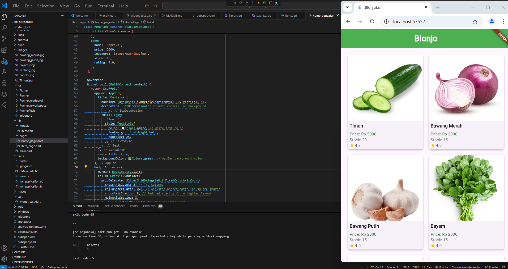

4. Silakan implementasikan Hero widget pada aplikasi belanja Anda dengan mempelajari dari sumber ini: https://docs.flutter.dev/cookbook/navigation/hero-animations

Kode Programnya

Di Main

```
import 'package:flutter/material.dart';
import 'package:belanjaanku/pages/home_page.dart';
import 'package:belanjaanku/pages/item_page.dart';
import 'package:belanjaanku/models/itemdetail_page.dart';

void main() {
  runApp(MyApp());
}

class MyApp extends StatelessWidget {
  @override
  Widget build(BuildContext context) {
    return MaterialApp(
      title: 'Blonjoku', // Optional: Add a title for your app
      initialRoute: '/',
      routes: {
        '/': (context) => HomePage(),
        '/item': (context) => ItemPage(),
        '/detailitem': (context) => ItemDetailPage(),
      },
    );
  }
}
```

Di HomeScreen

```
import 'package:belanjaanku/models/item.dart';
import 'package:flutter/material.dart';

class HomePage extends StatelessWidget {
  final List<Item> items = [
    Item(
      name: 'Timun',
      price: 5000,
      imageUrl: 'images/Timun.jpg',
      stock: 20,
      rating: 4.8,
    ),
    Item(
      name: 'Bawang Merah',
      price: 2000,
      imageUrl: 'images/bawang_merah.jpg',
      stock: 15,
      rating: 4.0,
    ),
    Item(
      name: 'Bawang Putih',
      price: 2000,
      imageUrl: 'images/bawang_putih.jpg',
      stock: 15,
      rating: 4.0,
    ),
    Item(
      name: 'Bayam',
      price: 2000,
      imageUrl: 'images/Bayam.jpeg',
      stock: 15,
      rating: 4.0,
    ),
    Item(
      name: 'Kentang',
      price: 2000,
      imageUrl: 'images/kentang.jpg',
      stock: 15,
      rating: 4.0,
    ),
    Item(
      name: 'Paprika',
      price: 2000,
      imageUrl: 'images/paprika.jpg',
      stock: 15,
      rating: 4.0,
    ),
  ];

  @override
  Widget build(BuildContext context) {
    return Scaffold(
      appBar: AppBar(
        title: Container(
          padding: EdgeInsets.symmetric(horizontal: 10, vertical: 5),
          child: Text(
            'Blonjo',
            style: TextStyle(
              color: Colors.white,
              fontWeight: FontWeight.bold,
              fontSize: 25,
            ),
          ),
        ),
        centerTitle: true,
        backgroundColor: Colors.green,
      ),
      body: Container(
        margin: EdgeInsets.all(8),
        child: GridView.builder(
          gridDelegate: SliverGridDelegateWithFixedCrossAxisCount(
            crossAxisCount: 2,
            childAspectRatio: 0.8,
            crossAxisSpacing: 8,
            mainAxisSpacing: 8,
          ),
          padding: EdgeInsets.all(8),
          itemCount: items.length,
          itemBuilder: (context, index) {
            final item = items[index];
            return InkWell(
              onTap: () {
                Navigator.pushNamed(context, '/detailitem', arguments: item);
              },
              child: Card(
                elevation: 3,
                shape: RoundedRectangleBorder(
                  borderRadius: BorderRadius.circular(8),
                ),
                child: Column(
                  crossAxisAlignment: CrossAxisAlignment.stretch,
                  children: [
                    Hero(
                      tag: item.name, // Unique tag for each item
                      child: ClipRRect(
                        borderRadius:
                            BorderRadius.vertical(top: Radius.circular(8)),
                        child: Image.asset(
                          item.imageUrl,
                          height: 140,
                          fit: BoxFit.cover,
                        ),
                      ),
                    ),
                    Padding(
                      padding: const EdgeInsets.all(6.0),
                      child: Text(
                        item.name,
                        style: TextStyle(
                          fontWeight: FontWeight.bold,
                          fontSize: 14,
                        ),
                        maxLines: 1,
                        overflow: TextOverflow.ellipsis,
                      ),
                    ),
                    Padding(
                      padding: const EdgeInsets.symmetric(horizontal: 6.0),
                      child: Text(
                        'Price: Rp ${item.price}',
                        style: TextStyle(
                          color: Colors.green[800],
                          fontSize: 12,
                        ),
                      ),
                    ),
                    Padding(
                      padding: const EdgeInsets.symmetric(horizontal: 6.0),
                      child: Text(
                        'Stock: ${item.stock}',
                        style: TextStyle(
                          color: Colors.grey[600],
                          fontSize: 12,
                        ),
                      ),
                    ),
                    Padding(
                      padding: const EdgeInsets.symmetric(horizontal: 6.0),
                      child: Row(
                        children: [
                          Icon(
                            Icons.star,
                            color: Colors.amber,
                            size: 14,
                          ),
                          SizedBox(width: 2),
                          Text(
                            item.rating.toStringAsFixed(1),
                            style: TextStyle(
                              color: Colors.grey[700],
                              fontSize: 12,
                            ),
                          ),
                        ],
                      ),
                    ),
                  ],
                ),
              ),
            );
          },
        ),
      ),
    );
  }
}
```

Di itemdetail

```
import 'package:flutter/material.dart';
import 'package:belanjaanku/models/item.dart';

class ItemDetailPage extends StatelessWidget {
  static const routeName = '/itemdetail';

  @override
  Widget build(BuildContext context) {
    // Mendapatkan argumen yang dipassing (item)
    final Item item = ModalRoute.of(context)!.settings.arguments as Item;

    return Scaffold(
      appBar: AppBar(
        title: Text(item.name),
        backgroundColor: Colors.green,
      ),
      body: Padding(
        padding: const EdgeInsets.all(16.0),
        child: Column(
          crossAxisAlignment: CrossAxisAlignment.start,
          children: [
            // Hero widget untuk transisi gambar
            Hero(
              tag: item.name, // Tag yang sama dengan di HomePage
              child: ClipRRect(
                borderRadius: BorderRadius.circular(8),
                child: Image.asset(
                  item.imageUrl,
                  height: 300,
                  width: double.infinity,
                  fit: BoxFit.cover,
                ),
              ),
            ),
            SizedBox(height: 16),
            // Nama item
            Text(
              item.name,
              style: TextStyle(
                fontWeight: FontWeight.bold,
                fontSize: 24,
              ),
            ),
            SizedBox(height: 8),
            // Harga item
            Text(
              'Harga: Rp ${item.price}',
              style: TextStyle(
                fontSize: 18,
                color: Colors.green[800],
              ),
            ),
            SizedBox(height: 8),
            // Stok item
            Text(
              'Stok: ${item.stock}',
              style: TextStyle(
                fontSize: 18,
                color: Colors.grey[600],
              ),
            ),
            SizedBox(height: 8),
            // Rating item
            Row(
              children: [
                Icon(
                  Icons.star,
                  color: Colors.amber,
                  size: 20,
                ),
                SizedBox(width: 4),
                Text(
                  item.rating.toStringAsFixed(1),
                  style: TextStyle(
                    fontSize: 18,
                  ),
                ),
              ],
            ),
          ],
        ),
      ),
    );
  }
}
```

Hasil ketika dijalankan adalah sebagai berikut


dan jika di klik maka hasilnya adalah sebagai berikut


5. Sesuaikan dan modifikasi tampilan sehingga menjadi aplikasi yang menarik. Selain itu, pecah widget menjadi kode yang lebih kecil. Tambahkan Nama dan NIM di footer aplikasi belanja Anda.

Kode program

```
import 'package:belanjaanku/models/item.dart';
import 'package:flutter/material.dart';

class HomePage extends StatelessWidget {
  final List<Item> items = [
    Item(
        name: 'Timun',
        price: 5000,
        imageUrl: 'images/Timun.jpg',
        stock: 20,
        rating: 4.8),
    Item(
        name: 'Bawang Merah',
        price: 2000,
        imageUrl: 'images/bawang_merah.jpg',
        stock: 15,
        rating: 4.0),
    Item(
        name: 'Bawang Putih',
        price: 2000,
        imageUrl: 'images/bawang_putih.jpg',
        stock: 15,
        rating: 4.0),
    Item(
        name: 'Bayam',
        price: 2000,
        imageUrl: 'images/Bayam.jpeg',
        stock: 15,
        rating: 4.0),
    Item(
        name: 'Kentang',
        price: 2000,
        imageUrl: 'images/kentang.jpg',
        stock: 15,
        rating: 4.0),
    Item(
        name: 'Paprika',
        price: 2000,
        imageUrl: 'images/paprika.jpg',
        stock: 15,
        rating: 4.0),
  ];

  @override
  Widget build(BuildContext context) {
    return Scaffold(
      appBar: AppBar(
        title: Text('Blonjo',
            style: TextStyle(
                color: Colors.white,
                fontWeight: FontWeight.bold,
                fontSize: 25)),
        centerTitle: true,
        backgroundColor: Colors.green,
      ),
      body: Column(
        children: [
          Expanded(
            child: Padding(
              padding: const EdgeInsets.all(8.0),
              child: ItemGrid(items: items),
            ),
          ),
          Footer(),
        ],
      ),
    );
  }
}

class ItemGrid extends StatelessWidget {
  final List<Item> items;

  const ItemGrid({required this.items});

  @override
  Widget build(BuildContext context) {
    return GridView.builder(
      gridDelegate: SliverGridDelegateWithFixedCrossAxisCount(
        crossAxisCount: 2,
        childAspectRatio: 0.8,
        crossAxisSpacing: 8,
        mainAxisSpacing: 8,
      ),
      itemCount: items.length,
      itemBuilder: (context, index) {
        return ItemCard(item: items[index]);
      },
    );
  }
}

class ItemCard extends StatelessWidget {
  final Item item;

  const ItemCard({required this.item});

  @override
  Widget build(BuildContext context) {
    return InkWell(
      onTap: () => Navigator.pushNamed(context, '/detailitem', arguments: item),
      child: Card(
        elevation: 3,
        shape: RoundedRectangleBorder(borderRadius: BorderRadius.circular(8)),
        child: Column(
          crossAxisAlignment: CrossAxisAlignment.stretch,
          children: [
            Hero(
              tag: item.name,
              child: ClipRRect(
                borderRadius: BorderRadius.vertical(top: Radius.circular(8)),
                child:
                    Image.asset(item.imageUrl, height: 140, fit: BoxFit.cover),
              ),
            ),
            Padding(
              padding: const EdgeInsets.all(6.0),
              child: Text(item.name,
                  style: TextStyle(fontWeight: FontWeight.bold, fontSize: 14),
                  maxLines: 1,
                  overflow: TextOverflow.ellipsis),
            ),
            Padding(
              padding: const EdgeInsets.symmetric(horizontal: 6.0),
              child: Text('Price: Rp ${item.price}',
                  style: TextStyle(color: Colors.green[800], fontSize: 12)),
            ),
            Padding(
              padding: const EdgeInsets.symmetric(horizontal: 6.0),
              child: Text('Stock: ${item.stock}',
                  style: TextStyle(color: Colors.grey[600], fontSize: 12)),
            ),
            Padding(
              padding: const EdgeInsets.symmetric(horizontal: 6.0),
              child: Row(
                children: [
                  Icon(Icons.star, color: Colors.amber, size: 14),
                  SizedBox(width: 2),
                  Text(item.rating.toStringAsFixed(1),
                      style: TextStyle(color: Colors.grey[700], fontSize: 12)),
                ],
              ),
            ),
          ],
        ),
      ),
    );
  }
}

class Footer extends StatelessWidget {
  @override
  Widget build(BuildContext context) {
    return Container(
      padding: EdgeInsets.all(8),
      color: Colors.green[200],
      child: Column(
        children: [
          Divider(color: Colors.green, thickness: 1),
          Text(
            'Chyntia Santi Nur Trisnawati - 2241720017',
            style: TextStyle(
                color: Colors.green[800],
                fontWeight: FontWeight.bold,
                fontSize: 14),
            textAlign: TextAlign.center,
          ),
        ],
      ),
    );
  }
}
```

Haisl ketika dijalankan adalah sebagai berikut
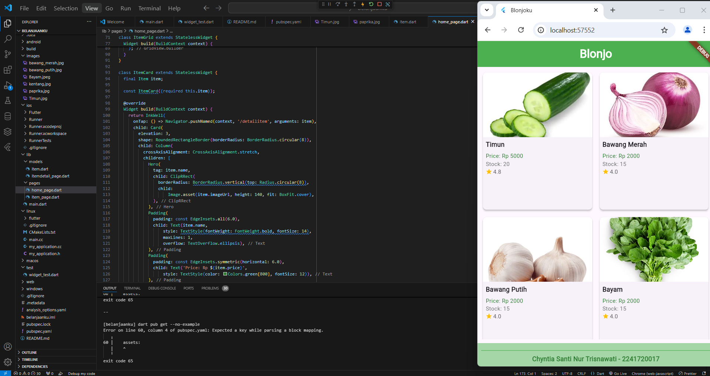
