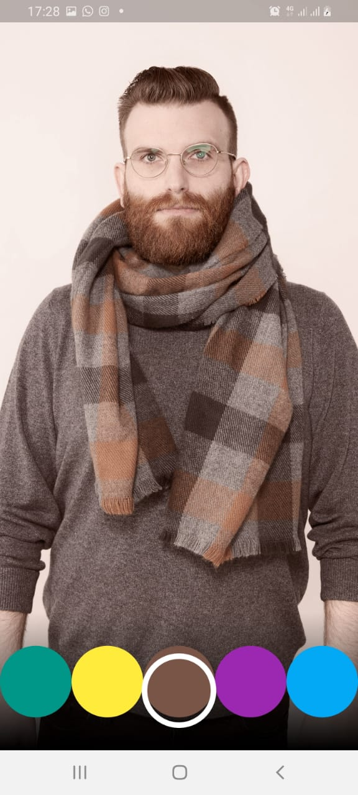
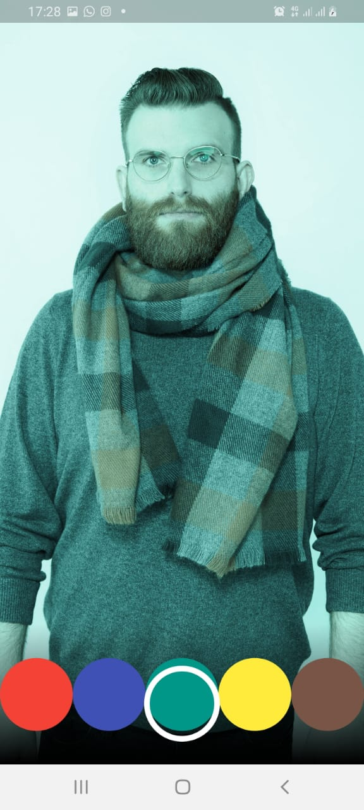
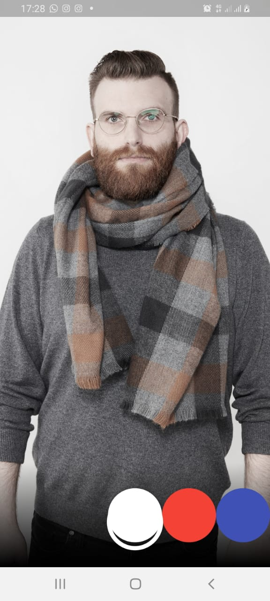

# Chyntia Santi Nur Trisnawati / 2241720017

# Praktikum 2 - Membuat photo filter carousel

## Langkah 1: Buat project baru

Buatlah project flutter baru di pertemuan 09 dengan nama photo_filter_carousel

## Langkah 2: Buat widget Selector ring dan dark gradient

Buatlah folder widget dan file baru yang berisi kode berikut.

lib/widget/filter_selector.dart

```
import 'package:flutter/material.dart';

@immutable
class FilterSelector extends StatefulWidget {
  const FilterSelector({
    super.key,
    required this.filters,
    required this.onFilterChanged,
    this.padding = const EdgeInsets.symmetric(vertical: 24),
  });

  final List<Color> filters;
  final void Function(Color selectedColor) onFilterChanged;
  final EdgeInsets padding;

  @override
  State<FilterSelector> createState() => _FilterSelectorState();
}

class _FilterSelectorState extends State<FilterSelector> {
  static const _filtersPerScreen = 5;
  static const _viewportFractionPerItem = 1.0 / _filtersPerScreen;

  late final PageController _controller;
  late int _page;

  int get filterCount => widget.filters.length;

  Color itemColor(int index) => widget.filters[index % filterCount];

  @override
  void initState() {
    super.initState();
    _page = 0;
    _controller = PageController(
      initialPage: _page,
      viewportFraction: _viewportFractionPerItem,
    );
    _controller.addListener(_onPageChanged);
  }

  void _onPageChanged() {
    final page = (_controller.page ?? 0).round();
    if (page != _page) {
      _page = page;
      widget.onFilterChanged(widget.filters[page]);
    }
  }

  void _onFilterTapped(int index) {
    _controller.animateToPage(
      index,
      duration: const Duration(milliseconds: 450),
      curve: Curves.ease,
    );
  }

  @override
  void dispose() {
    _controller.dispose();
    super.dispose();
  }

  @override
  Widget build(BuildContext context) {
    return Stack(
      alignment: Alignment.bottomCenter,
      children: [
        _buildShadowGradient(),
        Padding(
          padding: widget.padding,
          child: SizedBox(
            height: 100,
            child: PageView.builder(
              controller: _controller,
              physics: const PageScrollPhysics(),
              itemCount: filterCount,
              itemBuilder: (context, index) {
                return Center(
                  child: FilterItem(
                    onFilterSelected: () => _onFilterTapped(index),
                    color: itemColor(index),
                  ),
                );
              },
            ),
          ),
        ),
        _buildSelectionRing(),
      ],
    );
  }

  Widget _buildShadowGradient() {
    return Container(
      height: 100 + widget.padding.vertical,
      decoration: const BoxDecoration(
        gradient: LinearGradient(
          begin: Alignment.topCenter,
          end: Alignment.bottomCenter,
          colors: [
            Colors.transparent,
            Colors.black,
          ],
        ),
      ),
    );
  }

  Widget _buildSelectionRing() {
    return IgnorePointer(
      child: Padding(
        padding: widget.padding,
        child: const SizedBox(
          width: 80,
          height: 80,
          child: DecoratedBox(
            decoration: BoxDecoration(
              shape: BoxShape.circle,
              border: Border.fromBorderSide(
                BorderSide(width: 6, color: Colors.white),
              ),
            ),
          ),
        ),
      ),
    );
  }
}

class FilterItem extends StatelessWidget {
  const FilterItem({
    Key? key,
    required this.onFilterSelected,
    required this.color,
  }) : super(key: key);

  final VoidCallback onFilterSelected;
  final Color color;

  @override
  Widget build(BuildContext context) {
    return GestureDetector(
      onTap: onFilterSelected,
      child: Container(
        width: 80,
        height: 80,
        decoration: BoxDecoration(
          shape: BoxShape.circle,
          color: color,
        ),
      ),
    );
  }
}
```

## Langkah 3: Buat widget photo filter carousel

Buat file baru di folder widget dengan kode seperti berikut.

lib/widget/filter_carousel.dart

```
import 'package:flutter/material.dart';
import 'filter_selector.dart'; // Ensure this file is in the same directory or update the import path accordingly

@immutable
class PhotoFilterCarousel extends StatefulWidget {
  const PhotoFilterCarousel({super.key});

  @override
  State<PhotoFilterCarousel> createState() => _PhotoFilterCarouselState();
}

class _PhotoFilterCarouselState extends State<PhotoFilterCarousel> {
  final _filters = [
    Colors.white,
    ...List.generate(
      Colors.primaries.length,
      (index) => Colors.primaries[(index * 4) % Colors.primaries.length],
    )
  ];

  final _filterColor = ValueNotifier<Color>(Colors.white);

  void _onFilterChanged(Color value) {
    _filterColor.value = value;
  }

  @override
  Widget build(BuildContext context) {
    return Material(
      color: Colors.black,
      child: Stack(
        children: [
          Positioned.fill(
            child: _buildPhotoWithFilter(),
          ),
          Positioned(
            left: 0.0,
            right: 0.0,
            bottom: 0.0,
            child: _buildFilterSelector(),
          ),
        ],
      ),
    );
  }

  Widget _buildPhotoWithFilter() {
    return ValueListenableBuilder<Color>(
      valueListenable: _filterColor,
      builder: (context, color, child) {
        // Replace the URL with your own image if desired
        return Image.network(
          'https://docs.flutter.dev/cookbook/img-files/effects/instagram-buttons/millennial-dude.jpg',
          color: color.withOpacity(0.5),
          colorBlendMode: BlendMode.color,
          fit: BoxFit.cover,
        );
      },
    );
  }

  Widget _buildFilterSelector() {
    return FilterSelector(
      onFilterChanged: _onFilterChanged,
      filters: _filters,
    );
  }
}
```

## Langkah 4: Membuat filter warna - bagian 1

Buat file baru di folder widget seperti kode berikut.

lib/widget/carousel_flowdelegate.dart

```
import 'dart:math' as math;
import 'package:flutter/material.dart';
import 'package:flutter/rendering.dart';

class CarouselFlowDelegate extends FlowDelegate {
  CarouselFlowDelegate({
    required this.viewportOffset,
    required this.filtersPerScreen,
  }) : super(repaint: viewportOffset);

  final ViewportOffset viewportOffset;
  final int filtersPerScreen;

  @override
  void paintChildren(FlowPaintingContext context) {
    final count = context.childCount;

    // All available painting width
    final size = context.size.width;

    // The distance that a single item "page" takes up from the perspective
    // of the scroll paging system. We also use this size for the width and
    // height of a single item.
    final itemExtent = size / filtersPerScreen;

    // The current scroll position expressed as an item fraction, e.g., 0.0,
    // or 1.0, or 1.3, or 2.9, etc. A value of 1.3 indicates that item at
    // index 1 is active, and the user has scrolled 30% towards the item at
    // index 2.
    final active = viewportOffset.pixels / itemExtent;

    // Index of the first item we need to paint at this moment.
    // At most, we paint 3 items to the left of the active item.
    final min = math.max(0, active.floor() - 3).toInt();

    // Index of the last item we need to paint at this moment.
    // At most, we paint 3 items to the right of the active item.
    final max = math.min(count - 1, active.ceil() + 3).toInt();

    // Generate transforms for the visible items and sort by distance.
    for (var index = min; index <= max; index++) {
      final itemXFromCenter = itemExtent * index - viewportOffset.pixels;
      final percentFromCenter = 1.0 - (itemXFromCenter / (size / 2)).abs();
      final itemScale = 0.5 + (percentFromCenter * 0.5);
      final opacity = 0.25 + (percentFromCenter * 0.75);

      final itemTransform = Matrix4.identity()
        ..translate((size - itemExtent) / 2)
        ..translate(itemXFromCenter)
        ..translate(itemExtent / 2, itemExtent / 2)
        ..multiply(Matrix4.diagonal3Values(itemScale, itemScale, 1.0))
        ..translate(-itemExtent / 2, -itemExtent / 2);

      context.paintChild(
        index,
        transform: itemTransform,
        opacity: opacity,
      );
    }
  }

  @override
  bool shouldRepaint(covariant CarouselFlowDelegate oldDelegate) {
    return oldDelegate.viewportOffset != viewportOffset;
  }
}
```

## Langkah 5: Membuat filter warna

Buat file baru di folder widget seperti kode berikut ini.

lib/widget/filter_item.dart

```
import 'package:flutter/material.dart';

@immutable
class FilterItem extends StatelessWidget {
  const FilterItem({
    super.key,
    required this.color,
    this.onFilterSelected,
  });

  final Color color;
  final VoidCallback? onFilterSelected;

  @override
  Widget build(BuildContext context) {
    return GestureDetector(
      onTap: onFilterSelected,
      child: AspectRatio(
        aspectRatio: 1.0,
        child: Padding(
          padding: const EdgeInsets.all(8),
          child: ClipOval(
            child: Image.network(
              'https://docs.flutter.dev/cookbook/img-files'
              '/effects/instagram-buttons/millennial-texture.jpg',
              color: color.withOpacity(0.5),
              colorBlendMode: BlendMode.hardLight,
            ),
          ),
        ),
      ),
    );
  }
}
```

## Langkah 6: Implementasi filter carousel

Terakhir, kita impor widget PhotoFilterCarousel ke main seperti kode berikut ini.

lib/main.dart

```
import 'package:flutter/material.dart';
import 'package:photo_filter_carousel/widget/filter_carousel.dart';

void main() {
  runApp(
    const MaterialApp(
      home: PhotoFilterCarousel(),
      debugShowCheckedModeBanner: false,
    ),
  );
}
```

## Troubleshoot

Jika diperlukan, beberapa widget yang telah Anda buat sebelumnya, memerlukan kode import berikut ini.

```
import 'dart:math' as math;

import 'package:flutter/material.dart';
import 'package:flutter/rendering.dart' show ViewportOffset;
```

## Hasi

Hasil ketika dijalankan adalah sebagai berikut



